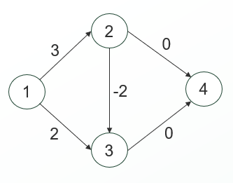
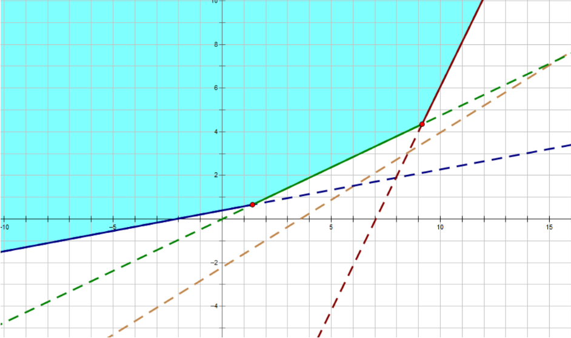

<div style="font-size:2em;font-weight:bold;text-align:center;margin-bottom:10px">目录</div>

<style>
.toc-item {
    display: flex;
    align-items: baseline;
    margin-bottom: 8px;
}
.toc-title {
    font-weight: bold;
}
.toc-dots {
    flex-grow: 1;
    border-bottom: 2px dotted #000;
    margin: 0 10px;
}
.toc-page {
    font-weight: bold;
}
</style>

<div class="toc-item"><span class="toc-title">Trie(01)</span><span class="toc-dots"></span><span class="toc-page">4</span></div>
<div class="toc-item"><span class="toc-title">ACAM</span><span class="toc-dots"></span><span class="toc-page">5</span></div>
<div class="toc-item"><span class="toc-title">二进制函数</span><span class="toc-dots"></span><span class="toc-page">7</span></div>
<div class="toc-item"><span class="toc-title">斐波那契数列</span><span class="toc-dots"></span><span class="toc-page">7</span></div>
<div class="toc-item"><span class="toc-title">预处理线性求逆元</span><span class="toc-dots"></span><span class="toc-page">7</span></div>
<div class="toc-item"><span class="toc-title">数论</span><span class="toc-dots"></span><span class="toc-page">8</span></div>
<div class="toc-item"><span class="toc-title">组合数学</span><span class="toc-dots"></span><span class="toc-page">10</span></div>
<div class="toc-item"><span class="toc-title">Block(RollBack)</span><span class="toc-dots"></span><span class="toc-page">11</span></div>
<div class="toc-item"><span class="toc-title">Block(Update)</span><span class="toc-dots"></span><span class="toc-page">13</span></div>
<div class="toc-item"><span class="toc-title">CAGD</span><span class="toc-dots"></span><span class="toc-page">16</span></div>
<div class="toc-item"><span class="toc-title">Fenwick(2D)</span><span class="toc-dots"></span><span class="toc-page">22</span></div>
<div class="toc-item"><span class="toc-title">Cantor</span><span class="toc-dots"></span><span class="toc-page">23</span></div>
<div class="toc-item"><span class="toc-title">Comb</span><span class="toc-dots"></span><span class="toc-page">24</span></div>
<div class="toc-item"><span class="toc-title">Dijkstra</span><span class="toc-dots"></span><span class="toc-page">25</span></div>
<div class="toc-item"><span class="toc-title">Dsu</span><span class="toc-dots"></span><span class="toc-page">26</span></div>
<div class="toc-item"><span class="toc-title">EBCC</span><span class="toc-dots"></span><span class="toc-page">27</span></div>
<div class="toc-item"><span class="toc-title">欧拉通路</span><span class="toc-dots"></span><span class="toc-page">29</span></div>
<div class="toc-item"><span class="toc-title">欧拉回路</span><span class="toc-dots"></span><span class="toc-page">29</span></div>
<div class="toc-item"><span class="toc-title">EulerSieve</span><span class="toc-dots"></span><span class="toc-page">29</span></div>
<div class="toc-item"><span class="toc-title">PositiveFunction(线性筛)</span><span class="toc-dots"></span><span class="toc-page">30</span></div>
<div class="toc-item"><span class="toc-title">Excrt</span><span class="toc-dots"></span><span class="toc-page">31</span></div>
<div class="toc-item"><span class="toc-title">Exgcd</span><span class="toc-dots"></span><span class="toc-page">31</span></div>
<div class="toc-item"><span class="toc-title">FastIo</span><span class="toc-dots"></span><span class="toc-page">32</span></div>
<div class="toc-item"><span class="toc-title">Fenwick</span><span class="toc-dots"></span><span class="toc-page">33</span></div>
<div class="toc-item"><span class="toc-title">FhqTreap</span><span class="toc-dots"></span><span class="toc-page">34</span></div>
<div class="toc-item"><span class="toc-title">Fraction</span><span class="toc-dots"></span><span class="toc-page">37</span></div>
<div class="toc-item"><span class="toc-title">Guass</span><span class="toc-dots"></span><span class="toc-page">38</span></div>
<div class="toc-item"><span class="toc-title">Hash(Double)</span><span class="toc-dots"></span><span class="toc-page">40</span></div>
<div class="toc-item"><span class="toc-title">Hash(Int128)</span><span class="toc-dots"></span><span class="toc-page">41</span></div>
<div class="toc-item"><span class="toc-title">Int128</span><span class="toc-dots"></span><span class="toc-page">42</span></div>
<div class="toc-item"><span class="toc-title">Josephus</span><span class="toc-dots"></span><span class="toc-page">42</span></div>
<div class="toc-item"><span class="toc-title">K-Ancestor</span><span class="toc-dots"></span><span class="toc-page">43</span></div>
<div class="toc-item"><span class="toc-title">Kmp</span><span class="toc-dots"></span><span class="toc-page">45</span></div>
<div class="toc-item"><span class="toc-title">Kruskal</span><span class="toc-dots"></span><span class="toc-page">46</span></div>
<div class="toc-item"><span class="toc-title">Kruskal重构树</span><span class="toc-dots"></span><span class="toc-page">46</span></div>
<div class="toc-item"><span class="toc-title">LCA</span><span class="toc-dots"></span><span class="toc-page">47</span></div>
<div class="toc-item"><span class="toc-title">Matrix</span><span class="toc-dots"></span><span class="toc-page">49</span></div>
<div class="toc-item"><span class="toc-title">Manacher</span><span class="toc-dots"></span><span class="toc-page">50</span></div>
<div class="toc-item"><span class="toc-title">MaxFlow</span><span class="toc-dots"></span><span class="toc-page">51</span></div>
<div class="toc-item"><span class="toc-title">MillerRabin</span><span class="toc-dots"></span><span class="toc-page">53</span></div>
<div class="toc-item"><span class="toc-title">MinCostFlow</span><span class="toc-dots"></span><span class="toc-page">54</span></div>
<div class="toc-item"><span class="toc-title">MergeSort</span><span class="toc-dots"></span><span class="toc-page">56</span></div>
<div class="toc-item"><span class="toc-title">QuickSort</span><span class="toc-dots"></span><span class="toc-page">56</span></div>
<div class="toc-item"><span class="toc-title">StaticModInt</span><span class="toc-dots"></span><span class="toc-page">57</span></div>
<div class="toc-item"><span class="toc-title">DynamicModInt</span><span class="toc-dots"></span><span class="toc-page">59</span></div>
<div class="toc-item"><span class="toc-title">莫比乌斯反演</span><span class="toc-dots"></span><span class="toc-page">63</span></div>
<div class="toc-item"><span class="toc-title">莫比乌斯(2)</span><span class="toc-dots"></span><span class="toc-page">64</span></div>
<div class="toc-item"><span class="toc-title">莫比乌斯(3)</span><span class="toc-dots"></span><span class="toc-page">65</span></div>
<div class="toc-item"><span class="toc-title">FFT</span><span class="toc-dots"></span><span class="toc-page">66</span></div>
<div class="toc-item"><span class="toc-title">NTT</span><span class="toc-dots"></span><span class="toc-page">67</span></div>
<div class="toc-item"><span class="toc-title">Poly2</span><span class="toc-dots"></span><span class="toc-page">69</span></div>
<div class="toc-item"><span class="toc-title">ODT</span><span class="toc-dots"></span><span class="toc-page">88</span></div>
<div class="toc-item"><span class="toc-title">PAM</span><span class="toc-dots"></span><span class="toc-page">90</span></div>
<div class="toc-item"><span class="toc-title">pbds</span><span class="toc-dots"></span><span class="toc-page">92</span></div>
<div class="toc-item"><span class="toc-title">PollardRho</span><span class="toc-dots"></span><span class="toc-page">93</span></div>
<div class="toc-item"><span class="toc-title">Prim</span><span class="toc-dots"></span><span class="toc-page">95</span></div>
<div class="toc-item"><span class="toc-title">SA</span><span class="toc-dots"></span><span class="toc-page">96</span></div>
<div class="toc-item"><span class="toc-title">SAM</span><span class="toc-dots"></span><span class="toc-page">98</span></div>
<div class="toc-item"><span class="toc-title">SCC</span><span class="toc-dots"></span><span class="toc-page">101</span></div>
<div class="toc-item"><span class="toc-title">Segtree</span><span class="toc-dots"></span><span class="toc-page">102</span></div>
<div class="toc-item"><span class="toc-title">Segtree(Dynamic)</span><span class="toc-dots"></span><span class="toc-page">104</span></div>
<div class="toc-item"><span class="toc-title">Segtree(Persistent)</span><span class="toc-dots"></span><span class="toc-page">106</span></div>
<div class="toc-item"><span class="toc-title">SparseTable</span><span class="toc-dots"></span><span class="toc-page">107</span></div>
<div class="toc-item"><span class="toc-title">Splay</span><span class="toc-dots"></span><span class="toc-page">107</span></div>
<div class="toc-item"><span class="toc-title">TreeHash</span><span class="toc-dots"></span><span class="toc-page">110</span></div>
<div class="toc-item"><span class="toc-title">TreeSplit(Segment)</span><span class="toc-dots"></span><span class="toc-page">111</span></div>
<div class="toc-item"><span class="toc-title">Trie</span><span class="toc-dots"></span><span class="toc-page">112</span></div>
<div class="toc-item"><span class="toc-title">Trie(unique_ptr)</span><span class="toc-dots"></span><span class="toc-page">113</span></div>
<div class="toc-item"><span class="toc-title">unordered_map</span><span class="toc-dots"></span><span class="toc-page">114</span></div>
<div class="toc-item"><span class="toc-title">ZFunction</span><span class="toc-dots"></span><span class="toc-page">115</span></div>
<div class="toc-item"><span class="toc-title">Triangle(3Cycle)</span><span class="toc-dots"></span><span class="toc-page">116</span></div>
<div class="toc-item"><span class="toc-title">Hungarian</span><span class="toc-dots"></span><span class="toc-page">117</span></div>
<div class="toc-item"><span class="toc-title">Bat</span><span class="toc-dots"></span><span class="toc-page">118</span></div>
<div class="toc-item"><span class="toc-title">平面最近点对</span><span class="toc-dots"></span><span class="toc-page">119</span></div>
<div class="toc-item"><span class="toc-title">DP(Digit)</span><span class="toc-dots"></span><span class="toc-page">120</span></div>
<div class="toc-item"><span class="toc-title">杂项(1)</span><span class="toc-dots"></span><span class="toc-page">121</span></div>
<div class="toc-item"><span class="toc-title">杂项(2)</span><span class="toc-dots"></span><span class="toc-page">122</span></div>
<div class="toc-item"><span class="toc-title">杂项(3)</span><span class="toc-dots"></span><span class="toc-page">123</span></div>
<div class="toc-item"><span class="toc-title">FloorSum</span><span class="toc-dots"></span><span class="toc-page">124</span></div>
<div class="toc-item"><span class="toc-title">LinearBasis(高斯消元法)</span><span class="toc-dots"></span><span class="toc-page">125</span></div>
<div class="toc-item"><span class="toc-title">ForwardStar</span><span class="toc-dots"></span><span class="toc-page">127</span></div>
<div class="toc-item"><span class="toc-title">MiniRep</span><span class="toc-dots"></span><span class="toc-page">128</span></div>
<div class="toc-item"><span class="toc-title">Python</span><span class="toc-dots"></span><span class="toc-page">128</span></div>
<div class="toc-item"><span class="toc-title">Convex_opt</span><span class="toc-dots"></span><span class="toc-page">129</span></div>
<div class="toc-item"><span class="toc-title">PartialOrder(3D)</span><span class="toc-dots"></span><span class="toc-page">133</span></div>

<div style="page-break-after:always;"></div>

### Trie(01)

```c++
constexpr int N = 1e5 + 10;
constexpr int MAXBIT = 32;
ll t[N << 5][2], ans[N << 5], idx;
int newnode() {
    memset(t[idx], 0, sizeof t[idx]);
    ans[idx] = 0;
    return idx++;
}
void init() {
    memset(t[0], 0, sizeof t[0]);
    ans[0] = 0;
    idx = 1;
}
void insert(ll x) {
    int p = 0, c;
    for (ll i = MAXBIT; i >= 0; i--) {
        c = (x >> i) & 1;
        if (!t[p][c])
            t[p][c] = newnode();
        p = t[p][c];
    }
    ans[p] = x;
}
ll find(ll x) {
    int p = 0, c;
    for (ll i = MAXBIT; i >= 0; i--) {
        c = (x >> i) & 1;
        if (t[p][c ^ 1])
            p = t[p][c ^ 1];
        else
            p = t[p][c];
    }
    return ans[p];
}
```

<div style="page-break-after:always;"></div>

### ACAM

时间复杂度为$O(\sum\vert S_i \vert+n\vert\sum\vert+\vert S\vert)$
$\vert S_i \vert$为模式串长度,$\vert S\vert$为文本串长度,$\vert\sum\vert$为字符集大小，一般为26
query函数返回每个模式串在文本串中的出现次数,模式串下标从0开始

```c++
struct ACAM {
    static constexpr int ALPHABET = 26;
    struct Node {
        int len, link;
        array<int, ALPHABET> next;
        Node() : len{}, link{}, next{} {}
    };
    vector<Node> t;
    vector<int> nodes, end;
    ACAM() { init(); }
    void init() {
        t.assign(2, Node());
        nodes.clear();
        end.clear();
        t[0].next.fill(1);
        t[0].len = -1;
    }
    int newNode() {
        t.emplace_back();
        return t.size() - 1;
    }
    int add(const string &a) {
        int p = 1;
        for (char c : a) {
            int x = c - 'a';
            if (t[p].next[x] == 0) {
                t[p].next[x] = newNode();
                t[t[p].next[x]].len = t[p].len + 1;
            }
            p = t[p].next[x];
        }
        end.push_back(p);
        return p;
    }
    void work() {
        queue<int> q;
        q.push(1);
        while (!q.empty()) {
            int x = q.front();
            nodes.push_back(x);
            q.pop();
            for (int i = 0; i < ALPHABET; i++) {
                if (t[x].next[i] == 0) {
                    t[x].next[i] = t[t[x].link].next[i];
                } else {
                    t[t[x].next[i]].link = t[t[x].link].next[i];
                    q.push(t[x].next[i]);
                }
            }
        }
    }
    vector<int> query(const string &s) {
        int p = 1;
        vector<int> f(t.size() + 1);
        for (auto c : s) {
            p = t[p].next[c - 'a'];
            f[p] += 1;
        }
        for (int i = nodes.size() - 1; i >= 0; i--) {
            int x = nodes[i];
            f[t[x].link] += f[x];
        }
        vector<int> cnt(end.size());
        for (int i = 0; i < end.size(); i++)
            cnt[i] = f[end[i]];
        return cnt;
    }
    int next(int p, int x) { return t[p].next[x]; }
    int link(int p) { return t[p].link; }
    int len(int p) { return t[p].len; }
    int size() { return t.size(); }
    int number() { return end.size(); }
};
```

---

求文本串中出现的模式串个数(小常数写法)

```c++
AhoCorasick aho;
vector<int> isEnd(N);
for (int i = 1; i <= n; i++) {
    cin >> s;
    int p = aho.add(s);
    isEnd[p] += 1;
}
aho.work();
cin >> s;
int p = 1;
for (auto c : s) {
    p = aho.next(p, c - 'a');
    for (int i = p; i > 1 && isEnd[i] != -1; i = aho.link(i)) {
        ans += isEnd[i];
        isEnd[i] = -1;
    }
}  // cout<<ans<<"\n";
```

<div style="page-break-after:always;"></div>

### 二进制函数

**__builtin_ctz()**返回整数二进制**后缀0**个数(整数为0时为ub)
**__builtin_clz()**返回整数二进制**前导0**个数(整数为0时为ub)
**__builtin_popcount()**返回整数二进制**1**个数
**long long**范围的数在函数名末尾加**ll** 


### 斐波那契数列

#### 通项公式:$F_n=\frac{(\frac{1+\sqrt5}{2})^n-(\frac{1-\sqrt5}{2})^n}{\sqrt5}$,$F_n=[\frac{(\frac{1+\sqrt5}{2})^n}{\sqrt5}]$,[]代表取最近的整数

$F_{2n}=F_{n+1}^2-F_{n-1}^2=...$ 
$F_{2n+1}=F_{n+1}^2+F_{n}^2$ 
$(F_m,F_n)=F_{(m,n)}$ 
$F_{n-1}F_{n+1}=F_n^2+(-1)^n$ 
$F_1+F_3+...+F_{2n-1}=F_{2n}$ 
$F_2+F_4+...+F_{2n}=F_{2n+1}-1$ 
$F_1^2+F_2^2+...+F_n^2=F_nF_{n+1}$ 


### 预处理线性求逆元

$1^{-1}\equiv 1\pmod{p}$ (初始化1的逆元为1)
设$p=k*i+r,(1<r<i<p)$,$k=\lfloor{\frac{p}{i}}\rfloor,r=p \mod i$  
能得到$k*i+r \equiv0 \pmod{p}$ 
乘上$i^{-1},r^{-1}$得到:$k*r^{-1}+i^{-1}\equiv0 \pmod{p}$ 
$i^{-1}\equiv -k*r^{-1} \pmod{p}$ 
$i^{-1}\equiv -\lfloor{\frac{p}{i}}\rfloor*(p \mod i)^{-1} \pmod{p}$ 
$i^{-1}\equiv (p-\lfloor{\frac{p}{i}}\rfloor)*(p \mod i)^{-1} \pmod{p}$ 

```c++
inv[1] = 1;
for (int i = 2; i <= n; i++)
    inv[i] = (p - p / i) * inv[p % i] % p;
```

<div style="page-break-after:always;"></div>

### 数论

##### 欧拉降幂

$$ a^b \equiv \begin{cases} a^{b \mod \varphi(p)},~~~~~~~~~~~~~gcd(a,p)=1\\ a^b,~~~~~~~~~~~~~~~~~~~~~~~~~~~~gcd(a,p)\neq1,b<\varphi(p)~~~~~(\mod p)\\ a^{b \mod \varphi(p)+\varphi(p)},~~~~~gcd(a,p)\neq1,b\ge\varphi(p) \end{cases} $$  


##### 第二类斯特林数(将n个不同元素划分成m个集合的方案数)

递推:$S(n,m)=S(n-1,m-1)+mS(n-1,m)$ ,即讨论当前球是否单独在一个盒子里
容斥原理:$S(n,m)=\frac{1}{m!}\sum_{k=0}^{m}(-1)^kC(m,k)(m-k)^n$ ,即枚举空盒个数,剩下随意,盒子相同,最终除以$m!$ 


##### 卡特兰数

$C_0=C_1=1$
递归定义:$C_n=\sum_{k=0}^{n-1}C_kC_{n-1-k}=C_0C_{n-1}+C_1C_{n-2}+...+C_{n-1}C_0 \,(n \ge 2)$ 
递推公式:$C_n=\frac{4n-2}{n+1}C_{n-1}$ 
通项公式:$C_n=\frac{1}{n+1}C_{2n}^{n}=C_{2n}^{n}-C_{2n}^{n-1}=\frac{1}{n+1}\sum_{i=0}^n (C_{n}^{i})^2$  


##### 泰勒展开

$$
f(x)=f(0)+f'(0)x+\frac{f''(0)}{2!}x^2+\cdots+\frac{f^{(n)}(0)}{n!}x^n+o(x^n) \\
\\
\sin(x)=x-\frac{x^3}{3!}+\frac{x^5}{5!}+...,x \in (-\infty,+\infty) \\
\arcsin(x)=x+\frac{x^3}{6}+\frac{3x^5}{40}+\frac{5x^7}{112}+\frac{35x^9}{1152}+...,x \in (-1,1) \\
\cos(x)=1-\frac{x^2}{2!}+\frac{x^4}{4!}-\frac{x^6}{6!}+...,x \in (-\infty,+\infty) \\
\arccos(x)=\frac{\pi}{2}-\arcsin(x),x \in (-1,1) \\
\tan(x)=x+\frac{x^3}{3}+\frac{2x^5}{15}+\frac{17x^7}{315}+\frac{62x^9}{2835}+...,x \in (-\frac{\pi}{2},\frac{\pi}{2}) \\
\arctan(x)=x-\frac{x^3}{3}+\frac{x^5}{5}+...,x \in [-1,1] \\
arccot(x)=\frac{\pi}{2}-\arctan(x),x \in (-\infty,+\infty) \\
\sec(x)=1+\frac{x^2}{2}+\frac{5x^4}{24}+...,x \in (-\frac{\pi}{2},\frac{\pi}{2}) \\
e^x=1+x+\frac{x^2}{2!}+\frac{x^3}{3!}+...,x \in (-\infty,+\infty) \\
\ln(1+x)=x-\frac{x^2}{2}+\frac{x^3}{3}+...,x \in (-1,1] \\
\frac{1}{1-x}=1+x+x^2+x^3+...,x \in (-1,1) \\
\frac{1}{1+x}=1-x+x^2-x^3+...,x \in (-1,1) \\
(1+x)^\alpha=1+\alpha x+\frac{\alpha (\alpha-1)}{2!}x^2+\frac{\alpha(\alpha-1)(\alpha-2)}{3!}x^3+...,x \in (-1,1) \\
$$

<div style="page-break-after:always;"></div>

### 组合数学

| k个球    | m个盒子  | 是否允许空盒 | 方案数                                               |
| -------- | -------- | ------------ | ---------------------------------------------------- |
| 各不相同 | 各不相同 | 是           | $m^k$                                                |
| 各不相同 | 各不相同 | 否           | $m!Stirling2(k,m)$                                   |
| 各不相同 | 完全相同 | 是           | $\sum_{i=1}^mStirling2(k,i)$                         |
| 各不相同 | 完全相同 | 否           | $Stirling2(k,m)$                                     |
| 完全相同 | 各不相同 | 是           | $C(m+k-1,k)$                                         |
| 完全相同 | 各不相同 | 否           | $C(k-1,m-1)$                                         |
| 完全相同 | 完全相同 | 是           | $\frac{1}{(1-x)(1-x^2)...(1-x^m)}$ 的$x^k$项的系数   |
| 完全相同 | 完全相同 | 否           | $\frac{x^m}{(1-x)(1-x^2)...(1-x^m)}$ 的$x^k$项的系数 |

<div style="page-break-after:always;"></div>

### Block(RollBack)

回滚莫队,取块长$b=\frac{n}{\sqrt q}$时最优,时间复杂度为$O(n\sqrt q)$ 

```c++
int L[N], R[N], col[N], cnt[N], a[N], x[N], n, m, q, sz, tot;
void build() {
    sz = sqrt(n);
    tot = n / sz;
    for (int i = 1; i <= tot; i++) {
        L[i] = (i - 1) * sz + 1, R[i] = i * sz;
        for (int j = L[i]; j <= R[i]; j++) col[j] = i;
    }
    if (R[tot] < n) {
        tot++;
        L[tot] = R[tot - 1] + 1, R[tot] = n;
        for (int j = L[tot]; j <= R[tot]; j++) col[j] = tot;
    }
}
struct Query {
    int l, r, id;
    bool operator<(const Query &A) const {
        if (col[l] != col[A.l]) return col[l] < col[A.l];
        return r < A.r;
    }
};
void add(int val, ll &ans) {
    cnt[val]++;
    ans = max(ans, 1LL * cnt[val] * x[val]);
}
void del(int val) { cnt[val]--; }
void solve() {
    cin >> n >> q;
    build();
    for (int i = 1; i <= n; i++) {
        cin >> a[i];
        x[i] = a[i];
    }
    sort(x + 1, x + n + 1);
    m = unique(x + 1, x + n + 1) - x - 1;
    for (int i = 1; i <= n; i++) a[i] = lower_bound(x + 1, x + m + 1, a[i]) - x;
    vector<Query> Q(q + 1);
    for (int i = 1; i <= q; i++) {
        cin >> Q[i].l >> Q[i].r;
        Q[i].id = i;
    }
    sort(Q.begin() + 1, Q.end());
    int l = 1, r = 0, lst_bk = 0;
    ll Ans = 0;
    vector<int> bf(n + 1);
    vector<ll> ans(q + 1);
    for (int i = 1; i <= q; i++) {
        if (col[Q[i].l] == col[Q[i].r]) {  // 同一块则暴力扫
            for (int j = Q[i].l; j <= Q[i].r; j++) {
                bf[a[j]]++;
                ans[Q[i].id] = max(ans[Q[i].id], 1LL * bf[a[j]] * x[a[j]]);
            }
            for (int j = Q[i].l; j <= Q[i].r; j++) bf[a[j]]--;
            continue;
        }
        if (col[Q[i].l] != lst_bk) {  // 访问到新左端点块，重新初始化莫队
            while (r > R[col[Q[i].l]]) del(a[r]), r--;
            while (l <= R[col[Q[i].l]]) del(a[l]), l++;
            Ans = 0;
            lst_bk = col[Q[i].l];
        }
        while (r < Q[i].r) ++r, add(a[r], Ans);  // 扩展右端点
        ll tmp_l = l, tmp = Ans;
        while (tmp_l > Q[i].l) --tmp_l, add(a[tmp_l], tmp);  // 扩展左端点
        ans[Q[i].id] = tmp;
        while (tmp_l < l) del(a[tmp_l]), ++tmp_l;  // 回滚
    }
    for (int i = 1; i <= q; i++) cout << ans[i] << "\n";
}
```

<div style="page-break-after:always;"></div>

### Block(Update)

普通莫队,先按左端点块再按左端点块奇升偶降(常数优化r端点移动次数)
块长$\sqrt n$时,总复杂度$O((n+q)\sqrt n)~~~~~~~~~~~~~~$块长$\frac{n}{\sqrt q}$时,总复杂度$O(n\sqrt q)$ 
带修莫队,视$n~~m$同阶,取$B=n^{\frac{2}{3}}$,时间复杂度达到$O(n^{\frac{5}{3}})$ 

```c++
constexpr int N = 1e6 + 10;
struct BLK {
    int B, n;
    vector<int> id;
    vector<int> pos;
    BLK() : B{}, n{}, id{} {}
    BLK(int n) : BLK() { init(n); }
    void init(int n) {
        this->n = n;
        this->B = (int)pow(n, 2.0 / 3);
        id.resize(n + 1);
        pos.assign(N, 0);
        for (int i = 1; i <= n; i++)
            id[i] = (i - 1) / B + 1;
    }
    bool del_l(int &x, int val) {
        x += 1;
        bool ischange = false;
        pos[val] -= 1;
        if (!pos[val]) ischange = true;
        return ischange;
    }
    bool del_r(int &x, int val) {
        x -= 1;
        bool ischange = false;
        pos[val] -= 1;
        if (!pos[val]) ischange = true;
        return ischange;
    }
    int del_t(int &x, int &val1, int &val2) {
        x -= 1;
        int ischange = 0;
        if (val1 == val2) return ischange;
        pos[val1] -= 1, pos[val2] += 1;
        if (pos[val1] > 0 && pos[val2] == 1)
            ischange = 1;
        else if (pos[val1] == 0 && pos[val2] > 1)
            ischange = -1;
        swap(val1, val2);
        return ischange;
    }
    bool add_l(int &x, int val) {
        x -= 1;
        bool ischange = false;
        if (!pos[val]) ischange = true;
        pos[val] += 1;
        return ischange;
    }
    bool add_r(int &x, int val) {
        x += 1;
        bool ischange = false;
        if (!pos[val]) ischange = true;
        pos[val] += 1;
        return ischange;
    }
    int add_t(int &x, int &val1, int &val2) {
        x += 1;
        int ischange = 0;
        if (val1 == val2) return ischange;
        pos[val1] -= 1, pos[val2] += 1;
        if (pos[val1] > 0 && pos[val2] == 1)
            ischange = 1;
        else if (pos[val1] == 0 && pos[val2] > 1)
            ischange = -1;
        swap(val1, val2);
        return ischange;
    }
};
void solve() {
    int n, q, time = 0, tot = 0, L, R;
    char op;
    cin >> n >> q;
    vector<int> a(n + 1);
    for (int i = 1; i <= n; i++) cin >> a[i];
    BLK B(n);
    vector<int> l(q + 1), r(q + 1), t(q + 1), p(q + 1), after(q + 1);
    for (int i = 1; i <= q; i++) {
        cin >> op >> L >> R;
        if (op == 'Q') {
            t[++tot] = time;
            l[tot] = L, r[tot] = R;
        } else {
            time += 1;
            p[time] = L, after[time] = R;
        }
    }
    vector<int> ans(tot + 1), idx(tot + 1);
    iota(idx.begin(), idx.end(), 0);
    sort(idx.begin(), idx.end(), [&](int R1, int R2) {
        if (B.id[l[R1]] != B.id[l[R2]])
            return B.id[l[R1]] < B.id[l[R2]];
        if (B.id[r[R1]] != B.id[r[R2]])
            return B.id[r[R1]] < B.id[r[R2]];
        return t[R1] < t[R2];
    });
    int nl = 1, nr = 0, nt = 0, cnt = 0;
    for (int i = 1; i <= tot; i++) {
        int now = idx[i];
        while (nr < n && nr < r[now]) {
            if (B.add_r(nr, a[nr + 1]))
                cnt += 1;
        }
        while (nl > 1 && nl > l[now]) {
            if (B.add_l(nl, a[nl - 1]))
                cnt += 1;
        }
        while (nl <= n && nl < l[now]) {
            if (B.del_l(nl, a[nl]))
                cnt -= 1;
        }
        while (nr >= 1 && nr > r[now]) {
            if (B.del_r(nr, a[nr]))
                cnt -= 1;
        }
        while (nt < time && nt < t[now]) {
            if (p[nt + 1] > nr || p[nt + 1] < nl)
                swap(a[p[nt + 1]], after[nt + 1]), nt += 1;
            else
                cnt += B.add_t(nt, a[p[nt + 1]], after[nt + 1]);
        }
        while (nt >= 1 && nt > t[now]) {
            if (p[nt] > nr || p[nt] < nl)
                swap(a[p[nt]], after[nt]), nt -= 1;
            else
                cnt += B.del_t(nt, a[p[nt]], after[nt]);
        }
        ans[now] = cnt;
    }
    for (int i = 1; i <= tot; i++) cout << ans[i] << "\n";
}
```

<div style="page-break-after:always;"></div>

### CAGD

```c++
using point_t = long double;  // 全局数据类型
constexpr point_t eps = 1e-8;
constexpr point_t INF = numeric_limits<point_t>::max();
constexpr long double PI = acosl(-1.0);
// 点与向量
template <typename T>
struct point {
    T x, y;
    bool operator==(const point &a) const { return (abs(x - a.x) <= eps && abs(y - a.y) <= eps); }
    bool operator<(const point &a) const {
        if (abs(x - a.x) <= eps) return y < a.y - eps;
        return x < a.x - eps;
    }
    bool operator>(const point &a) const { return !(*this < a || *this == a); }
    point operator+(const point &a) const { return {x + a.x, y + a.y}; }
    point operator-(const point &a) const { return {x - a.x, y - a.y}; }
    point operator-() const { return {-x, -y}; }
    point operator*(const T k) const { return {k * x, k * y}; }
    point operator/(const T k) const { return {x / k, y / k}; }
    T operator*(const point &a) const { return x * a.x + y * a.y; }  // 点积
    T operator^(const point &a) const { return x * a.y - y * a.x; }  // 叉积，注意优先级
    int toleft(const point &a) const {
        const auto t = (*this) ^ a;
        return (t > eps) - (t < -eps);
    }                                                              // to-left 测试
    T len2() const { return (*this) * (*this); }                   // 向量长度的平方
    T dis2(const point &a) const { return (a - (*this)).len2(); }  // 两点距离的平方
    // 涉及浮点数
    long double len() const { return sqrtl(len2()); }                                                                       // 向量长度
    long double dis(const point &a) const { return sqrtl(dis2(a)); }                                                        // 两点距离
    long double ang(const point &a) const { return acosl(max(-1.0l, min(1.0l, ((*this) * a) / (len() * a.len())))); }       // 向量夹角
    point rot(const long double rad) const { return {x * cos(rad) - y * sin(rad), x * sin(rad) + y * cos(rad)}; }           // 逆时针旋转（给定角度）
    point rot(const long double cosr, const long double sinr) const { return {x * cosr - y * sinr, x * sinr + y * cosr}; }  // 逆时针旋转（给定角度的正弦与余弦）
};
using Point = point<point_t>;
// 极角排序
struct argcmp {
    bool operator()(const Point &a, const Point &b) const {
        const auto quad = [](const Point &a) {
            if (a.y < -eps) return 1;
            if (a.y > eps) return 4;
            if (a.x < -eps) return 5;
            if (a.x > eps) return 3;
            return 2;
        };
        const int qa = quad(a), qb = quad(b);
        if (qa != qb) return qa < qb;
        const auto t = a ^ b;
        // if (abs(t)<=eps) return a*a<b*b-eps;  // 不同长度的向量需要分开
        return t > eps;
    }
};
// 直线
template <typename T>
struct line {
    point<T> p, v;  // p 为直线上一点，v 为方向向量
    bool operator==(const line &a) const { return v.toleft(a.v) == 0 && v.toleft(p - a.p) == 0; }
    int toleft(const point<T> &a) const { return v.toleft(a - p); }  // to-left 测试
    // 1 -> left    0 -> on    -1 -> right
    bool operator<(const line &a) const  // 半平面交算法定义的排序
    {
        if (abs(v ^ a.v) <= eps && v * a.v >= -eps) return toleft(a.p) == -1;
        return argcmp()(v, a.v);
    }
    // 涉及浮点数
    point<T> inter(const line &a) const { return p + v * ((a.v ^ (p - a.p)) / (v ^ a.v)); }  // 直线交点
    long double dis(const point<T> &a) const { return abs(v ^ (a - p)) / v.len(); }          // 点到直线距离
    point<T> proj(const point<T> &a) const { return p + v * ((v * (a - p)) / (v * v)); }     // 点在直线上的投影
};
using Line = line<point_t>;
// 线段
template <typename T>
struct segment {
    point<T> a, b;
    bool operator<(const segment &s) const { return make_pair(a, b) < make_pair(s.a, s.b); }
    // 判定性函数建议在整数域使用

    // 判断点是否在线段上
    // -1 点在线段端点 | 0 点不在线段上 | 1 点严格在线段上
    int is_on(const point<T> &p) const {
        if (p == a || p == b) return -1;
        return (p - a).toleft(p - b) == 0 && (p - a) * (p - b) < -eps;
    }
    // 判断线段直线是否相交
    // -1 直线经过线段端点 | 0 线段和直线不相交 | 1 线段和直线严格相交
    int is_inter(const line<T> &l) const {
        if (l.toleft(a) == 0 || l.toleft(b) == 0) return -1;
        return l.toleft(a) != l.toleft(b);
    }
    // 判断两线段是否相交
    // -1 在某一线段端点处相交 | 0 两线段不相交 | 1 两线段严格相交
    int is_inter(const segment<T> &s) const {
        if (is_on(s.a) || is_on(s.b) || s.is_on(a) || s.is_on(b)) return -1;
        const line<T> l{a, b - a}, ls{s.a, s.b - s.a};
        return l.toleft(s.a) * l.toleft(s.b) == -1 && ls.toleft(a) * ls.toleft(b) == -1;
    }
    // 点到线段距离
    long double dis(const point<T> &p) const {
        if ((p - a) * (b - a) < -eps || (p - b) * (a - b) < -eps) return min(p.dis(a), p.dis(b));
        const line<T> l{a, b - a};
        return l.dis(p);
    }
    // 两线段间距离
    long double dis(const segment<T> &s) const {
        if (is_inter(s)) return 0;
        return min({dis(s.a), dis(s.b), s.dis(a), s.dis(b)});
    }
};
using Segment = segment<point_t>;
// 多边形
template <typename T>
struct polygon {
    vector<point<T>> p;  // 以逆时针顺序存储
    size_t nxt(const size_t i) const { return i == p.size() - 1 ? 0 : i + 1; }
    size_t pre(const size_t i) const { return i == 0 ? p.size() - 1 : i - 1; }
    // 回转数
    // 返回值第一项表示点是否在多边形边上
    // 对于狭义多边形，回转数为 0 表示点在多边形外，否则点在多边形内
    pair<bool, int> winding(const point<T> &a) const {
        int cnt = 0;
        for (size_t i = 0; i < p.size(); i++) {
            const point<T> u = p[i], v = p[nxt(i)];
            if (abs((a - u) ^ (a - v)) <= eps && (a - u) * (a - v) <= eps) return {true, 0};
            if (abs(u.y - v.y) <= eps) continue;
            const Line uv = {u, v - u};
            if (u.y < v.y - eps && uv.toleft(a) <= 0) continue;
            if (u.y > v.y + eps && uv.toleft(a) >= 0) continue;
            if (u.y < a.y - eps && v.y >= a.y - eps) cnt++;
            if (u.y >= a.y - eps && v.y < a.y - eps) cnt--;
        }
        return {false, cnt};
    }
    // 多边形面积的两倍
    // 可用于判断点的存储顺序是顺时针或逆时针
    T area() const {
        T sum = 0;
        for (size_t i = 0; i < p.size(); i++) sum += p[i] ^ p[nxt(i)];
        return sum;
    }
    // 多边形的周长
    long double circ() const {
        long double sum = 0;
        for (size_t i = 0; i < p.size(); i++) sum += p[i].dis(p[nxt(i)]);
        return sum;
    }
};
using Polygon = polygon<point_t>;
// 凸多边形
template <typename T>
struct convex : polygon<T> {
    // 闵可夫斯基和
    convex operator+(const convex &c) const {
        const auto &p = this->p;
        vector<Segment> e1(p.size()), e2(c.p.size()), edge(p.size() + c.p.size());
        vector<point<T>> res;
        res.reserve(p.size() + c.p.size());
        const auto cmp = [](const Segment &u, const Segment &v) { return argcmp()(u.b - u.a, v.b - v.a); };
        for (size_t i = 0; i < p.size(); i++) e1[i] = {p[i], p[this->nxt(i)]};
        for (size_t i = 0; i < c.p.size(); i++) e2[i] = {c.p[i], c.p[c.nxt(i)]};
        rotate(e1.begin(), min_element(e1.begin(), e1.end(), cmp), e1.end());
        rotate(e2.begin(), min_element(e2.begin(), e2.end(), cmp), e2.end());
        merge(e1.begin(), e1.end(), e2.begin(), e2.end(), edge.begin(), cmp);
        const auto check = [](const vector<point<T>> &res, const point<T> &u) {
            const auto back1 = res.back(), back2 = *prev(res.end(), 2);
            return (back1 - back2).toleft(u - back1) == 0 && (back1 - back2) * (u - back1) >= -eps;
        };
        auto u = e1[0].a + e2[0].a;
        for (const auto &v : edge) {
            while (res.size() > 1 && check(res, u)) res.pop_back();
            res.push_back(u);
            u = u + v.b - v.a;
        }
        if (res.size() > 1 && check(res, res[0])) res.pop_back();
        return {res};
    }
    // 旋转卡壳
    // 例：凸多边形的直径的平方
    T rotcaliper1() const {
        const auto &p = this->p;
        if (p.size() == 1) return 0;
        if (p.size() == 2) return p[0].dis2(p[1]);
        const auto area = [](const point<T> &u, const point<T> &v, const point<T> &w) { return (w - u) ^ (w - v); };
        T ans = 0;
        for (size_t i = 0, j = 1; i < p.size(); i++) {
            const auto nxti = this->nxt(i);
            ans = max({ans, p[j].dis2(p[i]), p[j].dis2(p[nxti])});
            while (area(p[this->nxt(j)], p[i], p[nxti]) >= area(p[j], p[i], p[nxti])) {
                j = this->nxt(j);
                ans = max({ans, p[j].dis2(p[i]), p[j].dis2(p[nxti])});
            }
        }
        return ans;
    }
    // 凸多边形宽
    long double rotcaliper2() const {
        const auto &p = this->p;
        if (p.size() == 1) return 0;
        if (p.size() == 2) return p[0].dis2(p[1]);
        const auto area = [](const point<T> &u, const point<T> &v, const point<T> &w) { return (w - u) ^ (w - v); };
        const auto dis = [](const point<T> &u, const point<T> &v) { return u.dis(v); };
        long double ans = INF;
        for (size_t i = 0, j = 1; i < p.size(); i++) {
            const auto nxti = this->nxt(i);
            while (area(p[this->nxt(j)], p[i], p[nxti]) >= area(p[j], p[i], p[nxti])) {
                j = this->nxt(j);
            }
            ans = min(ans, area(p[j], p[i], p[nxti]) / dis(p[i], p[nxti]));
        }
        return ans;
    }
    // 判断点是否在凸多边形内
    // 复杂度 O(logn)
    // -1 点在多边形边上 | 0 点在多边形外 | 1 点在多边形内
    int is_in(const point<T> &a) const {
        const auto &p = this->p;
        if (p.size() == 1) return a == p[0] ? -1 : 0;
        if (p.size() == 2) return segment<T>{p[0], p[1]}.is_on(a) ? -1 : 0;
        if (a == p[0]) return -1;
        if ((p[1] - p[0]).toleft(a - p[0]) == -1 || (p.back() - p[0]).toleft(a - p[0]) == 1) return 0;
        const auto cmp = [&](const point<T> &u, const point<T> &v) { return (u - p[0]).toleft(v - p[0]) == 1; };
        const size_t i = lower_bound(p.begin() + 1, p.end(), a, cmp) - p.begin();
        if (i == 1) return segment<T>{p[0], p[i]}.is_on(a) ? -1 : 0;
        if (i == p.size() - 1 && segment<T>{p[0], p[i]}.is_on(a)) return -1;
        if (segment<T>{p[i - 1], p[i]}.is_on(a)) return -1;
        return (p[i] - p[i - 1]).toleft(a - p[i - 1]) > 0;
    }
    // 凸多边形关于某一方向的极点
    // 复杂度 O(logn)
    // 参考资料：https://codeforces.com/blog/entry/48868
    template <typename F>
    size_t extreme(const F &dir) const {
        const auto &p = this->p;
        const auto check = [&](const size_t i) { return dir(p[i]).toleft(p[this->nxt(i)] - p[i]) >= 0; };
        const auto dir0 = dir(p[0]);
        const auto check0 = check(0);
        if (!check0 && check(p.size() - 1)) return 0;
        const auto cmp = [&](const point<T> &v) {
            const size_t vi = &v - p.data();
            if (vi == 0) return 1;
            const auto checkv = check(vi);
            const auto t = dir0.toleft(v - p[0]);
            if (vi == 1 && checkv == check0 && t == 0) return 1;
            return checkv ^ (checkv == check0 && t <= 0);
        };
        return partition_point(p.begin(), p.end(), cmp) - p.begin();
    }
    // 过凸多边形外一点求凸多边形的切线，返回切点下标
    // 复杂度 O(logn)
    // 必须保证点在多边形外
    pair<size_t, size_t> tangent(const point<T> &a) const {
        const size_t i = extreme([&](const point<T> &u) { return u - a; });
        const size_t j = extreme([&](const point<T> &u) { return a - u; });
        return {i, j};
    }
    // 求平行于给定直线的凸多边形的切线，返回切点下标
    // 复杂度 O(logn)
    pair<size_t, size_t> tangent(const line<T> &a) const {
        const size_t i = extreme([&](...) { return a.v; });
        const size_t j = extreme([&](...) { return -a.v; });
        return {i, j};
    }
};
using Convex = convex<point_t>;
Convex ConvexHull(vector<Point> p) {  // 原point数组没用了可以加引用
    sort(p.begin(), p.end());
    p.erase(unique(p.begin(), p.end()), p.end());
    if (p.size() < 3) return {p};
    vector<Point> st;
    const auto check = [](const vector<Point> &st, const Point &u) {
        const auto back1 = st.back(), back2 = *prev(st.end(), 2);
        return (back1 - back2).toleft(u - back2) <= 0;
    };
    for (const Point &u : p) {
        while (st.size() > 1 && check(st, u)) st.pop_back();
        st.push_back(u);
    }
    size_t k = st.size();
    p.pop_back();
    reverse(p.begin(), p.end());
    for (const Point &u : p) {
        while (st.size() > k && check(st, u)) st.pop_back();
        st.push_back(u);
    }
    st.pop_back();
    return {st};
}
double HalfPlane(vector<Line> L) {
    vector<Line> q(L.size() + 1);
    vector<Point> p;
    double sum = 0;
    sort(L.begin(), L.end());
    auto parallel = [&](const Line a, const Line b) { return a.v.toleft(b.v) == 0; };
    L.erase(unique(L.begin(), L.end(), parallel), L.end());
    int l = 0, r = 1;
    q[0] = L[0], q[1] = L[1];
    for (int i = 2; i < L.size(); i++) {
        while (l < r && L[i].toleft(q[r - 1].inter(q[r])) == -1) r--;
        while (l < r && L[i].toleft(q[l + 1].inter(q[l])) == -1) l++;
        q[++r] = L[i];
    }
    while (l < r && q[l].toleft(q[r - 1].inter(q[r])) == -1) r--;
    while (l < r && q[r].toleft(q[l + 1].inter(q[l])) == -1) l++;
    q[r + 1] = q[l];
    if (r < l + 2) return 0;
    for (int i = l; i <= r; i++) p.push_back(q[i].inter(q[i + 1]));
    for (int i = 0; i + 1 < p.size(); i++) sum += p[i] ^ p[i + 1];
    sum += p.back() ^ p[0];
    return sum / 2;
}
```


### Fenwick(2D)

```c++
vector bit(n + 1, vector<ll>(m + 1));
auto add = [&](int x, int y, int d) -> void {
    for (int i = x; i <= n; i += lowbit(i))
        for (int j = y; j <= m; j += lowbit(j))
            bit[i][j] += d;
};
auto query = [&](int x, int y) -> ll {
    ll ret = 0;
    for (int i = x; i > 0; i -= lowbit(i))
        for (int j = y; j > 0; j -= lowbit(j))
            ret += bit[i][j];
    return ret;
};
```

<div style="page-break-after:always;"></div>

### Cantor

求排列的编号,或以编号求排列

```c++
int Cantor(vector<int> &a) {
    int n = a.size() - 1;
    Fenwick fw(n);
    vector<ll> fac(n + 1);
    fac[0] = 1;
    for (int i = 1; i <= n; i++) {
        fac[i] = fac[i - 1] * i % Mod;
        fw.add(i, 1);
    }
    ll rank = 0;
    for (int i = 1; i <= n; i++) {
        fw.add(a[i], -1);
        rank += fw.presum(a[i]) * fac[n - i] % Mod;
        rank %= Mod;
    }
    return (rank + 1) % Mod;
}
vector<int> invCantor(int n, ll k) {
    vector<int> a;
    Fenwick fw(n);
    vector<ll> fac(n + 1);
    fac[0] = 1;
    for (int i = 1; i <= n; i++) {
        fac[i] = fac[i - 1] * i % Mod;
        fw.add(i, 1);
    }
    for (int i = 1; i <= n; i++) {
        int now = k / fac[n - i];
        int val = fw.select(now + 1);
        a.push_back(val);
        fw.add(val, -1);
        k = k % fac[n - i];
    }
    return a;
}
```

<div style="page-break-after:always;"></div>

### Comb

A为排列数,C为组合数,Fac为阶乘,Invfac为阶乘的逆
模数必须为质数

```c++
struct Comb {
    int n;
    vector<ll> fac, invfac, inv;
    Comb() : fac{1}, invfac{1}, inv{0} {}
    Comb(int n) : Comb() { init(n); }
    void init(int n) {
        this->n = n;
        fac.resize(n + 1), invfac.resize(n + 1), inv.resize(n + 1);
        for (int i = 1; i <= n; i++)
            fac[i] = fac[i - 1] * i % Mod;
        invfac[n] = power(fac[n], Mod - 2);
        for (int i = n; i >= 1; i--) {
            invfac[i - 1] = invfac[i] * i % Mod;
            inv[i] = invfac[i] * fac[i - 1] % Mod;
        }
    }
    ll A(int n, int m) {
        if (n < m || m < 0) return 0;
        return fac[n] * invfac[n - m] % Mod;
    }
    ll C(int n, int m) {
        if (n < m || m < 0) return 0;
        return fac[n] * invfac[m] % Mod * invfac[n - m] % Mod;
    }
    ll Fac(int m) { return fac[m]; }
    ll Invfac(int m) { return invfac[m]; }
    ll Inv(int m) { return inv[m]; }
} comb(N);
ll inv(ll x) { return power(x, Mod - 2); }
```

---

模数不为质数时暴力预处理

$C^{n}_{m}=C^{n-1}_{m-1}+C^{n}_{m-1}$

```c++
vector C(n + 1, vector<int>(n + 1, 0));
for (int i = 0; i <= n; i++) {
    C[i][0] = 1;
    for (int j = 1; j <= i; j++)
        C[i][j] = (C[i - 1][j - 1] + C[i - 1][j]) % Mod;
}
```

<div style="page-break-after:always;"></div>

### Dijkstra

不能求有负权
理论结果:0 3 1 1      实际结果:0 3 1 2
复杂度$O(mlogm)$

```c++
vector<int> dis(n + 1, inf), vis(n + 1);
priority_queue<array<ll, 2>, vector<array<ll, 2>>, greater<>> pq;
auto dij = [&](int sp) {
    // fill(dis,dis+n+1,inf);fill(vis,vis+n+1,false);
    dis[sp] = 0;
    pq.push({0, sp});
    while (!pq.empty()) {
        auto [d, u] = pq.top();
        pq.pop();
        if (vis[u]) continue;
        vis[u] = 1;
        for (auto [v, w] : adj[u]) {
            if (dis[v] > d + w) {
                dis[v] = d + w;
                pq.push({dis[v], v});
            }
        }
    }
};
```


$n^2$暴力dijkstra

```c++
vector<int> dis(n + 1, inf), vis(n + 1);
auto dij = [&](int sp) {
    dis[sp] = 0;
    for (int i = 1; i <= n; i++) {
        int now = 0;
        for (int j = 1; j <= n; j++)
            if (!vis[j] && (!now || dis[j] < dis[now]))
                now = j;
        vis[now] = 1;
        for (int j = 1; j <= n; j++)
            dis[j] = min(dis[j], dis[now] + adj[now][j]);
    }
};
```


### Dsu

```c++
int f[N];
int find(int x) {
    return x == f[x] ? x : f[x] = find(f[x]);
}
void merge(int x, int y) {
    int fx = find(x), fy = find(y);
    if (fx != fy) f[fy] = fx;
}
// iota(f,f+n+1,0);
```

<div style="page-break-after:always;"></div>

### EBCC

对于一个无向图中的极大边双连通的子图，我们称这个**子图为**一个 **边双连通分量**。
**边双连通分量**(无论删去哪条边都不能使他们不连通)
**点双连通分量**(无论删去哪条点都不能使他们不连通)
points为割点数,cut_point为true代表是割点(点下标从1开始)
edges为割边数,bridge为true代表是割边(边下标从0开始)
有割点不一定有割边(桥),有割边(桥)一定存在割点
同一个连通分量内的点都标了相同的col

```c++
int root;
bool cut_point[N], bridge[M];
;
struct EBCC {
    int n;
    vector<vector<pair<int, int>>> adj;
    vector<int> stk;
    vector<int> dfn, low, col;
    int cur, cnt, edgeid, points, edges;
    EBCC() {}
    EBCC(int n) { init(n); }
    void init(int n) {
        this->n = n;
        adj.assign(n + 1, {});
        dfn.assign(n + 1, -1);
        low.resize(n + 1);
        col.assign(n + 1, -1);
        stk.clear();
        cur = cnt = edgeid = points = edges = 0;
    }
    void addEdge(int u, int v) {
        adj[u].push_back({v, edgeid++});
        adj[v].push_back({u, edgeid++});
    }
    void dfs(int x, int inedge) {
        int tot = 0;
        dfn[x] = low[x] = cur++;
        stk.push_back(x);
        for (auto [y, id] : adj[x]) {
            if (id == (inedge ^ 1)) continue;
            if (dfn[y] == -1) {
                dfs(y, id);
                ++tot;
                low[x] = min(low[x], low[y]);
                if (low[y] > dfn[x] && !bridge[id / 2]) {
                    edges += 1;
                    bridge[id / 2] = 1;
                }
                if (low[y] >= dfn[x] && !cut_point[x]) {
                    points += 1;
                    cut_point[x] = true;
                }
            } else if (col[y] == -1 && dfn[y] < dfn[x]) {
                low[x] = min(low[x], dfn[y]);
            }
        }
        if (x == root && tot < 2 && cut_point[x]) {
            points -= 1;
            cut_point[x] = false;
        }
        if (dfn[x] == low[x]) {
            int y;
            cnt += 1;
            do {
                y = stk.back();
                col[y] = cnt;
                stk.pop_back();
            } while (y != x);
        }
    }
    vector<int> work() {
        for (int i = 1; i <= n; i++)
            if (dfn[i] == -1) {
                root = i;
                dfs(i, -1);
            }
        return col;
    }
    int ebccnum() { return cnt; }
    int cut_points() { return points; }
    int cut_edges() { return edges; }
};
```

<div style="page-break-after:always;"></div>

### 欧拉通路

有向图：图连通，有一个顶点出度大入度1，有一个顶点入度大出度1，其余都是出度=入度。
无向图：图连通，只有两个顶点是奇数度，其余都是偶数度的。

### 欧拉回路

有向图：图连通，所有的顶点出度=入度。
无向图：图连通，所有顶点都是偶数度。


### EulerSieve

$phi$表示每个数的欧拉函数值，$mu$表示每个数的莫比乌斯函数值
暴力求欧拉函数根据公式$\varphi(a*b)=\varphi((a*b)/gcd(a,b))*gcd(a,b)$ 
$p$存储了所有的质数下标从1开始,$cnt$代表质数个数,$vis$为每个数的最小质因子，注意$1$的$vis$为$0$ 
$vis[x]=x$说明x为质数

```c++
int vis[N], phi[N], p[N], mu[N], cnt;
void sieve(int n) {
    phi[1] = mu[1] = 1;
    for (int i = 2; i <= n; i++) {
        if (!vis[i]) vis[i] = i, p[++cnt] = i, phi[i] = i - 1, mu[i] = -1;
        for (int j = 1; p[j] <= n / i; j++) {
            vis[p[j] * i] = p[j];
            if (i % p[j] == 0) {
                phi[i * p[j]] = phi[i] * p[j];
                mu[i * p[j]] = 0;
                break;
            }
            phi[i * p[j]] = phi[i] * phi[p[j]];
            mu[i * p[j]] = -mu[i];
        }
    }
}
```

枚举质数需要条件$i<=cnt$，否则有可能会枚举到越界

```c++
for (int i = 1; p[i] <= 10000000 && i <= cnt; i++) {
}
```

<div style="page-break-after:always;"></div>

### PositiveFunction(线性筛)

$pe[i]$代表$i$最小质因子的最大幂次的值，$f[i]$即为积性函数在$i$点的值
设$f(n)$为积性函数，$f(n)=f(p_1^{e_1} \times p_2^{e_2} \times ... \times p_k^{e_k})=f(p_1^{e_1}) \times f(p_2^{e_2}) \times...\times f(p_k^{e_k})$   (积性函数)
				                                                           $=f(p_1^{e_1}) \times f(\frac{n}{p_1^{e_1}})$ 	（$p,e$均可通过线性筛得到）
所以对于积性函数我们只需要考虑$n$为质数幂次的情况即可，其余均可通过上递推式得

```c++
int vis[N], p[N], pe[N], f[N], cnt;
void sieve(int n) {
    for (int i = 2; i <= n; i++) {
        if (!vis[i]) vis[i] = i, p[++cnt] = i, pe[i] = i;
        for (int j = 1; p[j] <= n / i; j++) {
            vis[p[j] * i] = p[j];
            if (i % p[j] == 0) {
                pe[i * p[j]] = pe[i] * p[j];
                break;
            }
            pe[i * p[j]] = p[j];
        }
    }
}
void cal(int n, function<void(int)> comp) {  //   auto &&comp
    f[1] = 1;
    for (int i = 2; i <= n; i++) {
        if (i == pe[i])
            comp(i);
        else
            f[i] = f[pe[i]] * f[i / pe[i]];
    }
}
cal(100000, [&](int x) { f[x] = (vis[x] == x ? -1 : 0); });     // mu(莫比乌斯函数)
cal(100000, [&](int x) { f[x] = x / vis[x] * (vis[x] - 1); });  // phi(欧拉函数)
cal(100000, [&](int x) { f[x] = f[x / vis[x]] + x; });          // sigma(因子和函数)
cal(100000, [&](int x) { f[x] = (vis[x] ? 0 : -1); });          // d(因子个数函数)
```

<div style="page-break-after:always;"></div>

### Excrt

$X \equiv x_1 \pmod{p_1} \xrightarrow{} X \mod{p_1} =x_1$ 
$X \equiv x_2 \pmod{p_2} \xrightarrow{} X \mod{p_2} =x_2$ 
$X \equiv x_3 \pmod{p_3} \xrightarrow{} X \mod{p_3} =x_3$ 
                                     $\vdots$ 
$X \equiv x_n \pmod{p_n} \xrightarrow{} X \mod{p_n} =x_n$ 
令$X=C_1+C_2+C_3+\dots+C_n$ 
同时$C_1 \mod{p_1}=x_1\;\;AND\;\;C_2 \mod{p_2}=0\;\;AND\;\;\dots\;\;AND\;\;C_n \mod{p_n}=0$ 
同时$C_2 \mod{p_2}=x_2\;\;AND\;\;C_1 \mod{p_1}=0\;\;AND\;\;\dots\;\;AND\;\;C_n \mod{p_n}=0$ 
同时$C_3 \mod{p_3}=x_3\;\;AND\;\;C_1 \mod{p_1}=0\;\;AND\;\;\dots\;\;AND\;\;C_n \mod{p_n}=0$ 
                                                                           $\vdots$ 
同时$C_n \mod{p_n}=x_n\;\;AND\;\;C_1 \mod{p_1}=0\;\;AND\;\;\dots\;\;AND\;\;C_{n-1} \mod{p_{n-1}}=0$ 
可得：
$C_1=x_1p_2p_3\dots p_n(\frac{1}{p_2p_3\dots p_n} \mod p_1)$ 
$C_2=x_2p_1p_3\dots p_n(\frac{1}{p_1p_3\dots p_n} \mod p_2)$ 
$C_3=x_3p_1p_2\dots p_n(\frac{1}{p_1p_2\dots p_n} \mod p_3)$ 
			   $\vdots$ 
$C_n=x_np_1p_2\dots p_{n-1}(\frac{1}{p_1p_2\dots p_{n-1}} \mod p_n)$ 
得到解:$X=\sum_{i=1}^{n}x_ir_i[r_i]^{-1}|_{p_i} \mod{lcm}$ 

```c++
for (int i = 1; i <= n; i++) {
    exgcd(prod / a[i], a[i], x, y);
    x %= lcm;
    if (x < 0) x += lcm;
    Add(sum, mul(mul(b[i], prod / a[i], lcm), x, lcm), lcm);
}
```

### Exgcd

```c++
ll x, y;
ll exgcd(ll a, ll b, ll &x, ll &y) {
    if (!b) {
        x = 1, y = 0;
        return a;
    }
    ll g = exgcd(b, a % b, y, x);
    y -= a / b * x;
    return g;  // a,b的最大公约数
}  // 用于求解ax+by=gcd⁡(a,b)
```

<div style="page-break-after:always;"></div>

### FastIo

只能读写整数

```c++
const int SIZE = 1 << 23;
char buf[SIZE], *p_1 = buf, *p_2 = buf, pbuf[SIZE], *p_p = pbuf;
#define getchar() (p_1 == p_2 && (p_2 = (p_1 = buf) + fread(buf, 1, SIZE, stdin), p_1 == p_2) ? EOF : *p_1++)
#define putchar(c) (p_p - pbuf == SIZE ? (fwrite(pbuf, 1, SIZE, stdout), p_p = pbuf, *p_p++ = c) : *p_p++ = c)
inline int read() {
    int x = 0, f = 1;
    char c = getchar();
    while (c < '0' || c > '9') f = (c == '-' ? -1 : f), c = getchar();
    while (c >= '0' && c <= '9') x = (x << 1) + (x << 3) + (c ^ 48), c = getchar();
    return x * f;
}
inline void write(long long x) {
    if (x < 0) putchar('-'), x = -x;
    int out[22], cnt = 0;
    do out[++cnt] = (int)(x % 10), x /= 10;
    while (x);
    for (int i = cnt; i >= 1; i--) putchar((char)(out[i] ^ 48));
    return;
}
int main() {
    int n;
    n = read();
    write(n);
    fwrite(pbuf, 1, p_p - pbuf, stdout);
}
```

<div style="page-break-after:always;"></div>

### Fenwick

```c++
struct Fenwick {
    vector<ll> Fbit;
    int n;
    Fenwick() {}
    Fenwick(int n) { init(n); }
    void init(int n) {
        Fbit.assign(n + 5, 0);
        this->n = n + 1;
    }
    int lowbit(int x) { return x & (-x); }
    void add(int k1, ll k2) {
        for (int i = k1 + 1; i <= n; i += lowbit(i))
            Fbit[i] += k2;
    }
    ll presum(int z) {
        ll res = 0;
        for (int i = z + 1; i >= 1; i -= lowbit(i))
            res += Fbit[i];
        return res;
    }
    ll sufsum(int z) {
        if (z >= n) return 0;
        return presum(n - 1) - presum(z - 1);
    }
    ll rangesum(int l, int r) {
        if (l > r) return 0;
        return presum(r) - presum(l - 1);
    }
    int select(const ll &k) {
        int x = 0;
        ll cur = 0;
        for (int i = (1 << __lg(n)); i; i /= 2) {
            if (x + i <= n && cur + Fbit[x + i] < k) {
                x += i;
                cur = cur + Fbit[x];
            }
        }
        return x;
    }
};
```

<div style="page-break-after:always;"></div>

### FhqTreap

```c++
mt19937 rng{chrono::steady_clock::now().time_since_epoch().count()};
int root, T1, T2, T3, cnt;
struct FHQ {
    struct Node {
        int ls, rs, key, sz, val;
    };
    vector<Node> tr;
    FHQ() {}
    FHQ(int n) { init(n); }
    void init(int n) {
        tr.resize(n + 10);
        root = T1 = T2 = T3 = cnt = 0;
    }
    int newNode(int v) {
        tr[++cnt] = {0, 0, (int)rng(), 1, v};
        return cnt;
    }
    void pushup(Node &u, Node &ls, Node &rs) {
        u.sz = ls.sz + rs.sz + 1;
    }
    void pushup(int p) { pushup(tr[p], tr[tr[p].ls], tr[tr[p].rs]); }
    void split(int u, int v, int &x, int &y) {
        if (!u) {
            x = y = 0;
            return;
        }
        if (tr[u].val > v) {
            y = u;
            split(tr[u].ls, v, x, tr[u].ls);
        } else {
            x = u;
            split(tr[u].rs, v, tr[u].rs, y);
        }
        pushup(u);
    }
    void split_rank(int u, int v, int &x, int &y) {
        if (!u) {
            x = y = 0;
            return;
        }
        int tmp = tr[tr[u].ls].sz + 1;
        if (tmp == v) {
            x = u;
            y = tr[u].rs;
            tr[u].rs = 0;
        } else if (tmp > v) {
            y = u;
            split_rank(tr[u].ls, v, x, tr[u].ls);
        } else {
            x = u;
            split_rank(tr[u].rs, v - tmp, tr[u].rs, y);
        }
        pushup(u);
    }
    int merge(int x, int y) {
        if (!x || !y) return x + y;
        if (tr[x].key > tr[y].key) {
            tr[x].rs = merge(tr[x].rs, y);
            pushup(x);
            return x;
        } else {
            tr[y].ls = merge(x, tr[y].ls);
            pushup(y);
            return y;
        }
    }
    void insert(int v) {
        split(root, v, T1, T2);
        root = merge(merge(T1, newNode(v)), T2);
    }
    void erase(int v) {
        split(root, v, T1, T2);
        split(T1, v - 1, T1, T3);
        T3 = merge(tr[T3].ls, tr[T3].rs);
        root = merge(merge(T1, T3), T2);
    }
    int rank(int x) {
        split(root, x - 1, T1, T2);
        int res = tr[T1].sz + 1;
        root = merge(T1, T2);
        return res;
    }
    int kth(int k) {
        int u = root;
        while (u) {
            int tmp = tr[tr[u].ls].sz + 1;
            if (tmp == k)
                break;
            else if (k < tmp)
                u = tr[u].ls;
            else
                k -= tmp, u = tr[u].rs;
        }
        return tr[u].val;
    }
    int find_pre(int u, int v) {
        if (u == 0) return -INF;
        if (tr[u].val < v) {
            int res = find_pre(tr[u].rs, v);
            return res == -INF ? tr[u].val : res;
        } else {
            return find_pre(tr[u].ls, v);
        }
    }
    int find_next(int u, int v) {
        if (u == 0) return INF;
        if (tr[u].val > v) {
            int res = find_next(tr[u].ls, v);
            return res == INF ? tr[u].val : res;
        } else {
            return find_next(tr[u].rs, v);
        }
    }
    int sz(int u) { return tr[u].sz; }
    int val(int u) { return tr[u].val; }
};
```

<div style="page-break-after:always;"></div>

### Fraction

```c++
struct frac {
    ll x, y;
    frac() : x(0), y(1) {}
    frac(ll x, ll y) { init(x, y); }
    void init(ll x, ll y) {
        ll g = gcd(x, y);
        if (y < 0) x *= -1, y *= -1;
        this->x = x / g, this->y = y / g;
    }
    long double val() { return 1.0L * x / y; }
    bool operator==(const frac &F) const { return x * F.y == F.x * y; }
    bool operator<(const frac &F) const { return x * F.y < F.x * y; }
    bool operator>(const frac &F) const { return x * F.y > F.x * y; }
    frac operator+(const frac &F) const { return frac(x * F.y + F.x * y, y * F.y); }
    frac operator-(const frac &F) const { return frac(x * F.y - F.x * y, y * F.y); }
    frac operator-() const { return frac(-1 * x, y); }
    frac operator*(const frac &F) const { return frac(x * F.x, y * F.y); }
    frac operator/(const frac &F) const { return frac(x * F.y, y * F.x); }
    frac operator*=(frac F) {
        ll a = x * F.x, b = y * F.y, g = gcd(a, b);
        x = a / g, y = b / g;
        if (y < 0) x *= -1, y *= -1;
        return *this;
    }
    frac operator/=(frac F) {
        ll a = x * F.y, b = y * F.x, g = gcd(a, b);
        x = a / g, y = b / g;
        if (y < 0) x *= -1, y *= -1;
        return *this;
    }
    frac operator+=(frac F) {
        ll a = x * F.y + F.x * y, b = y * F.y, g = gcd(a, b);
        x = a / g, y = b / g;
        if (y < 0) x *= -1, y *= -1;
        return *this;
    }
    frac operator-=(frac F) {
        ll a = x * F.y - F.x * y, b = y * F.y, g = gcd(a, b);
        x = a / g, y = b / g;
        if (y < 0) x *= -1, y *= -1;
        return *this;
    }
};
```

<div style="page-break-after:always;"></div>

### Guass

对于n元线性方程组$AX=\beta$解的情况：
若$R(A,\beta)=R(A)=r$,且$r=n$时,原方程有唯一解
若$R(A,\beta)=R(A)=r$,且$r<n$时,原方程有无穷多解
若$R(A,\beta) \neq R(A)$,原方程无解

```c++
int check = 0;           // 0唯一解   1无穷解    2无解
void Gauss(Matrix &a) {  // O(N^3)
    int n = a.size(), m = a[0].size(), cur_row = 0;
    for (int col = 0; col < min(n, m); col++) {
        int row;
        for (row = cur_row; row < n; row++)
            if (a[row][col]) break;
        if (row >= n || a[row][col] == 0) {
            check = 1;
            continue;
        }
        swap(a[row], a[cur_row]);
        for (int k = m - 1; k >= col; k--)  // 注意循环顺序
            a[cur_row][k] /= a[cur_row][col];
        for (int i = 0; i < n; i++) {
            if (i != cur_row) {
                for (int k = m - 1; k >= col; k--)  // 注意循环顺序
                    a[i][k] -= a[cur_row][k] * a[i][col];
            }
        }
        cur_row++;
    }
    for (int i = n - 1; i >= cur_row; i--) {
        if (abs(a[i][m - 1]) > eps) {
            check = 2;
            break;
        }
    }
}
```

矩阵的逆(高斯消元法)

```c++
using Matrix = vector<vector<Z>>;
Matrix tmp_mul, tmp_inv;
bool inv(Matrix &A) {
    // assert(A.size() && A.size()==A[0].size());
    int n = A.size(), cur_row = 0;
    tmp_inv.assign(n, vector<Z>(n));
    for (int i = 0; i < n; i++)
        tmp_inv[i][i] = 1;
    for (int col = 0; col < n; col++) {
        int row;
        for (row = cur_row; row < n; row++)
            if (A[row][col] != 0)
                break;
        if (row >= n || A[row][col] == 0) {
            return false;
        }
        swap(A[row], A[cur_row]);
        swap(tmp_inv[row], tmp_inv[cur_row]);
        for (int k = n - 1; k >= 0; k--)
            tmp_inv[cur_row][k] /= A[cur_row][col];
        for (int k = n - 1; k >= col; k--)  // 注意循环顺序
            A[cur_row][k] /= A[cur_row][col];
        for (int i = 0; i < n; i++) {
            if (i != cur_row) {
                for (int k = n - 1; k >= 0; k--)
                    tmp_inv[i][k] -= tmp_inv[cur_row][k] * A[i][col];
                for (int k = n - 1; k >= col; k--)  // 注意循环顺序
                    A[i][k] -= A[cur_row][k] * A[i][col];
            }
        }
        cur_row++;
    }
    return true;
}
void mul(const Matrix &A, const Matrix &B) {  // 矩阵乘法。O(N³)
    // assert(A.size() && A[0].size()==B.size() && B.size());
    tmp_mul.assign(A.size(), vector<Z>(B[0].size()));
    for (int i = 0; i < A.size(); i++) {
        for (int k = 0; k < B.size(); k++) {
            Z a = A[i][k];
            for (int j = 0; j < B[0].size(); j++)
                tmp_mul[i][j] += a * B[k][j];
        }
    }
}
void power(Matrix &A, ll K) {  // 矩阵快速幂。O(N³logK)
    // assert(A.size() && A.size()==A[0].size());
    Matrix B(A.size(), vector<Z>(A.size()));
    swap(A, B);
    for (int i = 0; i < A.size(); i++)
        A[i][i] = 1;
    while (K) {
        if (K & 1) {
            mul(A, B);
            swap(A, tmp_mul);
        }
        mul(B, B);
        swap(B, tmp_mul);
        K >>= 1;
    }
}
```

<div style="page-break-after:always;"></div>

### Hash(Double)

```c++
constexpr ll MOD1 = 1000000123, MOD2 = 1000001011;
constexpr ll BASE1 = 157, BASE2 = 211;
ll p1[N], p2[N];
void init() {
    p1[0] = p2[0] = 1;
    for (int i = 1; i < N; i++) {
        p1[i] = p1[i - 1] * BASE1 % MOD1;
        p2[i] = p2[i - 1] * BASE2 % MOD2;
    }
}
struct Hash {
    vector<ll> h1, h2;
    Hash() {}
    Hash(const string &s) { init(s); }
    void init(const string &s) {
        h1.resize((int)s.size() + 1);
        h2.resize((int)s.size() + 1);
        for (int i = 1; i <= (int)s.size(); i++) {
            h1[i] = h1[i - 1] * BASE1 % MOD1 + s[i - 1];
            if (h1[i] >= MOD1) h1[i] -= MOD1;
            h2[i] = h2[i - 1] * BASE2 % MOD2 + s[i - 1];
            if (h2[i] >= MOD2) h2[i] -= MOD2;
        }
    }
    pair<ll, ll> get(int l, int r) {
        if (l > r) return {-1, -1};
        ll part1 = (h1[r] - h1[l - 1] * p1[r - l + 1] % MOD1) % MOD1;
        if (part1 < 0) part1 += MOD1;
        ll part2 = (h2[r] - h2[l - 1] * p2[r - l + 1] % MOD2) % MOD2;
        if (part2 < 0) part2 += MOD2;
        return {part1, part2};
    }
    pair<ll, ll> get(const string &s) {
        ll part1 = 0, part2 = 0;
        for (int i = 1; i <= (int)s.size(); i++) {
            part1 = part1 * BASE1 % MOD1 + s[i - 1];
            if (part1 >= MOD1) part1 -= MOD1;
            part2 = part2 * BASE2 % MOD2 + s[i - 1];
            if (part2 >= MOD2) part2 -= MOD2;
        }
        return {part1, part2};
    }
};
```

<div style="page-break-after:always;"></div>

### Hash(Int128)

```c++
constexpr __int128 Mod = 1000000000000000283LL;
constexpr __int128 Base = 1000000033;
__int128 p[N];
void init() {
    p[0] = 1;
    for (int i = 1; i < N; i++)
        p[i] = p[i - 1] * Base % Mod;
}
struct Hash {
    vector<__int128> h;
    Hash() {}
    Hash(const string &s) { init(s); }
    void init(const string &s) {
        h.resize((int)s.size() + 1);
        for (int i = 1; i <= (int)s.size(); i++) {
            h[i] = h[i - 1] * Base % Mod + s[i - 1];
            if (h[i] >= Mod) h[i] -= Mod;
        }
    }
    ll get(int l, int r) {
        if (l > r) return -1;
        __int128 ans = (h[r] - h[l - 1] * p[r - l + 1] % Mod) % Mod;
        if (ans < 0) ans += Mod;
        return ans;
    }
    ll get(const string &s) {
        __int128 ans = 0;
        for (int i = 1; i <= (int)s.size(); i++) {
            ans = ans * Base % Mod + s[i - 1];
            if (ans >= Mod) ans -= Mod;
        }
        return ans;
    }
};
```

<div style="page-break-after:always;"></div>

### Int128

```c++
ostream &operator<<(ostream &os, __int128 n) {
    string s;
    bool sign = true;
    if (n == 0)
        return os << 0;
    else if (n < 0)
        n *= -1, sign = false;
    ;
    while (n) {
        s += '0' + n % 10;
        n /= 10;
    }
    if (!sign) s += '-';
    reverse(s.begin(), s.end());
    return os << s;
}
istream &operator>>(istream &is, __int128 &n) {
    ll v;
    cin >> v;
    n = v;
    return is;
}
```


### Josephus

```c++
int f(int n, int m, int k)  // 第m轮结果
{
    if (m == 1) return (k - 1) % n;
    return (f(n - 1, m - 1, k) + k) % n;
}
```

<div style="page-break-after:always;"></div>

### K-Ancestor

$O(nlogn)$预处理—$O(1)$查询

```c++
vector<int> vt[N], anc[N], des[N];
int dep[N], fa[20][N], son[N], top[N], len[N], dfn[N], mdfn[N], id[N], cnt, root;
void dfs1(int u) {
    len[u] = 1;
    dep[u] = dep[fa[0][u]] + 1;
    for (int v : vt[u]) {
        if (v == fa[0][u])
            continue;
        fa[0][v] = u;
        dfs1(v);
        if (len[v] + 1 > len[u])
            son[u] = v, len[u] = len[v] + 1;
    }
}
void dfs2(int u, int topfa) {
    dfn[u] = ++cnt, top[u] = topfa, id[cnt] = u;
    if (son[u])
        dfs2(son[u], topfa);
    for (int v : vt[u]) {
        if (v == fa[0][u] || v == son[u])
            continue;
        dfs2(v, v);
    }
    mdfn[u] = cnt;
}
void cut(int r = 1) {
    dfs1(r);
    dfs2(r, r);
}
int find(int u, int k)  // 查询u的k级祖先
{
    if (k == 0)
        return u;
    int step = __lg(k), now = fa[step][u];
    int d = k - (1 << step) + dep[top[now]] - dep[now];
    if (d > 0)
        return anc[top[now]][d];
    else
        return des[top[now]][-d];
}
void solve() {
    for (int i = 1; i <= n; i++) {
        cin >> fa[0][i];
        vt[fa[0][i]].push_back(i);
        if (!fa[0][i]) root = i;
    }
    cut(root);
    for (int i = 1; i <= __lg(n); i++)
        for (int j = 1; j <= n; j++)
            fa[i][j] = fa[i - 1][fa[i - 1][j]];
    for (int i = 1; i <= n; i++) {
        if (top[i] == i) {
            for (int j = 0; j < len[i]; j++)
                des[i].push_back(id[dfn[i] + j]);
            int now = i;
            for (int j = 0; j < len[i]; j++) {
                anc[i].push_back(now);
                now = fa[0][now];
            }
        }
    }
}
```

<div style="page-break-after:always;"></div>

### Kmp

对模式串b预处理PMT(Partial Match Table)
在文本串a中查找模式串b
pmt代表模式串每个前缀的最大前缀和后缀匹配个数(==**ABC**==D==**ABC**==------3)

```c++
int pmt[N], pos[N], cnt;
void get_pmt(string &s) {
    memset(pmt, 0, sizeof(int) * (s.size() + 5));
    for (int i = 1, j = 0; i < s.size(); i++) {
        while (j && s[i] != s[j])
            j = pmt[j - 1];
        if (s[i] == s[j])
            j++;
        pmt[i] = j;
    }
}
bool kmp(string &s, string &p) {
    cnt = 0;
    for (int i = 0, j = 0; i < s.size(); i++) {
        while (j && s[i] != p[j])
            j = pmt[j - 1];
        if (s[i] == p[j])
            j++;
        if (j == p.size()) {
            pos[++cnt] = i - j + 2;
            j = pmt[j - 1];
        }
    }
    return cnt > 0;
}
```

<div style="page-break-after:always;"></div>

### Kruskal

```c++
constexpr ll LNF = 0x3f3f3f3f3f3f3f3f;
struct E {
    ll u, v, w;
    bool operator<(const E &ano) const {
        if (w != ano.w) return w < ano.w;
        if (u != ano.u) return u < ano.u;
        return v < ano.v;
    }
};
void solve() {
    auto kruskal = [&]() -> ll {
        sort(edge.begin(), edge.end());
        DSU dsu(n);
        ll cnt = 0, sum = 0;
        for (auto &[u, v, w] : edge) {
            if (dsu.same(u, v)) continue;
            dsu.merge(u, v);
            cnt += 1;
            sum += w;
        }
        if (cnt != n - 1) return LNF;
        return sum;
    };
}
```

### Kruskal重构树

```c++
DSU dsu(2 * n);
for (auto &[u, v, w] : e) {
    int ls = dsu.find(u), rs = dsu.find(v);
    if (ls == rs) continue;
    ++tot;
    adj[tot].push_back(ls);
    adj[tot].push_back(rs);
    dsu.merge(tot, ls), dsu.merge(tot, rs);
    if (tot == 2 * n - 1) break;
}
```

<div style="page-break-after:always;"></div>

### LCA

$O(n)$预处理—$O(logn)$查询

```c++
vector<int> adj[N];
int fa[N], dep[N], top[N], sz[N], son[N];
void dfs1(int u) {
    sz[u] = 1;
    dep[u] = dep[fa[u]] + 1;
    for (auto v : adj[u]) {
        if (v == fa[u])
            continue;
        fa[v] = u;
        dfs1(v);
        sz[u] += sz[v];
        if (sz[v] > sz[son[u]])
            son[u] = v;
    }
}
void dfs2(int u, int topfa) {
    top[u] = topfa;
    if (son[u])
        dfs2(son[u], topfa);
    for (auto v : adj[u]) {
        if (v == fa[u] || v == son[u])
            continue;
        dfs2(v, v);
    }
}
void cut(int r = 1) {
    dfs1(r);
    dfs2(r, r);
}
int lca(int x, int y) {
    while (top[x] != top[y]) {
        if (dep[top[x]] > dep[top[y]])
            x = fa[top[x]];
        else
            y = fa[top[y]];
    }
    return (dep[x] < dep[y] ? x : y);
}
```

---

$O(nlogn)$预处理—$O(logn)$查询
注意多组的**预处理数组清空**!!!
注意会不会访问到>dep的祖先(即实际上不存在的点),可能导致错误的倍增上跳(用未更新过的数组值倍增向上跳了)
一般来说,固定倍增数组大小为常数D,固定更新和查询循环也为D就不会出现这种问题

```c++
int f[N][21], d[N], n, m, s;
vector<int> vt[N];
void dfs(int u, int fa) {
    d[u] = d[fa] + 1;
    f[u][0] = fa;
    for (int i = 1; i <= __lg(d[u]); i++)
        f[u][i] = f[f[u][i - 1]][i - 1];
    for (int v : vt[u])
        if (v != fa)
            dfs(v, u);
}
int lca(int a, int b) {
    if (d[a] < d[b])
        swap(a, b);
    int deplimit = __lg(d[a]);
    for (int i = deplimit; i >= 0; i--) {
        if (i > deplimit) continue;
        if (d[a] - (1 << i) >= d[b])
            a = f[a][i], deplimit = __lg(d[a]);
    }
    if (a == b) return a;
    for (int i = deplimit; i >= 0; i--) {
        if (i > deplimit) continue;
        if (f[a][i] != f[b][i])
            a = f[a][i], b = f[b][i], deplimit = __lg(d[a]);
    }
    return f[a][0];
}
void solve() {
    memset(f, 0, sizeof(int) * (n + 5) * 21);  //!!!!
}
```

<div style="page-break-after:always;"></div>

### Matrix

```c++
using Matrix = vector<vector<ll>>;
Matrix trans(Matrix &A) {  // 矩阵转置。O(N²)
    int H = A.size();
    int W = A[0].size();
    Matrix ret(W, vector<ll>(H));
    for (int i = 0; i < W; i++)
        for (int j = 0; j < H; j++)
            ret[i][j] = A[j][i];
    return ret;
}
Matrix Add(Matrix &A, Matrix &B, bool minus = false) {  // 矩阵加法。O(N²)
    assert(A.size() == B.size() && A[0].size() == B[0].size());
    int h = A.size(), w = A[0].size();
    Matrix C(h, vector<ll>(w));
    for (int i = 0; i < h; i++) {
        for (int j = 0; j < w; j++) {
            if (minus) {
                C[i][j] = A[i][j];
                C[i][j] = C[i][j] - B[i][j];
            } else {
                C[i][j] = A[i][j];
                C[i][j] = C[i][j] + B[i][j];
            }
        }
    }
    return C;
}
Matrix Sub(Matrix &A, Matrix &B)  // 矩阵减法。O(N²)
{ return Add(A, B, true); }
Matrix Mul(Matrix &A, Matrix &B) {  // 矩阵乘法。O(N³)
    assert(A[0].size() == B.size());
    Matrix C(A.size(), vector<ll>(B[0].size()));
    for (int i = 0; i < A.size(); i++) {
        for (int k = 0; k < B.size(); k++) {
            for (int j = 0; j < B[0].size(); j++) {
                int a = A[i][k];
                C[i][j] += a * B[k][j];
            }
        }
    }
    return C;
}
Matrix Pow(Matrix &A, ll K) {  // 矩阵快速幂。O(N³logK)
    assert(A.size() == A[0].size());
    Matrix B(A.size(), vector<ll>(A.size()));
    for (int i = 0; i < A.size(); i++)
        B[i][i] = 1;
    while (K) {
        if (K & 1) B = Mul(B, A);
        A = Mul(A, A);
        K >>= 1;
    }
    return B;
}
```


### Manacher

```c++
vector<int> manacher(const string &s) {
    string t = "#";
    for (char c : s)
        t += c, t += '#';
    int n = t.size();
    vector<int> r(n);
    for (int i = 0, j = 0; i < n; i++) {
        if (2 * j - i >= 0 && j + r[j] > i)
            r[i] = min(r[2 * j - i], j + r[j] - i);
        while (i - r[i] >= 0 && i + r[i] < n && t[i - r[i]] == t[i + r[i]])
            r[i] += 1;
        if (i + r[i] > j + r[j])
            j = i;
    }
    return r;  // 不论i为奇偶,以该为中心的最长回文子串长度均为r[i]-1
}
```

<div style="page-break-after:always;"></div>

### MaxFlow

最大流等于最小割。割[S,T]的容量式[S,T]中所有从S到T的边的总容量,记为c(S,T)

$c(S,T)=\sum_{u\in S}\sum_{v\in T}c(u,v)$

普通情况下为$O(n^2m)$,在二分图中为$O(\sqrt{n}m)$ 
minCut得到汇源和汇点,1代表汇源,0代表汇点
edges得到最大流情况下的图

```c++
template <class T>
struct MaxFlow {
    struct _Edge {
        int to;
        T cap;
        _Edge(int to, T cap) : to(to), cap(cap) {}
    };
    int n;
    vector<_Edge> e;
    vector<vector<int>> g;
    vector<int> cur, h;
    MaxFlow() {}
    MaxFlow(int n) { init(n); }
    void init(int n) {
        this->n = n;
        e.clear();
        g.assign(n + 1, {});
        cur.resize(n + 1);
        h.resize(n + 1);
    }
    void addEdge(int u, int v, T c) {
        g[u].push_back(e.size());
        e.emplace_back(v, c);
        g[v].push_back(e.size());
        e.emplace_back(u, 0);
    }
    bool bfs(int s, int t) {
        h.assign(n + 1, -1);
        h[s] = 0;
        queue<int> q;
        q.push(s);
        while (!q.empty()) {
            const int u = q.front();
            q.pop();
            for (int i : g[u]) {
                auto [v, c] = e[i];
                if (c > 0 && h[v] == -1) {
                    h[v] = h[u] + 1;
                    if (v == t) return true;
                    q.push(v);
                }
            }
        }
        return false;
    }
    T dfs(int u, int t, T f) {
        if (u == t) return f;
        auto r = f;
        for (int &i = cur[u]; i < int(g[u].size()); ++i) {
            const int j = g[u][i];
            auto [v, c] = e[j];
            if (c > 0 && h[v] == h[u] + 1) {
                auto a = dfs(v, t, min(r, c));
                e[j].cap -= a;
                e[j ^ 1].cap += a;
                r -= a;
                if (r == 0) return f;
            }
        }
        return f - r;
    }
    T flow(int s, int t) {
        T ans = 0;
        while (bfs(s, t)) {
            cur.assign(n + 1, 0);
            ans += dfs(s, t, numeric_limits<T>::max());
        }
        return ans;
    }
    vector<bool> minCut() {  // 1浠ｈ〃婧愮偣闆嗗悎S,0浠ｈ〃姹囩偣闆嗗悎T
        vector<bool> c(n + 1);
        for (int i = 1; i <= n; i++)
            c[i] = (h[i] != -1);
        return c;
    }
    struct Edge {
        int from, to;
        T cap, flow;
    };
    vector<Edge> edges() {
        vector<Edge> a;
        for (int i = 0; i < e.size(); i += 2) {
            Edge x;
            x.from = e[i + 1].to;
            x.to = e[i].to;
            x.cap = e[i].cap + e[i + 1].cap;
            x.flow = e[i + 1].cap;
            a.push_back(x);
        }
        return a;
    }
};
using Flow = MaxFlow<long long>;
```

<div style="page-break-after:always;"></div>

### MillerRabin

$O(klog^{2}n)$        k次检验 * log快速幂 * log取模

```c++
ll mul(ll a, ll b, ll mod) { return (__int128_t)a * b % mod; }
ll power(ll a, ll b, ll mod) {
    ll res = 1 % mod;
    while (b) {
        if (b & 1) res = mul(res, a, mod);
        a = mul(a, a, mod);
        b >>= 1;
    }
    return res;
}
bool isprime(ll n) {
    if (n == 2) return true;
    if (n <= 1 || n % 2 == 0) return false;
    ll base[7] = {2, 325, 9375, 28178, 450775, 9780504, 1795265022};
    ll u = n - 1, k = 0;
    while (u % 2 == 0) u /= 2, k++;
    for (ll x : base) {
        if (x % n == 0) continue;
        ll v = power(x, u, n);
        if (v == 1 || v == n - 1) continue;
        for (int j = 1; j <= k; j++) {
            ll last = v;
            v = mul(v, v, n);
            if (v == 1) {
                if (last != n - 1) return false;
                break;
            }
        }
        if (v != 1) return false;
    }
    return true;
}
```

<div style="page-break-after:always;"></div>

### MinCostFlow

模板中dij不同于普通dij,**允许到达一个点多次**,正权图dij无影响,在负权图时实际为spfa
可以适用于有**负权图**,不能适用于有**负环图**
$O(nm+fmlogm)$ f为费用流
edges得到最小费用最大流情况的图

```c++
template <class T>
struct MinCostFlow {
    struct _Edge {
        int to;
        T cap, cost;
        _Edge(int to_, T cap_, T cost_) : to(to_), cap(cap_), cost(cost_) {}
    };
    int n;
    vector<_Edge> e;
    vector<vector<int>> g;
    vector<T> h, dis;
    vector<int> pre;
    bool dijkstra(int s, int t) {
        dis.assign(n + 1, numeric_limits<T>::max());
        pre.assign(n + 1, -1);
        priority_queue<pair<T, int>, vector<pair<T, int>>, greater<pair<T, int>>> q;
        dis[s] = 0;
        q.emplace(0, s);
        while (!q.empty()) {
            T d = q.top().first;
            int u = q.top().second;
            q.pop();
            if (dis[u] != d) {  // 不同于普通dij
                continue;
            }
            for (int i : g[u]) {
                int v = e[i].to;
                T cap = e[i].cap;
                T cost = e[i].cost;
                if (cap > 0 && dis[v] > d + h[u] - h[v] + cost) {
                    dis[v] = d + h[u] - h[v] + cost;
                    pre[v] = i;
                    q.emplace(dis[v], v);
                }
            }
        }
        return dis[t] != numeric_limits<T>::max();
    }
    bool spfa(int s, int t) {
        dis.assign(n + 1, numeric_limits<T>::max());
        pre.assign(n + 1, -1);
        vector<bool> vis(n + 1);
        queue<int> q;
        dis[s] = 0;
        q.push(s);
        vis[s] = true;
        while (!q.empty()) {
            int u = q.front();
            q.pop();
            vis[u] = false;
            for (int i : g[u]) {
                int v = e[i].to;
                T cap = e[i].cap;
                T cost = e[i].cost;
                if (cap > 0 && dis[v] > dis[u] + cost) {
                    dis[v] = dis[u] + cost;
                    pre[v] = i;
                    if (vis[v] == false) q.push(v), vis[v] = true;
                }
            }
        }
        return dis[t] != numeric_limits<T>::max();
    }
    MinCostFlow() {}
    MinCostFlow(int n_) { init(n_); }
    void init(int n_) {
        n = n_;
        e.clear();
        g.assign(n + 1, {});
    }
    void addEdge(int u, int v, T cap, T cost) {
        g[u].push_back(e.size());
        e.emplace_back(v, cap, cost);
        g[v].push_back(e.size());
        e.emplace_back(u, 0, -cost);
    }
    pair<T, T> flow(int s, int t) {
        T flow = 0;
        T cost = 0;
        h.assign(n + 1, 0);
        for (bool flag = 0; flag ? dijkstra(s, t) : (flag = 1, spfa(s, t));) {
            for (int i = 1; i <= n; ++i) {
                h[i] += dis[i];
            }
            T aug = numeric_limits<int>::max();
            for (int i = t; i != s; i = e[pre[i] ^ 1].to) {
                aug = min(aug, e[pre[i]].cap);
            }
            for (int i = t; i != s; i = e[pre[i] ^ 1].to) {
                cost += e[pre[i]].cost * aug;
                e[pre[i]].cap -= aug;
                e[pre[i] ^ 1].cap += aug;
            }
            flow += aug;
            // cost += aug * h[t];//(若全用dijkstra求最短路)
        }
        return make_pair(flow, cost);
    }
    struct Edge {
        int from, to;
        T cap, cost, flow;
    };
    vector<Edge> edges() {
        vector<Edge> a;
        for (int i = 0; i < e.size(); i += 2) {
            Edge x;
            x.from = e[i + 1].to;
            x.to = e[i].to;
            x.cap = e[i].cap + e[i + 1].cap;
            x.cost = e[i].cost;
            x.flow = e[i + 1].cap;
            a.push_back(x);
        }
        return a;
    }
};
using Flow = MinCostFlow<long long>;
```


### MergeSort

```c++
void mergesort(int l, int r) {
    if (l >= r) return;
    mergesort(l, (l + r) / 2);
    mergesort((l + r) / 2 + 1, r);
    int cnt = 0, p1 = l, p2 = (l + r) / 2 + 1;
    while (p1 <= (l + r) / 2 && p2 <= r) {
        if (a[p1] > a[p2])
            b[++cnt] = a[p2++];
        else
            b[++cnt] = a[p1++];
    }
    while (p1 <= (l + r) / 2) b[++cnt] = a[p1++];
    while (p2 <= r) b[++cnt] = a[p2++];
    for (int i = 1; i <= cnt; i++) a[l + i - 1] = b[i];
}
```

### QuickSort

```c++
void quick_sort(int l, int r) {
    if (l >= r) return;
    int i = l - 1, j = r + 1, x = a[range(l, r)];
    while (i < j) {
        do i++;
        while (a[i] < x);
        do j--;
        while (a[j] > x);
        if (i < j) swap(a[i], a[j]);
    }
    quick_sort(l, j), quick_sort(j + 1, r);
}
```

<div style="page-break-after:always;"></div>

### StaticModInt

```c++
template <class T>
constexpr T power(T a, ll b) {
    T res = 1;
    for (; b; b /= 2, a *= a)
        if (b % 2)
            res *= a;
    return res;
}
constexpr ll mul(ll a, ll b, ll p) {
    ll res = a * b - ll(1.L * a * b / p) * p;
    res %= p;
    if (res < 0) res += p;
    return res;
}
template <int P>
struct MInt {
    int x;
    constexpr MInt() : x{} {}
    constexpr MInt(ll x) : x{norm(x % getMod())} {}
    static int Mod;
    constexpr static int getMod() {
        return (P > 0 ? P : Mod);
    }
    constexpr static void setMod(int Mod_) { Mod = Mod_; }
    constexpr int norm(int x) const {
        if (x < 0) x += getMod();
        if (x >= getMod()) x -= getMod();
        return x;
    }
    constexpr int val() const { return x; }
    explicit constexpr operator int() const { return x; }
    constexpr MInt operator-() const {
        MInt res;
        res.x = norm(getMod() - x);
        return res;
    }
    constexpr MInt inv() const {
        assert(x != 0);
        return power(*this, getMod() - 2);
    }
    constexpr MInt &operator*=(MInt rhs) & {
        x = 1LL * x * rhs.x % getMod();
        return *this;
    }
    constexpr MInt &operator+=(MInt rhs) & {
        x = norm(x + rhs.x);
        return *this;
    }
    constexpr MInt &operator-=(MInt rhs) & {
        x = norm(x - rhs.x);
        return *this;
    }
    constexpr MInt &operator/=(MInt rhs) & { return *this *= rhs.inv(); }
    friend constexpr MInt operator*(MInt lhs, MInt rhs) {
        MInt res = lhs;
        res *= rhs;
        return res;
    }
    friend constexpr MInt operator+(MInt lhs, MInt rhs) {
        MInt res = lhs;
        res += rhs;
        return res;
    }
    friend constexpr MInt operator-(MInt lhs, MInt rhs) {
        MInt res = lhs;
        res -= rhs;
        return res;
    }
    friend constexpr MInt operator/(MInt lhs, MInt rhs) {
        MInt res = lhs;
        res /= rhs;
        return res;
    }
    friend constexpr istream &operator>>(istream &is, MInt &a) {
        ll v;
        is >> v;
        a = MInt(v);
        return is;
    }
    friend constexpr ostream &operator<<(ostream &os, const MInt &a) { return os << a.val(); }
    friend constexpr bool operator==(MInt lhs, MInt rhs) { return lhs.val() == rhs.val(); }
    friend constexpr bool operator!=(MInt lhs, MInt rhs) { return lhs.val() != rhs.val(); }
};
template <>
int MInt<0>::Mod = 998244353;
template <int V, int P>
constexpr MInt<P> CInv = MInt<P>(V).inv();
constexpr int P = 1000000007;
using Z = MInt<P>;
```

<div style="page-break-after:always;"></div>

### DynamicModInt

```c++
template <class T>
constexpr T power(T a, i64 b) {
    T res{1};
    for (; b; b /= 2, a *= a) {
        if (b % 2) {
            res *= a;
        }
    }
    return res;
}

constexpr i64 mul(i64 a, i64 b, i64 p) {
    i64 res = a * b - i64(1.L * a * b / p) * p;
    res %= p;
    if (res < 0) {
        res += p;
    }
    return res;
}
template <i64 P>
struct MLong {
    i64 x;
    constexpr MLong() : x{} {}
    constexpr MLong(i64 x) : x{norm(x % getMod())} {}

    static i64 Mod;
    constexpr static i64 getMod() {
        if (P > 0) {
            return P;
        } else {
            return Mod;
        }
    }
    constexpr static void setMod(i64 Mod_) {
        Mod = Mod_;
    }
    constexpr i64 norm(i64 x) const {
        if (x < 0) {
            x += getMod();
        }
        if (x >= getMod()) {
            x -= getMod();
        }
        return x;
    }
    constexpr i64 val() const {
        return x;
    }
    explicit constexpr operator i64() const {
        return x;
    }
    constexpr MLong operator-() const {
        MLong res;
        res.x = norm(getMod() - x);
        return res;
    }
    constexpr MLong inv() const {
        assert(x != 0);
        return power(*this, getMod() - 2);
    }
    constexpr MLong &operator*=(MLong rhs) & {
        x = mul(x, rhs.x, getMod());
        return *this;
    }
    constexpr MLong &operator+=(MLong rhs) & {
        x = norm(x + rhs.x);
        return *this;
    }
    constexpr MLong &operator-=(MLong rhs) & {
        x = norm(x - rhs.x);
        return *this;
    }
    constexpr MLong &operator/=(MLong rhs) & {
        return *this *= rhs.inv();
    }
    friend constexpr MLong operator*(MLong lhs, MLong rhs) {
        MLong res = lhs;
        res *= rhs;
        return res;
    }
    friend constexpr MLong operator+(MLong lhs, MLong rhs) {
        MLong res = lhs;
        res += rhs;
        return res;
    }
    friend constexpr MLong operator-(MLong lhs, MLong rhs) {
        MLong res = lhs;
        res -= rhs;
        return res;
    }
    friend constexpr MLong operator/(MLong lhs, MLong rhs) {
        MLong res = lhs;
        res /= rhs;
        return res;
    }
    friend constexpr std::istream &operator>>(std::istream &is, MLong &a) {
        i64 v;
        is >> v;
        a = MLong(v);
        return is;
    }
    friend constexpr std::ostream &operator<<(std::ostream &os, const MLong &a) {
        return os << a.val();
    }
    friend constexpr auto operator<=>(const MLong &, const MLong &) = default;
};

template <>
i64 MLong<0LL>::Mod = i64(1E18) + 9;

template <int P>
struct MInt {
    int x;
    constexpr MInt() : x{} {}
    constexpr MInt(i64 x) : x{norm(x % getMod())} {}

    static int Mod;
    constexpr static int getMod() {
        if (P > 0) {
            return P;
        } else {
            return Mod;
        }
    }
    constexpr static void setMod(int Mod_) {
        Mod = Mod_;
    }
    constexpr int norm(int x) const {
        if (x < 0) {
            x += getMod();
        }
        if (x >= getMod()) {
            x -= getMod();
        }
        return x;
    }
    constexpr int val() const {
        return x;
    }
    explicit constexpr operator int() const {
        return x;
    }
    constexpr MInt operator-() const {
        MInt res;
        res.x = norm(getMod() - x);
        return res;
    }
    constexpr MInt inv() const {
        assert(x != 0);
        return power(*this, getMod() - 2);
    }
    constexpr MInt &operator*=(MInt rhs) & {
        x = 1LL * x * rhs.x % getMod();
        return *this;
    }
    constexpr MInt &operator+=(MInt rhs) & {
        x = norm(x + rhs.x);
        return *this;
    }
    constexpr MInt &operator-=(MInt rhs) & {
        x = norm(x - rhs.x);
        return *this;
    }
    constexpr MInt &operator/=(MInt rhs) & {
        return *this *= rhs.inv();
    }
    friend constexpr MInt operator*(MInt lhs, MInt rhs) {
        MInt res = lhs;
        res *= rhs;
        return res;
    }
    friend constexpr MInt operator+(MInt lhs, MInt rhs) {
        MInt res = lhs;
        res += rhs;
        return res;
    }
    friend constexpr MInt operator-(MInt lhs, MInt rhs) {
        MInt res = lhs;
        res -= rhs;
        return res;
    }
    friend constexpr MInt operator/(MInt lhs, MInt rhs) {
        MInt res = lhs;
        res /= rhs;
        return res;
    }
    friend constexpr std::istream &operator>>(std::istream &is, MInt &a) {
        i64 v;
        is >> v;
        a = MInt(v);
        return is;
    }
    friend constexpr std::ostream &operator<<(std::ostream &os, const MInt &a) {
        return os << a.val();
    }
    friend constexpr bool operator==(MInt lhs, MInt rhs) {
        return lhs.val() == rhs.val();
    }
    friend constexpr auto operator<=>(const MInt &, const MInt &) = default;
};

template <>
int MInt<0>::Mod = 998244353;

template <int V, int P>
constexpr MInt<P> CInv = MInt<P>(V).inv();

using Z = MInt<998244353>;
using Z1 = MInt<0>;
using Z2 = MLong<0>;
```

<div style="page-break-after:always;"></div>

### 莫比乌斯反演

#### 积性函数

$$
\left\{
\begin{array}{l}
f(ab)=f(a)f(b),~ \forall(a,b)=1~~~~(积性函数)\\
f(ab)=f(a)f(b),~ \forall ~a,b~~~~~~~~~~~~~~(完全积性函数)\\
\end{array}
\right.
$$

##### 莫比乌斯函数

$$
\left\{
\begin{array}{l}
\mu(n)=1 ~~~~~~~~~~~(n=1)\\
\mu(n)=0 ~~~~~~~~~~~(n存在平方因子)\\
\mu(n)=(-1)^k ~~~(k为质因子个数)\\
\end{array}
\right.
$$

##### 欧拉函数                       $\varphi(n)= \sum_{d=1}^{n} [gcd(d,n)=1]=n\sum_{p|n}(1-\frac{1}{p})~~~~~(p是n的所有质因子)$ 

##### 因子和函数                   $\sigma(n)=\sum_{d|n} d$ 

##### 因子个数函数               $d(n)=\sum_{d|n} 1$            $d(xy)=\sum_{d|xy}1=\sum_{i|x}\sum_{j|y}[(i,j)=1]$ 

##### 恒等函数                       $id(n)=n$ 

##### 常数函数                       $I(n)=1$ 

##### 单位元函数                   $\epsilon[n]=[n=1]$ 

#### 反演重要结论

1. ​    $\epsilon=I*\mu~~~~~~~~~~~~~~~~\epsilon(n)=\sum_{d|n} \,\,\mu(d)$  
2. ​    $id=I*\varphi~~~~~~~~~~~~~~n=\sum_{d|n} \varphi(d)$ 
3. ​    $\sigma=I*id~~~~~~~~~~~~~~\sigma(n)=\sum_{d|n} d$ 
4. ​    $\varphi=\mu*id~~~~~~~~~~~~~\varphi(n)=\sum_{d|n} \mu(d)id(\frac{n}{d})$  
5.    ​    $d=I*I~~~~~~~~~~~~~~~d(n)=\sum_{d|n} 1$ 

#### Dirichlet卷积

形式：$f(n)=\sum_{d|n}g(d) \Leftrightarrow g(n)=\sum\mu(\frac{n}{d})f(d)$ 
$~~~~~~~~~~~~~~~~~~~~~~~~f=g * 1 \Leftrightarrow g=\mu * f$ 
结论：任一积性函数一定满足$f(1)=1$ 
若$f(x)$和$g(x)$均为积性函数则$h(x)=f(x^p)~~~~~h(x)=f^p(x)~~~~~h(x)=f(x)g(x)~~~~~h(x)=\sum_{d|x}f(d)g(\frac{x}{d})$均为积性函数

<div style="page-break-after:always;"></div>

### 莫比乌斯(2)

下面式子默认$n\le m$ ,$(i,j)$指的是$gcd(i,j)$ 
$$
~~~~~\sum_{i=1}^{n}\sum_{j=1}^{m}[(i,j)=1] \\
~~~~~~~~~~~~~~~~~~~~~~~~~~~=\sum_{i=1}^{n}\sum_{j=1}^{m}\sum_{d|(i,j)}\mu(d)~~~~~~~~~~(e=\mu*I) \\
=\sum_{d=1}^{n}\mu(d)\sum_{d|i}^{n}\sum_{d|j}^{m}1 \\
=\sum_{d=1}^{n}\mu(d)\lfloor \frac{n}{d} \rfloor\lfloor \frac{m}{d} \rfloor \\
$$
同理可得$\sum_{i=1}^{n}\sum_{j=1}^{m}[(i,j)=k]~~=~~\sum_{i=1}^{\lfloor \frac{n}{k} \rfloor}\sum_{j=1}^{\lfloor \frac{m}{k} \rfloor}[(i,j)=1]$ 
对于$n=m,\sum_{i=1}^{n}\sum_{j=1}^{n}[(i,j)=1]=(\sum_{i=1}^{n}~~2\sum_{j=1}^{i}[(i,j)=1])-1=2\sum_{i=1}^n \varphi(i) - 1$ 
($i=j=1$)重复贡献，所以最后需要$-1$ 
$$
~~~~~\sum_{i=1}^{n}\sum_{j=1}^{m}(i,j) \\
~~~~~~~~~~~~~~~~~~~~~~~~~~~=\sum_{i=1}^{n}\sum_{j=1}^{m}\sum_{d|(i,j)}\varphi(d)~~~~~~~~~~(id=\varphi*I) \\
=\sum_{d=1}^{n}\varphi(d)\sum_{d|i}^{n}\sum_{d|j}^{m}1 \\
=\sum_{d=1}^{n}\varphi(d)\lfloor \frac{n}{d} \rfloor\lfloor \frac{m}{d} \rfloor \\
$$
对于$\sum_{i=1}^{n}\sum_{j=1}^{m}f((i,j))$这一类问题，都可根据$Dirichlet$卷积类似下式的形式
$f=1*g \to g=f*\mu$      推出     $\sum_{i=1}^{n}\sum_{j=1}^{m}\sum_{d|(i,j)}g(d)$ 
例如第二个样例也可以这样推$\sum_{i=1}^n\sum_{j=1}^m\sum_{d|(i,j)}\mu(d)id(\frac{(i,j)}{d})=\sum_{i=1}^{n}\sum_{j=1}^{m}\sum_{d|(i,j)}\varphi(d)$ 
求$\sum_{i=1}^n\sum_{j=1}^m[(i,j)=k]$代码

```c++
ll cal(int n, int m, int k) {
    if (n > m) swap(n, m);
    n /= k, m /= k;
    ll ans = 0;
    for (int l = 1; l <= n; l++) {
        int r = min(n / (n / l), m / (m / l));
        ans += 1LL * (pre[r] - pre[l - 1]) * (n / l) * (m / l);
        l = r;
    }
    return ans;
}
```

对于$\sum_{i=a}^b\sum_{j=c}^d$，容斥转化为$\sum_{i=1}^b\sum_{j=1}^d-\sum_{i=1}^{a-1}\sum_{j=1}^d-\sum_{i=1}^b\sum_{j=1}^{c-1}+\sum_{i=1}^{a-1}\sum_{j=1}^{c-1}$ 

<div style="page-break-after:always;"></div>

### 莫比乌斯(3)

$$
\sum_{x=1}^n \sum_{x=1}^m d(xy) \\
=\sum_{x=1}^n \sum_{y=1}^m \sum_{d|xy} 1 ~~~~~~~~~~~~~~~~~~~~~~~~~~~~~~~~~~~~~~~~~~~~~~~~~~~~~~~~~~~~~~~~~~~~~~~~~~~~~~~~~~~~~\\
=\sum_{x=1}^n \sum_{y=1}^m \sum_{i|x} \sum_{j|y} [(i,j)=1] ~~~~~~~~~~~~~~~~~~~~~~~~~~~~~~~~~~~~~~~~~~~~~~~~~~~~~~~~~~~~~~~~~\\
=\sum_{i=1}^n \sum_{j=1}^m \lfloor \frac{n}{i} \rfloor \lfloor \frac{m}{j} \rfloor [(i,j)=1] ~~(交换前两个\sum和后两个\sum枚举顺序) \\
=\sum_{x=1}^n \sum_{y=1}^m \sum_{d|(i,j)} \mu(d) \lfloor \frac{n}{i} \rfloor \lfloor \frac{m}{j} \rfloor ~~(\epsilon=I*\mu) ~~~~~~~~~~~~~~~~~~~~~~~~~~~~~~~~~~~~~~~~~~~\\
=\sum_{d=1}^n \mu(d) \sum_{d|i} \sum_{d|j} \lfloor \frac{n}{i} \rfloor \lfloor \frac{m}{j} \rfloor ~~~~~~~~~~~~~~~~~~~~~~~~~~~~~~~~~~~~~~~~~~~~~~~~~~~~~~~~~~~~~~~~~\\
=\sum_{d=1}^n \mu(d) \sum_{i=1}^{\frac{n}{d}} \lfloor \frac{n}{di} \rfloor \sum_{j=1} ^{\frac{m}{d}} \lfloor \frac{m}{dj} \rfloor ~~~~~~~~~~~~~~~~~~~~~~~~~~~~~~~~~~~~~~~~~~~~~~~~~~~~~~~~~~~~~~~~\\
$$

上式首先预数论分块预处理出$\sum_{i=1}^x \lfloor \frac{x}{i} \rfloor~~~O(n\sqrt{n})$     然后整个式子也就可以通过数论分块求得
$$
\sum_{i=1}^n \sum_{j=1}^m \gcd(a_i,b_j) \\
=\sum_{i=1}^n \sum_{j=1}^m \sum_{d|gcd(a_i,b_j)} \varphi(d) \\
=\sum_{d=1}^n \varphi(d) \sum_{i=1}^n [d|a_i] \sum_{j=1}^m [d|b_j] \\
$$
分别预处理出$a$数组和$b$数组中，对于每个$d$倍数的个数，然后枚举$d$即可算
$$
\sum_{i=1}^n \sum_{j=1}^m [\gcd(i,j)=p] ~~~~~~ (p \in Primes) \\
=\sum_{x \in Primes} \sum_{d=1}^{\lfloor \frac{n}{x} \rfloor} \mu(d) \lfloor \frac{n}{xd} \rfloor \lfloor \frac{m}{xd} \rfloor ~~~~~~~~(上略为常规步骤)\\
=\sum_{T=1}^n \lfloor \frac{n}{T} \rfloor \lfloor \frac{m}{T} \rfloor \sum_{x|T,x \in Primes} \mu(\frac{T}{x}) \\
$$
$\sum_{x|T,x \in Primes} \mu(\frac{T}{x})$该部分可以预处理，所以整个式子只需要预处理后分块即可

<div style="page-break-after:always;"></div>

### FFT

什么是卷积，连续形式：$(f*g)(n)=\int_{-\infty}^{\infty}f(\tau)g(n-\tau)d\tau$ 

​		       离散形式 ：$(f*g)(n)=\sum_{\tau=-\infty}^{\infty}f(\tau)g(n-\tau)$ 

思想：任一d阶多项式都由d+1个点唯一确定（例如$y=kx+b$由不同的两点唯一确定）
对于d阶$f$和d阶$g$相乘后得到$2d$阶$f*g$，朴素展开后合并同类项复杂度为$O(n^2)$
但是通过值表示法角度考虑$f*g$只需由$2d+1$个点表示
$A(x)=x^2+2x+1~~~~~~~~~~~~~~~~~~~~[(-2,1),(-1,0),(0,1),(1,4),(2,9)]$  

$B(x)=x^2-2x+1~~~~~~~~~~~~~~~~~~~~[(-2,9),(-1,4),(0,1),(1,0),(2,1)]$ 

$C(x)=x^4-2x^2+1~~~~~~~~~~~~~~~~~~[(-2,9),(-1,0),(0,1),(1,0),(2,9)]$ 

此时，若是我们能每次算出一个点，那么复杂度就变成了$O(d)$ 
若每次任意固定一个x，带入计算为$O(d)$，共$2d+1$个点，复杂度变回了$O(d^2)$ 
考虑奇函数偶函数性质$f(x)=-f(-x)$和$f(x)=f(-x)$ 
同时$P(x)=P_e(x^2)+xP_o(x^2)$ 
例如，$P(x)=3x^5+2x^4+x^3+7x^2+5x+1=(2x^4+7x^2+1)+x(3x^4+x^2+5)$ 
$P(x_i)=P_e(x_i^2)+x_iP_o(x_i^2)~~~~~~~~~~~~P(-x_i)=P_e(x_i^2)-x_iP_o(x_i^2)$ 
接下来通过分治思想，向下递归，最多递归约$log(2d)$层 ，所以总复杂度$O(nlog(n))$。以下为非递归，倍增优化版

``` c++
using cp = complex<double>;
int rev[N], bit, tot, res[N];  // N要开多项式最高项和的两倍，即2(n+m)
cp a[N], b[N];
void fft(cp a[], int inv) {
    for (int i = 0; i < tot; i++)
        if (i < rev[i]) swap(a[i], a[rev[i]]);
    for (int k = 1; k < tot; k *= 2) {
        auto w1 = cp(cos(PI / k), inv * sin(PI / k));
        for (int i = 0; i < tot; i += k * 2) {
            auto wk = cp(1, 0);
            for (int j = 0; j < k; j++, wk = wk * w1) {
                auto x = a[i + j], y = wk * a[i + j + k];
                a[i + j] = x + y, a[i + j + k] = x - y;
            }
        }
    }
}
void mul(int n, int m) {
    while ((1 << bit) < n + m + 1) bit++;
    tot = 1 << bit;
    for (int i = 0; i < tot; i++)
        rev[i] = (rev[i >> 1] >> 1) | ((i & 1) << (bit - 1));
    fft(a, 1), fft(b, 1);
    for (int i = 0; i < tot; i++) a[i] = a[i] * b[i];
    fft(a, -1);
    for (int i = 0; i <= n + m; i++) res[i] = (int)(a[i].real() / tot + 0.5);
}
```

<div style="page-break-after:always;"></div>

### NTT

更换Mod时同时需要修改原根e
$998244353-->3(原根)--->31、89$ 
$1004535809-->3(原根)--->4172$ 
以下和会爆int，同时有的还需要__int128来乘法取模
$2013265921--->137$ 
$4179340454199820289LL--->5198941775LL$      由于i128乘法以及取模，跑不动$10^6$数据范围

```c++
constexpr int Mod = 998244353;
int power(ll a, ll b) {
    ll res = 1;
    while (b) {
        if (b & 1) res = res * a % Mod;
        a = a * a % Mod;
        b >>= 1;
    }
    return res;
}
vector<int> rev, roots{0, 1};
void dft(vector<int> &a) {
    int n = a.size();
    if (int(rev.size()) != n) {
        int k = __builtin_ctz(n) - 1;
        rev.resize(n);
        for (int i = 0; i < n; i++)
            rev[i] = rev[i >> 1] >> 1 | (i & 1) << k;
    }
    for (int i = 0; i < n; i++)
        if (rev[i] < i)
            swap(a[i], a[rev[i]]);
    if (roots.size() < n) {
        int k = __builtin_ctz(roots.size());
        roots.resize(n);
        while ((1 << k) < n) {
            int e = power(31, 1 << (__builtin_ctz(Mod - 1) - k - 1));  // Mod变后此处底数也需要修改
            // 此处power底数并非为原根，是findPrimitiveRoot()函数的值
            for (int i = 1 << (k - 1); i < (1 << k); i++) {
                roots[2 * i] = roots[i];
                roots[2 * i + 1] = 1LL * roots[i] * e % Mod;
            }
            k++;
        }
    }
    for (int k = 1; k < n; k *= 2) {
        for (int i = 0; i < n; i += 2 * k) {
            for (int j = 0; j < k; j++) {
                int u = a[i + j];
                int v = 1LL * a[i + j + k] * roots[k + j] % Mod;
                a[i + j] = (u + v) % Mod;
                a[i + j + k] = (u - v + Mod) % Mod;  //
            }
        }
    }
}
void idft(vector<int> &a) {
    int n = a.size();
    reverse(a.begin() + 1, a.end());
    dft(a);
    int inv = (1 - Mod) / n + Mod;  //
    for (int i = 0; i < n; i++)
        a[i] = 1LL * a[i] * inv % Mod;
}
vector<int> mul(vector<int> a, vector<int> b) {
    int n = 1, tot = a.size() + b.size() - 1;
    while (n < tot) n *= 2;
    //    if(tot<128) {//测试时将暴力特判情况注释
    //        vector<int> c(a.size() + b.size() - 1);
    //        for(int i=0;i<a.size();i++)
    //            for(int j=0;j<b.size();j++)
    //                c[i+j]=(c[i+j]+1LL*a[i]*b[j])%Mod;
    //        return c;
    //    }
    a.resize(n);
    b.resize(n);
    dft(a);
    dft(b);
    for (int i = 0; i < n; i++)
        a[i] = 1LL * a[i] * b[i] % Mod;
    idft(a);
    a.resize(tot);
    return a;
}
```

找原根（返回值不是原根，对应的i值可能是）

```c++
constexpr ll findPrimitiveRoot() {
    ll i = 2;
    int k = __builtin_ctz(P - 1);
    while (1) {
        if (power(i, (P - 1) / 2) != 1) break;
        i += 1;
    }
    return power(i, (P - 1) >> k);
}
```


<div style="page-break-after:always;"></div>

### Poly2

```c++
#include <bits/stdc++.h>
#define LL long long
#define LLL __int128
#define uint unsigned
#define ldb long double
#define uLL unsigned long long
using namespace std;
typedef vector<int> poly;
typedef vector<int> Vec;
typedef vector<Vec> Mat;
typedef tuple<poly, poly> Vec2;
typedef tuple<poly, poly, poly, poly> Mat2;
mt19937 rng(chrono::system_clock::now().time_since_epoch().count());
const int Mod = 998244353, G = 3, img = 86583718;
vector<uLL> Grt, iGrt;
poly Tr, grt, igrt, frc({1, 1}), inv({0, 1}), ivf({1, 1});
inline int qpow(int x, int y, int z = 1) {
    for (; y; (y >>= 1) && (x = (LL)x * x % Mod))
        if (y & 1) z = (LL)z * x % Mod;
    return z;
}
inline void Init(const int &n) {
    for (int i = frc.size(); i <= n; ++i)
        frc.emplace_back((LL)frc.back() * i % Mod),
            inv.emplace_back(Mod - Mod / i * (LL)inv[Mod % i] % Mod),
            ivf.emplace_back((LL)ivf.back() * inv.back() % Mod);
}
inline int Binom(const int &n, const int &m) {
    if (n < m || m < 0) return 0;
    return Init(n), (LL)frc[n] * ivf[m] % Mod * ivf[n - m] % Mod;
}
inline int Sqrt(const int &x) {
    if (qpow(x, (Mod - 1) / 2) != 1) return -1;
    int a = 1;
    while (qpow(((LL)a * a + Mod - x) % Mod, (Mod - 1) / 2) == 1)
        a = uniform_int_distribution<int>(0, Mod - 1)(rng);
    const int b = ((LL)a * a + Mod - x) % Mod;
    pair<int, int> z(1, 0), r(a, 1);
    const auto mul = [&](pair<int, int> x, pair<int, int> y) {
        return make_pair(((LL)x.first * y.first + (LL)x.second * y.second % Mod * b) % Mod, ((LL)x.first * y.second + (LL)x.second * y.first) % Mod);
    };
    for (int y = (Mod + 1) / 2; y; (y >>= 1) && (r = mul(r, r), 1))
        if (y & 1) z = mul(z, r);
    if (z.first < 0) z.first += Mod;
    return min(z.first, Mod - z.first);
}
inline bool Empty(poly &P) {
    for (; !P.empty() && !P.back(); P.pop_back());
    return P.empty();
}
inline poly Add(poly P, poly Q) {
    if (P.size() < Q.size()) P.swap(Q);
    for (int i = Q.size(); i--;) (P[i] += Q[i]) >= Mod && (P[i] -= Mod);
    return P;
}
inline poly Add_Empty(poly P, poly Q) {
    if (P.size() < Q.size()) P.swap(Q);
    for (int i = Q.size(); i--;) (P[i] += Q[i]) >= Mod && (P[i] -= Mod);
    return Empty(P), P;
}
inline poly Sub(poly P, poly Q) {
    if (P.size() < Q.size()) P.resize(Q.size());
    for (int i = Q.size(); i--;) (P[i] -= Q[i]) < 0 && (P[i] += Mod);
    return P;
}
inline poly Sub_Empty(poly P, poly Q) {
    if (P.size() < Q.size()) P.resize(Q.size());
    for (int i = Q.size(); i--;) (P[i] -= Q[i]) < 0 && (P[i] += Mod);
    return Empty(P), P;
}
inline poly Mulx(poly P, int x) {
    for (int &i : P) i = (LL)i * x % Mod;
    return P;
}
inline poly Neg(poly P) {
    for (int i = P.size(); i--;) P[i] && (P[i] = Mod - P[i]);
    return P;
}
inline int Eval(poly &P, int x) {
    int z = 0;
    for (int i = P.size(); i--;) z = ((LL)z * x + P[i]) % Mod;
    return z;
}
inline poly invLinear(poly P) {
    const int n = P.size();
    poly Q(n + 1, 1);
    for (int i = 0; i < n; ++i) Q[i + 1] = (LL)Q[i] * P[i] % Mod;
    int t = qpow(Q[n], Mod - 2);
    Q.pop_back();
    for (int i = n; i--;) Q[i] = (LL)Q[i] * t % Mod, t = (LL)t * P[i] % Mod;
    return Q;
}
inline Mat operator*(const Mat &x, const Mat &y) {
    const int n = x.size(), m = y.size(), q = y[0].size();
    Mat z(n, Vec(q));
    for (int i = 0; i < n; ++i)
        for (int j = 0; j < m; ++j)
            if (x[i][j])
                for (int k = 0; k < q; ++k) z[i][k] = (z[i][k] + (LL)x[i][j] * y[j][k]) % Mod;
    return z;
}
inline uLL trans(const uLL &x) {
    constexpr uLL A = -(uLL)Mod / Mod + 1;
    constexpr uLL Q = (((__uint128_t)(-(uLL)Mod % Mod) << 64) + Mod - 1) / Mod;
    return x * A + (uLL)((__uint128_t)x * Q >> 64) + 1;
}
inline uLL mul(const uLL &x, const uLL &y) {
    return x * y * (__uint128_t)Mod >> 64;
}
inline uLL add(uLL x, const uLL &y) {
    return (LL)((x += y) - Mod) >= 0 ? x - Mod : x;
}
inline uLL sub(uLL x, const uLL &y) {
    return (LL)(x -= y) < 0 ? x + Mod : x;
}
inline void extend(const int &n) {
    if (grt.empty())
        grt.emplace_back(1), igrt.emplace_back(1),
            Grt.emplace_back(trans(1)), iGrt.emplace_back(trans(1));
    if (grt.size() < n) {
        int L = grt.size();
        grt.resize(n), igrt.resize(n), Grt.resize(n), iGrt.resize(n);
        for (; L < n; L *= 2) {
            const int w = qpow(G, Mod / (L * 4)), iw = qpow(w, Mod - 2);
            for (int i = 0; i < L; ++i)
                grt[i + L] = (LL)grt[i] * w % Mod, igrt[i + L] = (LL)igrt[i] * iw % Mod,
                        Grt[i + L] = trans(grt[i + L]), iGrt[i + L] = trans(igrt[i + L]);
        }
    }
}
template <int A, int B, int C = 0, class fun>
inline void Butterrep(int i, int j, int k, fun F) {
    if (A != C) F(i, j + C / B, k + C * 2 - C % B), Butterrep<A, B, C + (C < A)>(i, j, k, F);
}
template <class fun>
inline void ButterX(int i, int n, fun F) {
    for (int j = 0; 2 * i * j < n; ++j)
        for (int k = 0; k < i; k += 32) Butterrep<32, 32>(i, j, k + 2 * i * j, F);
}
template <int i, class fun>
inline void ButterY(int n, fun F) {
    if (n > 32)
        for (int j = 0; 2 * i * j < n; j += 32 / i) Butterrep<32, i>(i, j, 2 * i * j, F);
    else if (i < n)
        for (int j = 0; 2 * i * j < n; ++j)
            for (int k = 0; k < i; ++k) F(i, j, k + 2 * i * j);
}
template <class T>
inline void DFT(T P, int n) {
    extend(n);
    const auto F = [&](int x, int y, int z) {
        const uLL a = P[z], b = mul(P[z + x], Grt[y]);
        P[z] = add(a, b), P[z + x] = sub(a, b);
    };
    for (int i = n >> 1; i > 16; i >>= 1) ButterX(i, n, F);
    ButterY<16>(n, F), ButterY<8>(n, F), ButterY<4>(n, F), ButterY<2>(n, F), ButterY<1>(n, F);
}
template <class T>
inline void IDFT(T P, int n) {
    const uLL ni = trans(qpow(n, Mod - 2));
    for (int i = 0; i < n; ++i) P[i] = mul(P[i], ni);
    extend(n);
    const auto F = [&](int x, int y, int z) {
        const uLL a = P[z], b = P[z + x];
        P[z] = add(a, b), P[z + x] = mul(a - b + Mod, iGrt[y]);
    };
    ButterY<1>(n, F), ButterY<2>(n, F), ButterY<4>(n, F), ButterY<8>(n, F), ButterY<16>(n, F);
    for (int i = 32; i < n; i <<= 1) ButterX(i, n, F);
}
inline void DFT(poly &P) {
    DFT(P.begin(), P.size());
}
inline void IDFT(poly &P) {
    IDFT(P.begin(), P.size());
}
inline poly Mul(poly P, poly Q) {
    if (P.empty() || Q.empty()) return poly();
    const int pn = P.size(), qn = Q.size(), rn = pn + qn - 1;
    const int m = 2 << __lg(max(1, rn - 1));
    P.resize(m), Q.resize(m);
    DFT(P), DFT(Q);
    for (int i = m; i--;) P[i] = (LL)P[i] * Q[i] % Mod;
    IDFT(P);
    return P.resize(rn), P;
}
inline poly MulT(poly P, poly Q) {
    const int m = Q.size();
    reverse(Q.begin(), Q.end()), Q = Mul(P, Q);
    return poly(Q.begin() + m - 1, Q.end());
}
inline poly Inv(poly P) {
    const int pn = P.size();
    const int m = 2 << __lg(max(1, pn - 1));
    P.resize(m);
    poly Q({qpow(P[0], Mod - 2)});
    for (int n = 2; n <= m; n *= 2) {
        poly F(P.begin(), P.begin() + n), dQ(Q);
        dQ.resize(n), DFT(dQ), DFT(F);
        poly nQ(n);
        for (int i = 0; i < n; ++i) nQ[i] = (LL)(Mod - F[i]) * dQ[i] % Mod;
        IDFT(nQ), fill_n(nQ.begin(), n / 2, 0), DFT(nQ);
        for (int i = 0; i < n; ++i) dQ[i] = (LL)nQ[i] * dQ[i] % Mod;
        IDFT(dQ), Q.insert(Q.end(), dQ.begin() + n / 2, dQ.end());
    }
    return Q.resize(pn), Q;
}
inline pair<poly, poly> Sqrt_InvSqrt(poly P) {
    const int pn = P.size();
    const int m = 2 << __lg(max(1, pn - 1));
    P.resize(m);
    poly Q({1}), H({1}), dQ({Q[0]});
    for (int n = 2; n <= m; n *= 2) {
        poly dH(H);
        for (int i = 0; i < n / 2; ++i) dQ[i] = (LL)dQ[i] * dQ[i] % Mod;
        IDFT(dQ), dQ = Sub(Sub(dQ, poly(P.begin(), P.begin() + n / 2)), poly(P.begin() + n / 2, P.begin() + n));
        dQ.insert(dQ.begin(), n / 2, 0), dH.resize(n), DFT(dH), DFT(dQ);
        for (int i = 0; i < n; ++i)
            if ((dQ[i] = (LL)(Mod - dQ[i]) * dH[i] % Mod) & 1)
                dQ[i] += Mod, dQ[i] >>= 1;
            else
                dQ[i] >>= 1;
        IDFT(dQ);
        Q.insert(Q.end(), dQ.begin() + n / 2, dQ.end());
        dQ = Q, DFT(dQ);
        poly nH(n);
        for (int i = 0; i < n; ++i) nH[i] = (LL)(Mod - dQ[i]) * dH[i] % Mod;
        IDFT(nH), fill_n(nH.begin(), n / 2, 0), DFT(nH);
        for (int i = 0; i < n; ++i) dH[i] = (LL)nH[i] * dH[i] % Mod;
        IDFT(dH), H.insert(H.end(), dH.begin() + n / 2, dH.end());
    }
    return Q.resize(pn), H.resize(pn), make_pair(Q, H);
}
inline poly Sqrt(poly P) {
    const int n = P.size();
    int p = 0;
    while (p < n && !P[p]) ++p;
    if (p >= n) return P;
    if (p & 1) return poly({-1});
    const int v = Sqrt(P[p]);
    if (v == -1) return poly({-1});
    P.erase(P.begin(), P.begin() + p), P.resize(n - p / 2);
    P = Mulx(Sqrt_InvSqrt(Mulx(P, qpow(P[0], Mod - 2))).first, v);
    return P.insert(P.begin(), p / 2, 0), P;
}
inline poly InvSqrt(poly P) {
    const int v = Sqrt(P[0]);
    if (v == -1) return poly({-1});
    return Mulx(Sqrt_InvSqrt(Mulx(P, qpow(P[0], Mod - 2))).second, v);
}
inline poly Direv(poly P) {
    const int n = P.size();
    for (int i = 1; i < n; ++i) P[i - 1] = (LL)P[i] * i % Mod;
    return P.pop_back(), P;
}
inline poly Inter(poly P) {
    P.emplace_back(0);
    const int n = P.size();
    Init(n);
    for (int i = n; --i;) P[i] = (LL)P[i - 1] * inv[i] % Mod;
    return P[0] = 0, P;
}
inline poly Ln(poly P) {
    const int n = P.size();
    P = Mul(Direv(P), Inv(P));
    return P.resize(n - 1), Inter(P);
}
inline vector<poly> Mul(vector<poly> P, vector<poly> Q) {
    const int mP = P.size(), nP = P[0].size(), mQ = Q.size(), nQ = Q[0].size();
    poly _P(nP * (mP + mQ - 1)), _Q(nQ * (mP + mQ - 1));
    for (int i = 0; i < mP; ++i)
        for (int j = 0; j < nP; ++j) _P[i + j * (mP + mQ - 1)] = P[i][j];
    for (int i = 0; i < mQ; ++i)
        for (int j = 0; j < nQ; ++j) _Q[i + j * (mP + mQ - 1)] = Q[i][j];
    _P = Mul(_P, _Q), P.resize(mP + mQ - 1);
    for (int i = 0; i < mP + mQ - 1; ++i) {
        P[i].resize(nP + nQ - 1);
        for (int j = 0; j < nP + nQ - 1; ++j)
            P[i][j] = _P[i + j * (mP + mQ - 1)];
    }
    return P;
}
inline poly Exp(poly P) {
    const int pn = P.size();
    const int m = 2 << __lg(max(1, pn - 1));
    P.resize(m), Init(m), extend(m);
    poly Q({1}), H({1}), dQ({1});
    for (int n = 2; n <= m; n *= 2) {
        poly ddQ(Q);
        const int t = grt[n / 4];
        for (int i = 0, w = 1; i < n / 2; ++i) ddQ[i] = (LL)ddQ[i] * w % Mod, w = (LL)w * t % Mod;
        DFT(ddQ), dQ.insert(dQ.end(), ddQ.begin(), ddQ.end());
        poly nF(Direv(poly(P.begin(), P.begin() + n / 2))), nQ(Direv(Q)), dH(H), dnF(nF);
        dnF.resize(n), DFT(dnF);
        nQ.resize(n), DFT(nQ);
        dH.resize(n), DFT(dH);
        for (int i = 0; i < n; ++i) nQ[i] = (nQ[i] + Mod - (LL)dnF[i] * dQ[i] % Mod) * dH[i] % Mod;
        IDFT(nQ), copy(nF.begin(), nF.end(), nQ.begin());
        nQ = Sub(poly(P.begin(), P.begin() + n), Inter(nQ));
        nQ.resize(n), DFT(nQ);
        for (int i = 0; i < n; ++i) dQ[i] = (LL)dQ[i] * nQ[i] % Mod;
        IDFT(dQ), Q.insert(Q.end(), dQ.begin() + n / 2, dQ.end());
        if (n == m) break;
        dQ = Q, DFT(dQ);
        poly nH(n);
        for (int i = 0; i < n; ++i) nH[i] = (LL)(Mod - dQ[i]) * dH[i] % Mod;
        IDFT(nH), fill_n(nH.begin(), n / 2, 0), DFT(nH);
        for (int i = 0; i < n; ++i) dH[i] = (LL)nH[i] * dH[i] % Mod;
        IDFT(dH), H.insert(H.end(), dH.begin() + n / 2, dH.end());
    }
    return Q.resize(pn), Q;
}
inline poly Qpow(poly P, int k) {
    return Exp(Mulx(Ln(P), k));
}
inline poly Shift(poly P, int k) {
    if (!k) return P;
    const int n = P.size();
    Init(n);
    for (int i = 0; i < n; ++i) P[i] = (LL)frc[i] * P[i] % Mod;
    poly Q(n, 1);
    for (int i = 1; i < n; ++i) Q[i] = (LL)Q[i - 1] * k % Mod * inv[i] % Mod;
    Q = MulT(P, Q);
    for (int i = 0; i < n; ++i) Q[i] = (LL)Q[i] * ivf[i] % Mod;
    return Q;
}
inline poly Multi(poly P, int k) {
    const int n = P.size();
    for (int i = 0, w = 1; i < n; ++i, w = (LL)w * k % Mod) P[i] = (LL)P[i] * w % Mod;
    return P;
}
inline poly ModPow(poly X, LL k, poly P) {
    const int m = P.size();
    poly nP = P;
    reverse(nP.begin(), nP.end()), nP = Inv(nP);
    const int L = 2 << __lg(m * 2 - 1);
    P.resize(L), nP.resize(L), DFT(P), DFT(nP);
    int Xn = X.size();
    X.resize(L), DFT(X);
    const auto MoD = [&](poly F) {
        poly nF = F;
        IDFT(nF);
        nF.resize(m * 2 - 3), reverse(nF.begin(), nF.end()), nF.resize(m - 2);
        nF.resize(L), DFT(nF);
        for (int i = 0; i < L; ++i) nF[i] = (LL)nF[i] * nP[i] % Mod;
        IDFT(nF), nF.resize(m - 2), reverse(nF.begin(), nF.end());
        nF.resize(L), DFT(nF);
        for (int i = 0; i < L; ++i) nF[i] = (LL)nF[i] * P[i] % Mod;
        return Sub(F, nF);
    };
    poly Q({1});
    int Qn = Q.size();
    Q.resize(L), DFT(Q);
    while (k) {
        if (k & 1) {
            for (int i = 0; i < L; ++i) Q[i] = (LL)Q[i] * X[i] % Mod;
            Qn += Xn - 1;
            if (Qn >= m) Q = MoD(Q), Qn = m - 1;
        }
        if (k >>= 1) {
            for (int i = 0; i < L; ++i) X[i] = (LL)X[i] * X[i] % Mod;
            Xn += Xn - 1;
            if (Xn >= m) X = MoD(X), Xn = m - 1;
        }
    }
    return IDFT(Q), Q.resize(m - 1), Q;
}
inline poly Comp_solve(poly &P, poly &Q, int d, int n, int v) {
    if (n == 1) {
        poly H(d + 1);
        Init(d + d);
        for (int i = 0, w = 1; i <= d; ++i)
            H[i] = (LL)Binom(d + i - 1, d - 1) * w % Mod, w = (LL)w * v % Mod;
        H = MulT(P, H);
        return H;
    }
    poly nQ(d * n * 4);
    for (int i = 0; i < d; ++i)
        for (int j = 0; j < n; ++j) nQ[i * n * 2 + j] = Q[i * n + j];
    nQ[d * n * 2] = 1, DFT(nQ);
    poly H(d * n * 2);
    for (int i = 0; i < d * n * 4; i += 2) H[i / 2] = (LL)nQ[i] * nQ[i + 1] % Mod;
    IDFT(H), --H[0];
    for (int i = 1; i < d * 2; ++i)
        for (int j = 0; j < n / 2; ++j) H[i * (n / 2) + j] = H[i * n + j];
    H.resize(d * n);
    H = Comp_solve(P, H, d * 2, n / 2, v);
    poly nH(d * n * 2);
    for (int i = 0; i < d * 2; ++i)
        for (int j = 0; j < n / 2; ++j) nH[i * n + j] = H[i * (n / 2) + j];
    DFT(nH);
    poly F(d * n * 4);
    for (int i = 0; i < d * n * 4; i += 2) F[i] = (LL)nH[i / 2] * nQ[i + 1] % Mod, F[i + 1] = (LL)nH[i / 2] * nQ[i] % Mod;
    IDFT(F);
    for (int i = 0; i < d; ++i)
        for (int j = 0; j < n; ++j) F[i * n + j] = F[(i + d) * n * 2 + j];
    return F.resize(d * n), F;
}
inline poly Comp(poly P, poly Q) {
    if (P.empty() || Q.empty()) return poly();
    const int pn = P.size(), m = 2 << __lg(max(1, pn - 1)), v = Q[0];
    P.resize(m), Q = Neg(Q), Q.resize(m);
    Q = Comp_solve(P, Q, 1, m, v);
    return Q.resize(pn), Q;
}
inline poly Compinv(poly P) {
    const int n = P.size(), t = qpow(P[1], Mod - 2);
    Init(n);
    for (int i = 1, w = t; i < n; ++i) P[i] = (LL)P[i] * w % Mod, w = (LL)w * t % Mod;
    const int m = 2 << __lg(n - 1);
    poly Q(m);
    Q[0] = 1, P = Neg(P), P.resize(m);
    P.swap(Q);
    int d = 1;
    for (int k = n - 1; k; d *= 2, k /= 2) {
        const int L = 2 << __lg(d * (k + 1) * 4 - 1);
        poly nP(L), nQ(L);
        for (int i = 0; i < d; ++i)
            for (int j = 0; j <= k; ++j)
                nP[i * (k + 1) * 2 + j] = P[i * (k + 1) + j], nQ[i * (k + 1) * 2 + j] = Q[i * (k + 1) + j];
        nQ[d * (k + 1) * 2] = 1, DFT(nP), DFT(nQ);
        P.resize(L / 2), Q.resize(L / 2);
        if (k & 1) {
            for (int i = 0; i < L; i += 2) {
                if ((P[i / 2] = ((LL)nP[i] * nQ[i + 1] - (LL)nP[i + 1] * nQ[i]) % Mod * igrt[i / 2] % Mod) < 0) P[i / 2] += Mod;
                if (P[i / 2] & 1) P[i / 2] += Mod;
                P[i / 2] >>= 1, Q[i / 2] = (LL)nQ[i] * nQ[i + 1] % Mod;
            }
        } else {
            for (int i = 0; i < L; i += 2) {
                if ((P[i / 2] = ((LL)nP[i] * nQ[i + 1] + (LL)nP[i + 1] * nQ[i]) % Mod) & 1) P[i / 2] += Mod;
                P[i / 2] >>= 1, Q[i / 2] = (LL)nQ[i] * nQ[i + 1] % Mod;
            }
        }
        IDFT(P), IDFT(Q);
        if (d * (k + 1) * 4 >= L) --Q[d * (k + 1) * 4 % L];
        for (int i = 1; i < d * 2; ++i)
            for (int j = 0; j <= k / 2; ++j)
                P[i * (k / 2 + 1) + j] = P[i * (k + 1) + j], Q[i * (k / 2 + 1) + j] = Q[i * (k + 1) + j];
        P.resize(d * 2 * (k / 2 + 1)), Q.resize(d * 2 * (k / 2 + 1));
    }
    Init(n);
    Q = P, reverse(Q.begin(), Q.end()), Q.resize(n);
    for (int i = 1; i < n; ++i) Q[i] = Q[i] * (n - 1ll) % Mod * inv[i] % Mod;
    reverse(Q.begin(), Q.end()), Q = Mulx(Qpow(Q, Mod - qpow(n - 1, Mod - 2)), t);
    Q.insert(Q.begin(), 0);
    return Q.resize(n), Q;
}
inline poly Div(poly P, poly Q) {
    const int n = P.size(), m = Q.size();
    if (n < m) return poly();
    reverse(P.begin(), P.end());
    reverse(Q.begin(), Q.end()), Q.resize(n - m + 1);
    P = Mul(P, Inv(Q)), P.resize(n - m + 1);
    reverse(P.begin(), P.end());
    return P;
}
inline poly MOD(poly P, poly Q) {
    if (P.size() < Q.size()) return P;
    const int m = Q.size();
    return Q = Mul(Q, Div(P, Q)), P.resize(m - 1), Q.resize(m - 1), Sub(P, Q);
}
inline poly Fpow(poly P, int k, int ki) {
    const int n = P.size();
    int tn = 0;
    for (tn = 0; tn < n && !P[tn]; ++tn);
    if ((LL)tn * k >= n) return poly(n);
    const int x = qpow(P[tn], Mod - 2), y = qpow(P[tn], ki);
    poly Q(n - (tn * k));
    for (int i = n - tn * k - 1; ~i; --i) Q[i] = (LL)P[i + tn] * x % Mod;
    Q = Mulx(Ln(Q), k), tn *= k;
    Q = Exp(Q), fill_n(P.begin(), tn, 0);
    for (int i = tn; i < n; ++i) P[i] = (LL)Q[i - tn] * y % Mod;
    return P;
}
inline poly _MultiBuild(poly Q) {
    const int n = Q.size(), lgm = __lg(max(1, n - 1)) + 1, m = 1 << lgm;
    Tr.assign((lgm + 1) * m * 2, 1);
    for (int i = 0; i < n; ++i) Tr[lgm * m * 2 + i * 2] = Mod + 1 - Q[i], Tr[lgm * m * 2 + i * 2 + 1] = Mod - 1 - Q[i];
    for (int k = lgm - 1, L = 2; ~k; --k, L *= 2)
        for (int i = 0; i < (1 << k); ++i) {
            auto p = Tr.begin() + (k * m * 2 + i * L * 2);
            auto ls = Tr.begin() + ((k + 1) * m * 2 + i * L * 2), rs = ls + L;
            for (int j = 0; j < L; ++j) p[j] = (LL)ls[j] * rs[j] % Mod;
            poly A(p, p + L);
            IDFT(A);
            if ((i + 1) * L <= n) (A[0] -= 2) < 0 && (A[0] += Mod);
            if (k) {
                const int t = grt[L / 2];
                for (int j = 0, w = 1; j < L; ++j) A[j] = (LL)A[j] * w % Mod, w = (LL)w * t % Mod;
                DFT(A);
            }
            copy(A.begin(), A.end(), p + L);
        }
    Q.assign(Tr.begin() + m, Tr.begin() + m * 2);
    if (n == m) ++Q[0], Q.emplace_back(1);
    return Q.resize(n + 1), Q;
}
inline poly _MultiEval(poly P, poly Q) {
    const int n = Q.size() - 1, lgm = __lg(max(1, n - 1)) + 1, m = 1 << lgm;
    reverse(Q.begin(), Q.end());
    const int pn = P.size();
    reverse(P.begin(), P.end());
    Q.resize(pn), P = Mul(P, Inv(Q)), P.resize(pn);
    if (pn > n) P.erase(P.begin(), P.end() - n);
    reverse(P.begin(), P.end());
    P.resize(m);
    for (int k = 0, L = m; (1 << k) < m; ++k, L /= 2) {
        poly X(L), Y(L);
        for (int i = 0; i < (1 << k); ++i) {
            auto W = P.begin() + i * L;
            auto ls = Tr.begin() + ((k + 1) * m * 2 + i * L * 2), rs = ls + L;
            DFT(P.begin() + i * L, L);
            for (int j = 0; j < L; ++j) X[j] = (LL)W[j] * rs[j] % Mod, Y[j] = (LL)W[j] * ls[j] % Mod;
            IDFT(X), IDFT(Y);
            const int nl = max(min(i * L + L / 2, n) - i * L, 0);
            const int nr = max(min((i + 1) * L, n) - i * L - L / 2, 0);
            copy_n(X.begin() + nr, L / 2, P.begin() + i * L);
            copy_n(Y.begin() + nl, L / 2, P.begin() + i * L + L / 2);
        }
    }
    return P.resize(n), P;
}
inline poly MultiEval(poly P, poly Q) {
    return _MultiEval(P, _MultiBuild(Q));
}
inline poly Interpolation(poly P, poly Q) {
    P = _MultiBuild(P), P = _MultiEval(Direv(P), P);
    const int n = Q.size(), lgm = __lg(max(1, n - 1)) + 1, m = 1 << lgm;
    Q.resize(m * 2);
    for (int i = n; i--;) Q[i * 2] = Q[i * 2 + 1] = qpow(P[i], Mod - 2, Q[i]);
    for (int k = lgm - 1, L = 2; ~k; --k, L *= 2)
        for (int i = 0; i < (1 << k); ++i) {
            auto p = Q.begin() + i * L * 2;
            auto ls = Tr.begin() + ((k + 1) * m * 2 + i * L * 2), rs = ls + L;
            for (int j = 0; j < L; ++j) p[j] = p[j + L] = ((LL)p[j] * rs[j] + (LL)p[j + L] * ls[j]) % Mod;
            if (k) {
                IDFT(p + L, L);
                const int t = grt[L / 2];
                for (int j = 0, w = 1; j < L; ++j) p[L + j] = (LL)p[L + j] * w % Mod, w = (LL)w * t % Mod;
                DFT(p + L, L);
            }
        }
    return Q.resize(m), IDFT(Q), Q.resize(n), Q;
}
inline poly ChirpZ(poly P, int X, int m) {
    if (!X) {
        poly Q(m, Eval(P, 0));
        return Q[0] = Eval(P, 1), Q;
    }
    const int n = P.size(), iX = qpow(X, Mod - 2);
    poly pwX(n + m - 1, 1), ipwX(n + m - 1, 1), pwXX(n + m - 1, 1), ipwXX(n + m - 1, 1);
    for (int i = 0; i + 1 < n + m; ++i)
        pwX[i + 1] = (LL)pwX[i] * X % Mod, ipwX[i + 1] = (LL)ipwX[i] * iX % Mod,
                pwXX[i + 1] = (LL)pwXX[i] * pwX[i] % Mod, ipwXX[i + 1] = (LL)ipwXX[i] * ipwX[i] % Mod;
    for (int i = 0; i < n; ++i) P[i] = (LL)P[i] * ipwXX[i] % Mod;
    poly Q = MulT(pwXX, P);
    Q.resize(m);
    for (int i = 0; i < m; ++i) Q[i] = (LL)Q[i] * ipwXX[i] % Mod;
    return Q;
}
inline poly ChirpZrev(poly P, int X) {
    const int n = P.size();
    if (n < 2) return P;
    const int iX = qpow(X, Mod - 2);
    poly pwX(n + n - 1, 1), ipwX(n + n - 1, 1), pwXX(n + n - 1, 1), ipwXX(n + n - 1, 1);
    for (int i = 0; i + 1 < n + n; ++i)
        pwX[i + 1] = (LL)pwX[i] * X % Mod, ipwX[i + 1] = (LL)ipwX[i] * iX % Mod,
                pwXX[i + 1] = (LL)pwXX[i] * pwX[i] % Mod, ipwXX[i + 1] = (LL)ipwXX[i] * ipwX[i] % Mod;
    poly Q(n, 1);
    for (int i = 1; i < n; ++i) Q[i] = (LL)(Mod + 1 - pwX[i]) * Q[i - 1] % Mod;
    const int t = (LL)(Mod + 1 - pwX[n]) * Q[n - 1] % Mod;
    Q = invLinear(Q);
    for (int i = 0; i < n; ++i)
        P[i] = (LL)(i & 1 ? Mod - P[i] : P[i]) * pwXX[n - 1 - i] % Mod * ipwXX[n - 1] % Mod * Q[i] % Mod * Q[n - 1 - i] % Mod * ipwXX[i] % Mod;
    P = MulT(pwXX, P), P.resize(n);
    for (int i = 0; i < n; ++i) P[i] = (LL)P[i] * ipwXX[i] % Mod;
    poly H(n, 1);
    for (int i = 1; i < n; ++i)
        H[i] = (LL)(i & 1 ? Mod - t : t) * pwXX[i] % Mod * Q[i] % Mod * Q[n - i] % Mod;
    P = Mul(P, H), P.resize(n), reverse(P.begin(), P.end());
    return P;
}
inline poly Sin(poly P) {
    P = Mulx(P, img);
    const poly Q = Exp(P);
    for (int i = (P = Inv(Q)).size(); i--;)
        ((P[i] -= Q[i]) & 1) && (P[i] += Mod), (P[i] = (LL)(P[i] >> 1) * img % Mod) < 0 && (P[i] += Mod);
    return P;
}
inline poly Cos(poly P) {
    P = Mulx(P, img);
    const poly Q = Exp(P);
    for (int i = (P = Inv(Q)).size(); i--;)
        ((P[i] += Q[i]) & 1) && (P[i] -= Mod), ((P[i] >>= 1) < 0) && (P[i] += Mod);
    return P;
}
inline poly Tan(poly P) {
    const int n = P.size();
    return P = Mul(Sin(P), Inv(Cos(P))), P.resize(n), P;
}
inline poly Asin(poly P) {
    const int n = P.size();
    poly Q = Neg(Mul(P, P));
    Q[0] = 1, Q = Sqrt(Q), Q.resize(n);
    for (int i = n; i--;) P[i] = ((LL)img * P[i] + Q[i]) % Mod;
    P = Ln(P);
    for (int i = n; i--;) P[i] = (LL)(Mod - img) * P[i] % Mod;
    return P;
}
inline poly Atan(poly P) {
    const int n = P.size();
    P = Mulx(P, img);
    P[0] = 1;
    poly Q = Neg(Ln(P));
    P[0] = 1, P = Ln(P);
    for (int i = n; i--;)
        ((P[i] -= Q[i]) & 1) && (P[i] += Mod), (P[i] = (LL)(P[i] >> 1) * img % Mod) < 0 && (P[i] += Mod);
    return P;
}
inline poly Acos(poly P) {
    const int n = P.size();
    poly Q = Mul(P, P);
    Q[0] = 1, Q = Sqrt(Q);
    for (int i = n; i--;) P[i] = (LL)img * (P[i] + Q[i]) % Mod;
    P = Ln(P);
    for (int i = n; i--;) P[i] = (LL)(Mod - img) * P[i] % Mod;
    return P;
}
inline int ConstHomogeneousLinear(poly P, poly A, LL k) {
    const int n = P.size();
    P = Neg(P), P.insert(P.begin(), 1);
    A = Mul(P, A), A.resize(n);
    const int m = 2 << __lg(n);
    P.resize(m * 2), A.resize(m * 2);
    DFT(P), DFT(A);
    for (; k >= m; k >>= 1) {
        if (k & 1) {
            for (int i = 0; i < m * 2; i += 2) {
                if ((A[i / 2] = ((LL)A[i] * P[i + 1] - (LL)A[i + 1] * P[i]) % Mod * igrt[i / 2] % Mod) < 0) A[i / 2] += Mod;
                if (A[i / 2] & 1) A[i / 2] += Mod;
                A[i / 2] >>= 1, P[i / 2] = (LL)P[i] * P[i + 1] % Mod;
            }
        } else {
            for (int i = 0; i < m * 2; i += 2) {
                if ((A[i / 2] = ((LL)A[i] * P[i + 1] + (LL)A[i + 1] * P[i]) % Mod) & 1) A[i / 2] += Mod;
                A[i / 2] >>= 1, P[i / 2] = (LL)P[i] * P[i + 1] % Mod;
            }
        }
        const int t = grt[m / 2];
        copy_n(A.begin(), m, A.begin() + m), IDFT(A.begin() + m, m);
        copy_n(P.begin(), m, P.begin() + m), IDFT(P.begin() + m, m);
        for (int i = m, w = 1; i < m * 2; ++i) A[i] = (LL)A[i] * w % Mod, P[i] = (LL)P[i] * w % Mod, w = (LL)w * t % Mod;
        DFT(A.begin() + m, m);
        DFT(P.begin() + m, m);
    }
    IDFT(P), P.resize(m), P = Inv(P), P.resize(m * 2), DFT(P);
    for (int i = 0; i < m * 2; ++i) A[i] = (LL)A[i] * P[i] % Mod;
    return IDFT(A), A[k];
}
inline int ConstNonHomogeneousLinear(poly P, poly Q, poly A, LL k) {
    const int m = A.size(), n = Q.size();
    P.insert(P.begin(), 0);
    poly C(n);
    iota(C.begin(), C.end(), m);
    C = MultiEval(Q, C);
    poly B = Mul(P, A);
    B.resize(m);
    for (int i = 0; i < m; ++i) (B[i] = A[i] - B[i]) < 0 && (B[i] += Mod);
    B.insert(B.end(), C.begin(), C.end());
    P[0] = Mod - 1, P = Neg(P);
    A = P, A.resize(n + m + 1), A = Mul(B, Inv(A)), A.resize(n + m);
    C.resize(n + 1);
    for (int i = 0; i <= n; ++i) C[i] = (n - i) & 1 ? Binom(n, i) : Mod - Binom(n, i);
    return ConstHomogeneousLinear(Mul(P, C), A, k);
}
inline vector<poly> ODEAM(vector<poly> P) {
    const int n = P.size() - 1;
    vector<poly> F;
    for (int i = 0; i < (int)P.size(); ++i)
        for (int j = 0; j < (int)P[i].size(); ++j) {
            poly R({P[i][j]});
            for (int k = -j + 1; k <= i - j; ++k) R = Mul(R, {k < 0 ? k + Mod : k, 1});
            if (j - i + n >= F.size()) F.resize(j - i + n + 1);
            F[j - i + n] = Add(F[j - i + n], R);
        }
    while (Empty(F.back())) F.pop_back();
    const int m = F.size() - 1 - n;
    for (poly &i : F) i = Comp(i, {m > 0 ? Mod - m : -m, 1});
    reverse(F.begin(), F.end());
    while (Empty(F.back())) F.pop_back();
    return F;
}
inline int InterRecursive(vector<poly> P, poly A, int n) {
    const int m = A.size();
    int D = 0;
    if (n < m) return A[n];
    n -= m - 1;
    for (poly &i : P) D = max(D, (int)i.size());
    for (poly &i : P) i.resize(D);
    --D;
    const int B = ceil(sqrtl(1.L * n / D)) + 1, C = (n - B) / B, iB = qpow(B, Mod - 2);
    const auto MatP = [&](const int &x) {
        Mat z(m, Vec(m));
        int v = Eval(P[0], x + m);
        for (int i = 0; i + 1 < m; ++i) z[i + 1][i] = v;
        for (int i = 0; i < m; ++i) z[i][m - 1] = Mod - Eval(P[m - i], x + m);
        return z;
    };
    const auto solve = [&](vector<Mat> f, vector<int> g, int X, bool op) {
        const int n = f.size() - 1, k = n + 1;
        Init(n);
        poly frcm(n + 1, 1), ivfm(n + 1);
        for (int i = 0; i <= n; ++i)
            frcm[0] = (LL)frcm[0] * (X - n + i + Mod) % Mod,
            ivfm[i] = (LL)ivf[i] * ivf[n - i] % Mod;
        poly pre(k + 2, 1), suf(k + 2, 1), qinv(k + 1);
        for (int i = 1; i <= k; ++i) pre[i] = (LL)pre[i - 1] * (X - n + i - 1 + Mod) % Mod;
        for (int i = k; i >= 1; --i) suf[i] = (LL)suf[i + 1] * (X - n + i - 1 + Mod) % Mod;
        const int s = qpow(pre[k], Mod - 2);
        for (int i = 1; i <= k; ++i) qinv[i] = (LL)s * pre[i - 1] % Mod * suf[i + 1] % Mod;
        for (int i = 1; i <= n; ++i) frcm[i] = (LL)frcm[i - 1] * (X + i) % Mod * qinv[i] % Mod;
        poly F = qinv;
        F.erase(F.begin());
        poly Q(n + 1);
        for (int i = 0; i <= n; ++i) Q[i] = (LL)ivfm[i] * ((n - i) & 1 ? Mod - g[i] : g[i]) % Mod;
        Q = Mul(F, Q);
        for (int i = 0; i <= n; ++i) g[i] = (LL)Q[i + n] * frcm[i] % Mod;
        if (op)
            for (int i = 0; i < m; ++i)
                for (int j = 0; j < m; ++j) {
                    Q.resize(n + 1);
                    for (int t = 0; t <= n; ++t) Q[t] = (LL)ivfm[t] * ((n - t) & 1 ? Mod - f[t][i][j] : f[t][i][j]) % Mod;
                    Q = Mul(F, Q);
                    for (int t = 0; t <= n; ++t) f[t][i][j] = (LL)Q[t + n] * frcm[t] % Mod;
                }
        return make_pair(f, g);
    };
    vector<Mat> f(D + 1);
    vector<int> g(D + 1);
    for (int i = 0; i <= D; ++i) f[i] = MatP(i * B), g[i] = Eval(P[0], i * B);
    for (int _ = __lg(B), R = 1; _--;) {
        auto [nf, ng] = solve(f, g, D * R + 1, 1);
        f.insert(f.end(), nf.begin(), nf.end()), f.pop_back();
        g.insert(g.end(), ng.begin(), ng.end()), g.pop_back();
        tie(nf, ng) = solve(f, g, (LL)R * iB % Mod, 1);
        for (int i = 0; i <= D * R * 2; ++i) f[i] = f[i] * nf[i], g[i] = (LL)g[i] * ng[i] % Mod;
        R *= 2;
        if (B >> _ & 1) {
            for (int i = D * R + 1; i <= D * (R + 1); ++i) {
                f.emplace_back(MatP(i * B)), g.emplace_back(Eval(P[0], i * B));
                for (int j = 1; j < R; ++j) f[i] = f[i] * MatP(i * B + j), g[i] = (LL)g[i] * Eval(P[0], i * B + j) % Mod;
            }
            for (int i = 0; i <= D * (R + 1); ++i)
                f[i] = f[i] * MatP(i * B + R), g[i] = (LL)g[i] * Eval(P[0], i * B + R) % Mod;
            ++R;
        }
    }
    tie(f, g) = solve(f, g, (LL)m * iB % Mod, 0);
    Mat X = f[0];
    int Y = g[0];
    for (int i = 1; i <= C; ++i) X = X * f[i], Y = (LL)Y * g[i] % Mod;
    for (int i = (n / B) * B; i < n; ++i) X = X * MatP(i), Y = (LL)Y * Eval(P[0], i + m) % Mod;
    int ans = 0;
    for (int i = 0; i < m; ++i) ans = (ans + (LL)A[i] * X[i][m - 1]) % Mod;
    return qpow(Y, Mod - 2, ans);
}
inline Mat2 operator*(const Mat2 &x, const Mat2 &y) {
    return Mat2(
        Add_Empty(Mul(get<0>(x), get<0>(y)), Mul(get<1>(x), get<2>(y))),
        Add_Empty(Mul(get<0>(x), get<1>(y)), Mul(get<1>(x), get<3>(y))),
        Add_Empty(Mul(get<2>(x), get<0>(y)), Mul(get<3>(x), get<2>(y))),
        Add_Empty(Mul(get<2>(x), get<1>(y)), Mul(get<3>(x), get<3>(y))));
}
inline Vec2 operator*(const Mat2 &x, const Vec2 &y) {
    return Vec2(
        Add_Empty(Mul(get<0>(x), get<0>(y)), Mul(get<1>(x), get<1>(y))),
        Add_Empty(Mul(get<2>(x), get<0>(y)), Mul(get<3>(x), get<1>(y))));
}
inline Mat2 Halfgcd(Vec2 P) {
    const int m = get<0>(P).size() / 2;
    if ((int)get<1>(P).size() <= m) return Mat2(poly({1}), poly(), poly(), poly({1}));
    Mat2 Q = Halfgcd(Vec2(poly(get<0>(P).begin() + m, get<0>(P).end()), poly(get<1>(P).begin() + m, get<1>(P).end())));
    P = Q * P;
    if ((int)get<1>(P).size() <= m) return Q;
    poly W = Div(get<0>(P), get<1>(P));
    Mat2 A(poly(), poly({1}), poly({1}), Neg(W));
    Q = A * Q, P = A * P;
    if ((int)get<1>(P).size() <= m) return Q;
    const int k = m + m + 1 - get<0>(P).size();
    return Halfgcd(Vec2(poly(get<0>(P).begin() + k, get<0>(P).end()), poly(get<1>(P).begin() + k, get<1>(P).end()))) * Q;
}
inline Mat2 Cogcd(Vec2 P) {
    Mat2 Q = Halfgcd(P);
    P = Q * P;
    if (get<1>(P).empty()) return Q;
    poly W = Div(get<0>(P), get<1>(P));
    Mat2 A(poly(), poly({1}), poly({1}), Neg(W));
    Q = A * Q, P = A * P;
    if (get<1>(P).empty()) return Q;
    return Cogcd(P) * Q;
}
inline tuple<poly, poly, poly> Exgcd(poly P, poly Q) {
    Empty(P), Empty(Q);
    poly W = Div(P, Q);
    Mat2 A(poly(), poly({1}), poly({1}), Neg(W));
    Vec2 C = A * Vec2(P, Q);
    if (!get<1>(C).empty()) A = Cogcd(C) * A;
    poly D = Add_Empty(Mul(P, get<0>(A)), Mul(Q, get<1>(A)));
    const int v = qpow(D.back(), Mod - 2);
    return make_tuple(Mulx(D, v), Mulx(get<0>(A), v), Mulx(get<1>(A), v));
}
inline poly Gcd(poly P, poly Q) {
    Empty(P), Empty(Q);
    if (P.empty()) return Q;
    if (Q.empty()) return P;
    return get<0>(Exgcd(P, Q));
}
inline pair<poly, poly> BerlekampMassey(poly P) {
    const int n = P.size(), m = (n + 1) / 2 + 1;
    poly M(n + 1);
    M.back() = 1;
    Mat2 Q = Halfgcd(Vec2(M, P));
    Vec2 A = Q * Vec2(M, P);
    while ((int)max(get<3>(Q).size(), get<1>(A).size() + 1) > m) {
        poly W = Div(get<0>(A), get<1>(A));
        Mat2 B(poly(), poly({1}), poly({1}), Neg(W));
        Q = B * Q, A = B * A;
    }
    poly X = get<3>(Q), Y = get<1>(A);
    const int v = qpow(X[0], Mod - 2);
    X = Mulx(X, v), Y = Mulx(Y, v);
    X.erase(X.begin()), X = Neg(X);
    if (X.size() > Y.size()) Y.resize(X.size());
    if (X.size() < Y.size()) X.resize(Y.size());
    P.resize(Y.size());
    return make_pair(P, X);
}
inline poly Modinv(poly P, poly Q) {
    Empty(P), Empty(Q);
    auto [D, W, _] = Exgcd(P, Q);
    if (D.size() > 1) return poly({-1});
    return W;
}
inline void FindingRoot_solve(poly P, poly &W) {
    if (P.size() == 1) return;
    if (P.size() == 2) {
        W.emplace_back(qpow(P[1], Mod - 2, Mod - P[0]));
        return;
    }
    poly Q({uniform_int_distribution<int>(0, Mod - 1)(rng), 1});
    Q = ModPow(Q, Mod >> 1, P);
    if (Empty(Q)) return FindingRoot_solve(P, W);
    (--Q[0]) < 0 && (Q[0] += Mod);
    Q = Gcd(P, Q), P = Div(P, Q);
    FindingRoot_solve(P, W), FindingRoot_solve(Q, W);
}
inline poly FindingRoot(poly P) {
    Empty(P);
    poly Q = ModPow(poly({0, 1}), Mod, P);
    if (Q.size() < 2) Q.resize(2);
    (--Q[1]) < 0 && (Q[1] += Mod);
    P = Gcd(P, Q);
    poly W;
    FindingRoot_solve(P, W);
    sort(W.begin(), W.end());
    return W;
}
inline poly FirstStirLingLine(int n) {
    if (!n) return poly({1});
    poly P({0, 1});
    for (int i = __lg(n); i--;) {
        P = Mul(P, Shift(P, Mod - (n >> (i + 1))));
        if (n >> i & 1) P = Mul(P, poly({Mod - ((n >> i) - 1), 1}));
    }
    return P;
}
inline poly FirstStirLingRow(int n, int k) {
    Init(n);
    poly P(n - k + 1);
    for (int i = 0; i <= n - k; ++i) P[i] = inv[i + 1];
    P = Qpow(P, k);
    for (int i = 0; i <= n - k; ++i)
        P[i] = (LL)(i & 1 ? Mod - P[i] : P[i]) * ivf[k] % Mod * frc[i + k] % Mod;
    return P;
}
inline poly SecondStirLingLine(int n) {
    Init(n);
    poly P(n + 1), Q(n + 1);
    for (int i = 0; i <= n; ++i) P[i] = qpow(i, n, ivf[i]), Q[i] = (i & 1 ? Mod - ivf[i] : ivf[i]);
    P = Mul(P, Q);
    return P.resize(n + 1), P;
}
inline poly SecondStirLingRow(int n, int k) {
    if (!k) {
        poly P(n + 1);
        return P[0] = 1, P;
    }
    poly P({Mod - 1, 1});
    for (int i = __lg(k); i--;) {
        P = Mul(P, Shift(P, Mod - (k >> (i + 1))));
        if (k >> i & 1) P = Mul(P, poly({Mod - (k >> i), 1}));
    }
    reverse(P.begin(), P.end()), P.resize(n - k + 1), P = Inv(P);
    return P;
}
inline poly Bell(int n) {
    Init(n);
    poly P(n + 1);
    for (int i = 1; i <= n; ++i) P[i] = ivf[i];
    P = Exp(P);
    for (int i = 1; i <= n; ++i) P[i] = (LL)P[i] * frc[i] % Mod;
    return P;
}
inline poly Bernoulli(int n) {
    Init(n + 1);
    poly P(n + 1);
    for (int i = 0; i <= n; ++i) P[i] = ivf[i + 1];
    P = Inv(P);
    for (int i = 1; i <= n; ++i) P[i] = (LL)P[i] * frc[i] % Mod;
    return P;
}
inline poly Partition(int n) {
    poly P(n + 1);
    P[0] = 1;
    for (int i = 1;; ++i) {
        int j = i * (3 * i - 1) / 2;
        if (j > n) break;
        if (i & 1)
            (--P[j]) < 0 && (P[j] += Mod);
        else
            ++P[j];
        if (i + j <= n)
            if (i & 1)
                (--P[i + j]) < 0 && (P[i + j] += Mod);
            else
                ++P[i + j];
    }
    P = Inv(P);
    return P.resize(n + 1), P;
}
signed main() {
    cin.tie(0)->sync_with_stdio(0);
    int d;
    LL k;
    cin >> d >> k;
    poly A(d);
    for (auto &i : A) cin >> i;
    poly P(d);
    for (auto &i : P) cin >> i;
    cout << ConstHomogeneousLinear(P, A, k) << '\n';
    return 0;
}
```

<div style="page-break-after:always;"></div>

### ODT

split函数:把$<l,r,v>$断成$<l,pos-1,v>$和$<pos,r,v>$
add函数:区间+
assign函数:区间赋值(删除原节点,添加一个新区间节点)
mulable元素改变后不会改变set中原元素结构,即不会重新排序!!!

```c++
int a[N], n, m;
struct node {
    int l, r;
    mutable int v;
    node(ll l, ll r, ll v) : l(l), r(r), v(v) {}
    bool operator<(const node &a) const {
        return l < a.l;
    }
};
set<node> s;
auto split(int x) {
    if (x > n) return s.end();
    auto it = --s.upper_bound({x, 0, 0});
    if (it->l == x) return it;
    int l = it->l, r = it->r, v = it->v;
    s.erase(it);
    s.insert({l, x - 1, v});
    return s.insert({x, r, v}).first;
}
void add(int l, int r, int x) {
    auto itr = split(r + 1), itl = split(l);
    for (auto it = itl; it != itr; it++) {
        it->v += x;
    }
}
void assign(int l, int r, int x) {
    auto itr = split(r + 1), itl = split(l);
    s.erase(itl, itr);
    s.insert({l, r, x});
}
void solve() {
    while (cin >> n >> m) {
        int init = 1, l, r, v;
        s.clear();
        for (int i = 1; i <= n; i++) {
            cin >> a[i];
            if (a[i] == a[init])
                continue;
            s.insert(node(init, i - 1, a[init]));
            init = i;
        }
        s.insert(node(init, n, a[n]));
        for (int i = 1; i <= m; i++) {
            cin >> l >> r >> v;
            auto it1 = s.lower_bound(node(l, 0, 0));
            ll res = 0, cnt = 0;
            if (it1 == s.end() || (it1->l) > l)
                it1--;
            while (it1 != s.end()) {
                res += (ll)(min(r, it1->r) - max(l, it1->l) + 1) * (it1->v);
                if ((it1->v) == v)
                    cnt += (min(r, it1->r) - max(l, it1->l) + 1);
                if (r <= it1->r)
                    break;
                it1++;
            }
            cout << cnt << ' ' << res << '\n';
            assign(l, r, v);
        }
    }
}
```

<div style="page-break-after:always;"></div>

### PAM

对于一个字符串s,它的本质不同回文子串个数最多只有|s|个
构造回文树时间复杂度$O(|s|)$
**fail指针(link)**指向子串的**最长回文真后缀**
suff代表的是,前缀的**最长回文后缀**,($pam.len(suff)$即为以当前位置结尾最长回文子串长度)
0号点为奇根,1号点为偶根,偶根fail指向奇根
每一个Node代表了一种状态,**len**为该状态的回文子串长度,**link**指向该回文子串的最长回文真后缀,**cnt**表示该状态回文子串个数

```c++
struct PAM {
    static constexpr int ALPHABET_SIZE = 26;
    struct Node {
        int len, link, cnt;
        array<int, ALPHABET_SIZE> next;
        Node() : len{}, link{}, cnt{}, next{} {}
    };
    vector<Node> t;
    int suff;
    string s;
    PAM() { init(); }
    void init() {
        t.assign(2, Node());
        t[0].len = -1;
        suff = 1;
        s.clear();
    }
    int newNode() {
        t.emplace_back();
        return t.size() - 1;
    }
    bool add(char c) {
        int pos = s.size();
        s += c;
        int let = c - 'a';
        int cur = suff, curlen = 0;
        while (true) {  // getfail
            curlen = t[cur].len;
            if (pos - 1 - curlen >= 0 && s[pos - 1 - curlen] == s[pos]) {
                break;
            }
            cur = t[cur].link;
        }
        if (t[cur].next[let]) {
            suff = t[cur].next[let];
            return false;
        }
        int num = newNode();
        suff = num;
        t[num].len = t[cur].len + 2;
        t[cur].next[let] = num;
        if (t[num].len == 1) {
            t[num].link = 1;
            t[num].cnt = 1;
            return true;
        }
        while (true) {  // getfail
            cur = t[cur].link;
            curlen = t[cur].len;
            if (pos - 1 - curlen >= 0 && s[pos - 1 - curlen] == s[pos]) {
                t[num].link = t[cur].next[let];
                break;
            }
        }
        t[num].cnt = 1 + t[t[num].link].cnt;
        return true;
    }
    int next(int p, int x) { return t[p].next[x]; }
    int link(int p) { return t[p].link; }
    int len(int p) { return t[p].len; }
    int cnt(int p) { return t[p].cnt; }
    int size() { return t.size(); }
};
```

fail边建树能得到每种回文子串的出现次数,f[u]代表回文子串u出现的次数(u为状态编号)
```c++
for (char ch : s) {
    pam.add(ch);
    ends.push_back(pam.suff);
}
vector<int> f(pam.size());
for (int v : ends)
    f[v]++;
vector adj(pam.size(), vector<int>());
for (int i = 2; i < pam.size(); i++)
    adj[pam.link(i)].push_back(i);
ll ans = 0;
auto dfs = [&](auto &&dfs, int u) -> void {
    for (int v : adj[u]) {
        dfs(dfs, v);
        f[u] += f[v];
    }
    ans = max(ans, 1LL * pam.len(u) * pam.len(u) * f[u]);
};
dfs(dfs, 1);
```

<div style="page-break-after:always;"></div>

### pbds

加第二维是为了分离相同的数

```c++
#include <bits/extc++.h>
using namespace __gnu_cxx;
using namespace __gnu_pbds;
using pii = pair<int, int>;
using Tree = tree<pii, null_type, less<pii>, rb_tree_tag, tree_order_statistics_node_update>;
constexpr int INF = 0x3f3f3f3f;
Tree st;
int Rank(pii x) { return st.order_of_key(x) + 1; }
pii kth_value(int k) {
    auto it = st.find_by_order(k - 1);
    if (it != st.end()) return *it;
    return {INF, 0};
}
void solve() {
    int n;
    cin >> n;
    for (int i = 1; i <= n; i++) {
        int op, x;
        cin >> op >> x;
        if (op == 1)
            st.insert({x, i});
        else if (op == 2)
            st.erase(st.lower_bound({x, 0}));
        else if (op == 3)
            cout << Rank({x, 0}) << "\n";
        else if (op == 4)
            cout << kth_value(x).first << "\n";
        else if (op == 5)
            cout << (--st.lower_bound({x, 0}))->first << "\n";
        else if (op == 6)
            cout << (st.upper_bound({x, INF}))->first << "\n";
    }
}
```

<div style="page-break-after:always;"></div>

### PollardRho

时间复杂度$O(n^{\frac{1}{4}})$

```c++
mt19937_64 rng(time(0));
long double Inv;
ll MOD;
void setmod(ll mod) {
    MOD = mod;
    Inv = (long double)1 / MOD;
}
ll mul(ll a, ll b) {
    ll r = a * b - (ll)(a * Inv * b - 0.5) * MOD;
    return r < MOD ? r : r - MOD;
}
ll add(ll a, ll b) { return a += b, a >= MOD ? a - MOD : a; }
ll power(ll a, ll b) {
    ll ans = 1;
    while (b) {
        if (b & 1) ans = mul(ans, a);
        a = mul(a, a);
        b >>= 1;
    }
    return ans;
}
bool mr(ll n) {
    if (n <= 2 || (!(n & 1))) return n == 2;
    int t = __builtin_ctzll(n - 1);
    ll m = (n - 1) >> t;
    setmod(n);
    for (int i = 0; i < 6; i++) {
        ll v = power(rng() % (n - 2) + 2, m);
        if (v == 1) continue;
        for (int j = 1; j <= t; j++) {
            if (v == n - 1) break;
            if (j == t) return false;
            v = mul(v, v);
        }
    }
    return true;
}
ll rho(ll n) {
    if (!(n & 1)) return 2;
    ll s = 0, t = 0, v = 0, c = rng() % (n - 1) + 1;
    for (int i = 1;; i <<= 1) {
        v = 1;
        s = t;
        for (int j = 1; j <= i; j++) {
            t = add(mul(t, t), c);
            v = mul(v, abs(t - s));
            if (j == i || ((j & 255) == 0)) {
                ll d = gcd(n, v);
                if (d > 1) return d;
            }
        }
    }
    return 0;
}
vector<ll> prime_factor(ll n) {
    vector<ll> ans;
    auto D = [&](auto &&D, ll n) -> void {
        if (n == 1) return;
        if (mr(n)) return ans.push_back(n), void();
        ll m = rho(n);
        D(D, m);
        D(D, n / m);
    };
    D(D, n);
    sort(begin(ans), end(ans));
    return ans;
}
vector<ll> factor(ll x) {
    auto div = prime_factor(x);
    vector<pair<ll, int>> p;
    ll lst = 0;
    int cnt = 0;
    for (auto v : div) {
        if (v == lst)
            cnt++;
        else if (lst == 0)
            lst = v, cnt = 1;
        else {
            p.emplace_back(lst, cnt);
            lst = v, cnt = 1;
        }
    }
    p.emplace_back(lst, cnt);
    vector<ll> res;
    int lim = p.size();
    auto f = [&](auto &&f, ll now, int k) -> void {
        if (k == lim) {
            res.emplace_back(now);
            return;
        }
        ll d = 1;
        for (int i = 0; i <= p[k].second; i++) {
            if (i > 0) d *= p[k].first;
            f(f, d * now, k + 1);
        }
    };
    f(f, 1, 0);
    return res;
}
```

<div style="page-break-after:always;"></div>

### Prim

朴素$O(n^2)$,先将两点间距离设为无穷大,输入双向边$adj[u][v]=adj[v][u]=min(adj[u][v],w);$

```c++
auto prim = [&]() -> ll {
    vector<ll> dis(n + 1, LNF);
    vector<int> vis(n + 1, 0);
    ll sum = 0;
    for (int i = 1; i <= n; i++) {
        int x = 0;
        for (int j = 1; j <= n; j++)
            if (!vis[j] && (!x || dis[j] < dis[x]))
                x = j;
        vis[x] = 1;
        if (i > 1 && dis[x] == LNF) return LNF;
        if (i > 1) sum += dis[x];
        for (int i = 1; i <= n; i++) dis[i] = min(dis[i], adj[x][i]);
    }
    return sum;
};
```

---

堆优化$O(mlogm)$,输入存双向边

```c++
struct To {
    ll v, w;
    bool operator<(const To &ano) const {
        if (w != ano.w) return w > ano.w;
        return 0;
    }
};
auto prim = [&]() -> ll {
    priority_queue<To> q;
    vector<ll> dis(n + 1, LNF);
    vector<int> vis(n + 1, 0);
    ll sum = 0, cnt = 0;
    q.push({1, 0});
    while (!q.empty()) {
        auto [u, d] = q.top();
        q.pop();
        if (vis[u]) continue;
        vis[u] = 1, sum += d, cnt++;
        for (auto &[v, w] : adj[u]) {
            if (dis[v] > w) {
                dis[v] = w;
                q.push({v, w});
            }
        }
    }
    if (cnt < n) return LNF;
    return sum;
};
```

<div style="page-break-after:always;"></div>

### SA

rk[i]表示从第i位开始,长度为K的字串(长度不足K串尾补0)在所有长度为K子串中的**排名**
sa[i]表示长度为K的子串中字典序第i小的字串在原串中的**开始位置**
lc[i]表示排序后的后缀子串,相邻两字串的**最长公共前缀子串(LCP)**
rk排名从0开始,sa开始位置从0开始
sa以及lc下标对应排完序的后缀子串编号,rk下标对应的原字符串下标
banana(排完序所有后缀:a  ana  anana  banana  na  nana)
基于基数排序的实现方式,时间复杂度$O(nlogn)$
本质不同子串$(O(n))$=$\frac{n(n+1)}{2}-\sum lc[i]$(总子串-重复子串)**[不能预处理区间查询]**
本质不同子序列$(O(n))$:dp[i]=2dp[i-1]+1或dp[i]=2dp[i-1]-dp[lst-1]

```c++
struct SA {
    int n;
    vector<int> sa, rk, lc;
    SA(string s) {
        n = s.size();
        sa.resize(n);
        lc.resize(n - 1);
        rk.resize(n);
        iota(sa.begin(), sa.end(), 0);
        sort(sa.begin(), sa.end(), [&](int a, int b) { return s[a] < s[b]; });
        rk[sa[0]] = 0;
        for (int i = 1; i < n; i++) {
            rk[sa[i]] = rk[sa[i - 1]] + (s[sa[i]] != s[sa[i - 1]]);
        }
        int k = 1;
        vector<int> tmp, cnt(n);
        tmp.reserve(n);
        while (rk[sa[n - 1]] < n - 1) {
            tmp.clear();
            for (int i = 0; i < k; i++)
                tmp.push_back(n - k + i);
            for (auto i : sa)
                if (i >= k)
                    tmp.push_back(i - k);
            fill(cnt.begin(), cnt.end(), 0);
            for (int i = 0; i < n; i++)
                cnt[rk[i]]++;
            for (int i = 1; i < n; i++)
                cnt[i] += cnt[i - 1];
            for (int i = n - 1; i >= 0; i--)
                sa[--cnt[rk[tmp[i]]]] = tmp[i];
            swap(rk, tmp);
            rk[sa[0]] = 0;
            for (int i = 1; i < n; i++) {
                rk[sa[i]] = rk[sa[i - 1]] + (tmp[sa[i - 1]] < tmp[sa[i]] || sa[i - 1] + k == n || tmp[sa[i - 1] + k] < tmp[sa[i] + k]);
            }
            k *= 2;
        }
        for (int i = 0, j = 0; i < n; i++) {
            if (rk[i] == 0)
                j = 0;
            else {
                for (j -= j > 0; i + j < n && sa[rk[i] - 1] + j < n && s[i + j] == s[sa[rk[i] - 1] + j];)
                    j++;
                lc[rk[i] - 1] = j;
            }
        }
    }
};
```

---

$LCP(s_1=s[l_1..r_1],s_2=s[l_2..r_2])=\min(|s_1|,|s_2|,lcp(sa[l_1],sa[l_2]))$
$lcp(sa[l_1],sa[l_2])=\min_{l_1\lt k\le l_2}(lc[k])$
**特判字符串长度为1**$(因为当len=1时,sa.lc为空)$

```c++
SA sa(s);
int n = s.size(), m = sa.lc.size(), K = __lg(m);
vector st(K + 1, vector<int>(m));
st[0] = sa.lc;
for (int j = 0; j < K; j++)
    for (int i = 0; i + (2 << j) <= m; i++)
        st[j + 1][i] = min(st[j][i], st[j][i + (1 << j)]);
auto rmq = [&](int l, int r) {
    int k = __lg(r - l);
    return min(st[k][l], st[k][r - (1 << k)]);
};
auto lcp = [&](int i, int j, int x, int y) {  // 得到s[i..j]与s[x..y]的最长公共前缀子串
    if (i == x || i == j + 1 || x == y + 1)
        return min(j + 1 - i, y + 1 - x);
    int a = sa.rk[i], b = sa.rk[x];
    if (a > b) swap(a, b);
    return min({j + 1 - i, y + 1 - x, rmq(a, b)});
};
```

在求两字符串**最长公共子串**时,需要通过**特殊字符**连接两个字符串(例:**k  sks**不通过特殊字符分割求得最长公共子串为2)**[多串同理,滑动窗口保证当前x个后缀的前缀来自n个不同字符串]**
```c++
s = a + "|" + b;
SA sa(s);
int ans = 0;
for (int i = 1; i < sa.sa.size(); i++) {
    int x = sa.sa[i - 1], y = sa.sa[i];
    if (x > y) swap(x, y);
    if (0 <= x && x < a.size() && a.size() < y && y <= a.size() + b.size()) ans = max(ans, sa.lc[i - 1]);
}  // cout<<ans<<"\n";
```

<div style="page-break-after:always;"></div>

### SAM

构建时间复杂度$O(n)$,用法和pam和acam类似
一个SAM最多**2n-1个节点,3n-4条转移边**
每个节点代表了$t[p].len-t[t[p].link]$个子串,且每个节点子串各不相同
一个状态代表一个endpos等价类,len为该等价类中最长串长度
(**aababc**中**b**和**ab**的endpos都是**{3,5}**)

```c++
struct SAM {
    static constexpr int ALPHABET_SIZE = 26;
    struct Node {
        int len, link;
        array<int, ALPHABET_SIZE> next;
        Node() : len{}, link{}, next{} {}
    };
    vector<Node> t;
    SAM() { init(); }
    void init() {
        t.reserve(2000000);  // 预先reserver所有节点两倍,防止vector扩容爆空间
        t.assign(2, Node());
        t[0].next.fill(1);
        t[0].len = -1;
    }
    int newNode() {
        t.emplace_back();
        return t.size() - 1;
    }
    int extend(int p, int c) {
        if (t[p].next[c]) {
            int q = t[p].next[c];
            if (t[q].len == t[p].len + 1) {
                return q;
            }
            int r = newNode();
            t[r].len = t[p].len + 1;
            t[r].next = t[q].next;
            t[r].link = t[q].link;
            t[q].link = r;
            while (t[p].next[c] == q) {
                t[p].next[c] = r;
                p = t[p].link;
            }
            return r;
        }
        int cur = newNode();
        t[cur].len = t[p].len + 1;
        while (!t[p].next[c]) {
            t[p].next[c] = cur;
            p = t[p].link;
        }
        t[cur].link = extend(p, c);
        return cur;
    }
    int lcp(const string &s) {
        int len = 0, p = 1, ans = 0;
        for (auto c : s) {
            c -= 'a';
            while (p != 1 && t[p].next[c] == 0)
                p = t[p].link, len = t[p].len;
            if (t[p].next[c]) p = t[p].next[c], len++;
            if (len > ans) ans = len;
        }
        return ans;
    }
    int next(int p, int x) { return t[p].next[x]; }
    int link(int p) { return t[p].link; }
    int len(int p) { return t[p].len; }
    int size() { return t.size(); }
};
```

功能:1. p是否在s中出现(从1号节点按p的字符在SAM上转移,同理能求最长前缀)
	 2.s的最小表示法(重复s后建出SAM,从1号节点走|s|步)
	 3.s和p的最长公共子串(lcp函数)

---

fail边建树,vector<int> f表示该状态出现次数

```c++
int p = 1;
for (char ch : s) {
    p = sam.extend(p, ch - 'a');
    ends.push_back(p);
}
vector<int> f(sam.size());
for (int v : ends)
    f[v]++;
vector adj(sam.size(), vector<int>());
for (int i = 2; i < sam.size(); i++)
    adj[sam.link(i)].push_back(i);
auto dfs = [&](auto &&dfs, int u) -> void {
    for (int v : adj[u]) {
        dfs(dfs, v);
        f[u] += f[v];
    }
};
dfs(dfs, 1);
```

#### GSAM(广义后缀自动机)

在多个字符串上建立后缀自动机,可求n个字符串所有本质不同子串个数
```c++
for (int i = 1; i <= n; i++) {
    string s;
    cin >> s;
    int p = 1;
    for (char ch : s)
        p = sam.extend(p, ch - 'a');
}
for (int i = 2; i < sam.size(); i++)
    ans += sam.len(i) - sam.len(sam.link(i));
```

功能:1. n个字符串所有本质不同子串数

2. n字符串最长公共子串(某个状态在n个字符串中都有,找len最长的那个)

<div style="page-break-after:always;"></div>

### SCC

**强连通分量**:节点两两互相可达的极大联通子图
将一张图的强连通分量都缩为一个点,图会变为DAG(有向无环图),可进行拓扑排序等操作
同一个强连通分量中的点col标为相同

```c++
struct SCC {
    int n;
    vector<vector<int>> adj;
    vector<int> stk, dfn, low, col;
    int cur, cnt;
    SCC() {}
    SCC(int n) { init(n); }
    void init(int n) {
        this->n = n;
        adj.assign(n + 1, {});
        dfn.assign(n + 1, -1);
        col.assign(n + 1, -1);
        low.resize(n + 1);
        stk.clear();
        cur = cnt = 0;
    }
    void addEdge(int u, int v) { adj[u].push_back(v); }
    void dfs(int x) {
        dfn[x] = low[x] = cur++;
        stk.push_back(x);
        for (int y : adj[x]) {
            if (dfn[y] == -1) {
                dfs(y);
                low[x] = min(low[x], low[y]);
            } else if (col[y] == -1) {
                low[x] = min(low[x], dfn[y]);
            }
        }
        if (dfn[x] == low[x]) {
            int y;
            cnt += 1;
            do {
                y = stk.back();
                col[y] = cnt;
                stk.pop_back();
            } while (y != x);
        }
    }
    vector<int> work() {
        for (int i = 1; i <= n; i++)
            if (dfn[i] == -1) dfs(i);
        return col;
    }
    int sccnum() { return cnt; }
};
```

<div style="page-break-after:always;"></div>

### Segtree

```c++
ll a[N];
struct segtree {
    struct Node {
        int l, r;
        ll ans, lz;
    };
    vector<Node> tr;
    segtree() {}
    segtree(int n) { init(n); }
    void init(int n) { tr.resize(4 * n + 10); }
    void pushup(Node &u, Node &ls, Node &rs) {
        u.ans = ls.ans + rs.ans;
    }
    void pushup(int p) { pushup(tr[p], tr[p * 2], tr[p * 2 + 1]); }
    void pushdown(Node &u, ll x) {
        u.ans += (u.r - u.l + 1) * x;
        u.lz += x;
    }
    void pushdown(Node &u, Node &ls, Node &rs) {
        if (u.lz) pushdown(ls, u.lz), pushdown(rs, u.lz), u.lz = 0;
    }
    void pushdown(int p) { pushdown(tr[p], tr[p * 2], tr[p * 2 + 1]); }
    void build(int p, int l, int r) {
        tr[p] = {l, r, 0, 0};
        if (l == r) {
            tr[p] = {l, r, a[l], 0};
            return;
        }
        int mid = (l + r) >> 1;
        build(p * 2, l, mid);
        build(p * 2 + 1, mid + 1, r);
        pushup(p);
    }
    void update(int p, int x, int y, ll z) {
        if (x <= tr[p].l && tr[p].r <= y) {
            pushdown(tr[p], z);
            return;
        }
        pushdown(p);
        int mid = (tr[p].l + tr[p].r) >> 1;
        if (x <= mid) update(p * 2, x, y, z);
        if (y > mid) update(p * 2 + 1, x, y, z);
        pushup(p);
    }
    Node query(int p, int x, int y) {
        if (x <= tr[p].l && y >= tr[p].r)
            return tr[p];
        pushdown(p);
        int mid = (tr[p].l + tr[p].r) >> 1;
        Node r1, r2, r3;
        if (y <= mid) return query(p * 2, x, y);
        if (x > mid) return query(p * 2 + 1, x, y);
        r1 = query(p * 2, x, y), r2 = query(p * 2 + 1, x, y);
        r3.l = r1.l, r3.r = r2.r;
        pushup(r3, r1, r2);
        return r3;
    }
};
```

势能线段树主要对update函数修改，然后考虑势能结束条件
```c++
// 渚嬪瓙
void update(int p, int x, int y, ll z) {
    if (tr[p].ans > 0) return;  // 鍔胯兘缁撴潫鏉′欢
    if (tr[p].l == tr[p].r) {
        tr[p].ans = z;
        return;  //!!!!!
    }
    int mid = (tr[p].l + tr[p].r) >> 1;
    if (x <= mid) update(p * 2, x, y, z);
    if (y > mid) update(p * 2 + 1, x, y, z);
    pushup(p);
}
```


<div style="page-break-after:always;"></div>

### Segtree(Dynamic)

```c++
int tot, L, R;
struct segtree {
    struct Node {
        int l, r;
        ll sum, mx;
    };
    vector<Node> tr;
    segtree() {}
    segtree(int n) { init(n); }
    void init(int n) {
        tr.assign(2 * n * __lg(R), {});  // 绌洪棿O(operations*logV)
    }
    void pushup(Node &u, Node &ls, Node &rs) {
        if (ls.mx > rs.mx) {
            u.mx = ls.mx;
            u.sum = ls.sum;
        } else if (ls.mx < rs.mx) {
            u.mx = rs.mx;
            u.sum = rs.sum;
        } else {
            u.mx = ls.mx;
            u.sum = ls.sum + rs.sum;
        }
    }
    void pushup(int p) {
        if (tr[p].l && tr[p].r)
            pushup(tr[p], tr[tr[p].l], tr[tr[p].r]);
        else {
            int ml = tr[p].l, mr = tr[p].r;
            if (!tr[p].r)
                tr[p] = tr[tr[p].l];
            else if (!tr[p].l)
                tr[p] = tr[tr[p].r];
            tr[p].l = ml, tr[p].r = mr;
        }
    }
    void upd(int p, int l, int r, int pos, int val) {
        if (l == r) {
            tr[p].mx += val;
            tr[p].sum = l;
        } else {
            int mid = (l + r) >> 1;
            if (pos <= mid) {
                if (!tr[p].l) tr[p].l = ++tot;
                upd(tr[p].l, l, mid, pos, val);
            } else {
                if (!tr[p].r) tr[p].r = ++tot;
                upd(tr[p].r, mid + 1, r, pos, val);
            }
            pushup(p);
        }
    }
    void upd(int p, int pos, int val) {
        upd(p, L, R, pos, val);
    }
    int merge(int x, int y, int l = L, int r = R) {
        if (!x || !y) return x + y;
        if (l == r) {
            tr[x].mx += tr[y].mx;
            tr[x].sum = l;
            return x;
        }
        int mid = (l + r) >> 1;
        tr[x].l = merge(tr[x].l, tr[y].l, l, mid);
        tr[x].r = merge(tr[x].r, tr[y].r, mid + 1, r);
        pushup(x);
        return x;
    }
};
void solve() {
    int n;
    cin >> n;
    tot = 0, L = 1, R = n;
    vector<int> a(n + 1);
    segtree sg(n);
    vector adj(n + 1, vector<int>());
    for (int i = 1; i <= n; i++) cin >> a[i];
    for (int i = 1; i < n; i++) {
        int u, v;
        cin >> u >> v;
        adj[u].push_back(v);
        adj[v].push_back(u);
    }
    vector<int> root(n + 1);
    vector<ll> ans(n + 1);
    auto dfs = [&](auto &&dfs, int u, int fa) -> void {
        root[u] = ++tot;
        for (int v : adj[u]) {
            if (v == fa) continue;
            dfs(dfs, v, u);
            sg.merge(root[u], root[v]);
        }
        sg.upd(root[u], a[u], 1);
        ans[u] = sg.tr[root[u]].sum;
    };
    dfs(dfs, 1, 0);
    for (int i = 1; i <= n; i++) cout << ans[i] << " \n"[i == n];
}
```

<div style="page-break-after:always;"></div>

### Segtree(Persistent)

```c++
struct Node {
    int l, r, val;
} tr[N << 5];  //(更新前版本需update覆盖,不应手写modify更新,这样主席树数组也需要更大<<6)
int tot, root[N], b[N], a[N];
void build(int &k, int l, int r) {
    k = ++tot;
    if (l == r) return;
    int mid = (l + r) >> 1;
    build(tr[k].l, l, mid);
    build(tr[k].r, mid + 1, r);
}  // 动态开点建树
void update(int &now, int pre, int l, int r, int kth, int val) {
    now = ++tot;
    tr[now] = tr[pre];
    tr[now].val += val;
    if (l == r) return;
    int mid = (l + r) >> 1;
    if (kth <= mid) update(tr[now].l, tr[pre].l, l, mid, kth, val);
    else update(tr[now].r, tr[pre].r, mid + 1, r, kth, val);
}  // 求区间mex则需要再pushup数出现的位置
int query(int lp, int rp, int l, int r, int k) {  // 求区间第k大
    if (l == r) return b[l];
    int num = tr[tr[rp].l].val - tr[tr[lp].l].val;
    int mid = (l + r) >> 1;
    if (k <= num) return query(tr[lp].l, tr[rp].l, l, mid, k);
    else return query(tr[lp].r, tr[rp].r, mid + 1, r, k - num);
}
ll query(int lp, int rp, int l, int r, int x1, int x2) {  // 求区间[l,r]中x1<=X<=x2的数和
    if (x1 <= l && r <= x2) return tr[rp].val - tr[lp].val;
    int mid = (l + r) >> 1;
    ll ans = 0;
    if (x1 <= mid) ans += query(tr[lp].l, tr[rp].l, l, mid, x1, x2);
    if (x2 > mid) ans += query(tr[lp].r, tr[rp].r, mid + 1, r, x1, x2);
    return ans;
}
void solve() {
    cin >> n >> m;
    for (int i = 1; i <= n; i++) cin >> a[i], b[i] = a[i];
    sort(b + 1, b + n + 1);
    sum = unique(b + 1, b + n + 1) - b - 1;  // 离散化后的个数
    // build(root[0],1,sum);
    for (int i = 1; i <= n; i++)
        update(root[i], root[i - 1], 1, sum, lower_bound(b + 1, b + sum + 1, a[i]) - b, 1);
    for (int i = 1; i <= m; i++) {
        cin >> l >> r >> k;
        cout << query(root[l - 1], root[r], 1, sum, k) << '\n';
    }
}
```

<div style="page-break-after:always;"></div>

### SparseTable

区间可重复贡献问题

```c++
template <typename T>
struct RMQ {
    vector<vector<T>> f;
    int n, k;
    RMQ() {}
    RMQ(int n) { init(n); }
    T op(T A, T B) { return gcd(A, B); }
    void init(int n) {
        this->n = n;
        this->k = __lg(n);
        f.assign(k + 1, vector<T>(n + 1));
    }
    void work() {
        for (int i = 1; i <= k; i++)
            for (int j = 1; j <= n - (1 << i) + 1; j++)
                f[i][j] = op(f[i - 1][j], f[i - 1][j + (1 << (i - 1))]);
    }
    T query(int l, int r) {
        if (l > r) return 0;
        int len = __lg(r - l + 1);
        return op(f[len][l], f[len][r - (1 << len) + 1]);
    }
};
```

### Splay

```c++
struct Splaytree {
    static inline int ch[N][2], fa[N], siz[N], cnt[N], val[N], node_tot;
    int root;
    Splaytree() : root(0) {}
    void pushup(int x) { siz[x] = siz[ch[x][0]] + cnt[x] + siz[ch[x][1]]; }
    void rotate(int x) {
        int y = fa[x], d = ch[y][0] == x;
        fa[ch[y][1 ^ d] = ch[x][d]] = y;
        if (fa[y]) ch[fa[y]][ch[fa[y]][1] == y] = x;
        fa[x] = fa[y], ch[x][d] = y, fa[y] = x;
        pushup(y);
    }
    void splay(int x, int guard) {
        if (!x) return;
        for (int y; (y = fa[x]) != guard; rotate(x)) {
            if (fa[y] != guard) rotate((ch[fa[y]][0] == y ^ ch[y][0] == x) ? x : y);
        }
        pushup(x);
        if (!guard) root = x;
    }
    int join(int x, int y) {  // assum that keys in x < keys in y
        if (!x || !y) return x | y;
        while (ch[x][1]) x = ch[x][1];
        splay(x, 0);
        fa[ch[x][1] = y] = x;
        pushup(x);
        return x;
    }
    void insert(int v) {
        int x = root, y = 0;
        while (x) {
            y = x;
            if (v != val[x]) {
                x = ch[x][v > val[x]];
            } else {
                ++cnt[x];
                splay(x, 0);
                return;
            }
        }
        if (!y) {
            root = ++node_tot;
        } else {
            ch[y][v > val[y]] = ++node_tot;
        }
        fa[node_tot] = y, val[node_tot] = v, cnt[node_tot] = 1;
        splay(node_tot, 0);
    }
    void del(int v) {  // assume that v is in the tree
        int x = root;
        while (val[x] != v) x = ch[x][v > val[x]];
        --siz[x];
        if (!--cnt[x]) {
            fa[ch[x][0]] = fa[ch[x][1]] = 0;
            if (fa[x]) {
                int y = fa[x], d = ch[y][1] == x;
                fa[ch[y][d] = join(ch[x][0], ch[x][1])] = y;
                splay(y, 0);
            } else {
                root = join(ch[x][0], ch[x][1]);
            }
        } else {
            splay(x, 0);
        }
    }
    int rank(int v) {
        int x = root, ans = 0, y = 0;
        while (x) {
            y = x;
            if (v > val[x]) {
                ans += siz[ch[x][0]] + cnt[x];
                x = ch[x][1];
            } else if (v == val[x]) {
                ans += siz[ch[x][0]];
                break;
            } else {
                x = ch[x][0];
            }
        }
        splay(y, 0);
        return ans;
    }
    int kth(int k) {  // k must > 0 and <= the size of the tree
        int x = root;
        while (k <= siz[ch[x][0]] || k > siz[ch[x][0]] + cnt[x]) {
            if (k <= siz[ch[x][0]]) {
                x = ch[x][0];
            } else {
                k -= siz[ch[x][0]] + cnt[x], x = ch[x][1];
            }
        }
        splay(x, 0);
        return val[x];
    }
    int pred(int v) {
        int x = root, ans = -0x3f3f3f3f, y = 0;
        while (x) {
            y = x;
            if (val[x] < v) {
                ans = val[x];
                x = ch[x][1];
            } else {
                x = ch[x][0];
            }
        }
        splay(y, 0);
        return ans;
    }
    int succ(int v) {
        int x = root, ans = 0x3f3f3f3f, y = 0;
        while (x) {
            y = x;
            if (val[x] > v) {
                ans = val[x];
                x = ch[x][0];
            } else {
                x = ch[x][1];
            }
        }
        splay(y, 0);
        return ans;
    }
} t;
```

<div style="page-break-after:always;"></div>

### TreeHash


TreeHash通常用来比较两棵树是否同构
无根树通常通过找重心,然后进行hash判断同构

```c++
mt19937_64 rng{chrono::steady_clock::now().time_since_epoch().count()};
const ull base = rng();
ull shift(ull x) {
    x ^= (x << 14) ^ (x >> 7) ^ (x << 21);
    x ^= (x << 9) ^ (x >> 17) ^ (x << 10);
    x ^= (x << 3) ^ (x >> 20) ^ (x << 19);
    return x;
}
ull h[N];
int sz[N], mxsz[N], n;
vector<int> adj[N];
void dfs1(int u, int p) {
    sz[u] = 1, mxsz[u] = 0;
    for (int v : adj[u]) {
        if (v == p) continue;
        dfs1(v, u);
        sz[u] += sz[v];
        mxsz[u] = max(mxsz[u], sz[v]);
    }
    mxsz[u] = max(mxsz[u], n - sz[u]);
    if (mxsz[u] <= n / 2) {
        // center
    }
}
void dfs2(int u, int p) {
    h[u] = base;
    for (int v : adj[u]) {
        if (v == p) continue;
        dfs2(v, u);
        h[u] += h[v];
    }
    h[u] = shift(h[u]);
}
```

<div style="page-break-after:always;"></div>

### TreeSplit(Segment)

维护边权则将边权放到儿子上进行维护,询问操作时注意最后两点关系
最后判断,若$x=y$则无需再询问,否则询问$query(1,dfn[y]+1,dfn[x]);~~~~~~~~$修改和查询同理 

```c++
int w[N], wt[N], dfn[N], cnt;
int sz[N], fa[N], dep[N], son[N], top[N];
vector<int> adj[N];
struct segtree { tr[p] = {l, r, wt[l], 0}; } sg;
void dfs1(int u) {
    sz[u] = 1, dep[u] = dep[fa[u]] + 1;
    for (int v : adj[u]) {
        if (v != fa[u]) {
            fa[v] = u;
            dfs1(v);
            sz[u] += sz[v];
            if (sz[v] > sz[son[u]]) son[u] = v;
        }
    }
}
void dfs2(int u, int topfa) {
    dfn[u] = ++cnt, wt[cnt] = w[u], top[u] = topfa;
    if (son[u]) dfs2(son[u], topfa);
    for (int v : adj[u]) {
        if (v == fa[u] || v == son[u]) continue;
        dfs2(v, v);
    }
}
void cut(int r = 1) { dfs1(r),dfs2(r, r); }
void update_path(int x, int y, int z) {
    while (top[x] != top[y]) {
        if (dep[top[x]] < dep[top[y]]) swap(x, y);
        sg.update(1, dfn[top[x]], dfn[x], z);
        x = fa[top[x]];
    }
    if (dep[x] < dep[y]) swap(x, y);
    sg.update(1, dfn[y], dfn[x], z);
}
ll query_path(int x, int y) {
    ll res = 0;
    while (top[x] != top[y]) {
        if (dep[top[x]] < dep[top[y]]) swap(x, y);
        res += sg.query(1, dfn[top[x]], dfn[x]).ans;
        x = fa[top[x]];
    }
    if (dep[x] < dep[y]) swap(x, y);
    res += sg.query(1, dfn[y], dfn[x]).ans;
    return res;
}
void update_tree(int x, int z) { sg.update(1, dfn[x], dfn[x] + sz[x] - 1, z); }
ll query_tree(int x) { return sg.query(1, dfn[x], dfn[x] + sz[x] - 1).ans; }
```

<div style="page-break-after:always;"></div>

### Trie

```c++
int t[N][65], cnt[N], idx;
int getnum(char x) {
    if (x >= 'A' && x <= 'Z')
        return x - 'A';
    else if (x >= 'a' && x <= 'z')
        return x - 'a' + 26;
    else
        return x - '0' + 52;
}
void insert(string &str) {
    int p = 0, len = str.size();
    for (int i = 0; i < len; i++) {
        int c = getnum(str[i]);
        if (!t[p][c])
            t[p][c] = ++idx;
        p = t[p][c];
        cnt[p]++;
    }
}
int find(string &str) {
    int p = 0, len = str.size();
    for (int i = 0; i < len; i++) {
        int c = getnum(str[i]);
        if (!t[p][c])
            return 0;
        p = t[p][c];
    }
    return cnt[p];
}
```

<div style="page-break-after:always;"></div>

### Trie(unique_ptr)

```c++
struct Node {
    unique_ptr<Node> child[26];
    bool end = false;
};

class Trie {
  private:
    Node root;

  public:
    Trie() {}

    void insert(string word) {
        auto p = &root;
        for (char c : word) {
            int idx = c - 'a';
            if (!p->child[idx]) {
                p->child[idx] = make_unique<Node>();
            }
            p = p->child[idx].get();
        }
        p->end = true;
    }

    bool search(string word) {
        auto p = &root;
        for (char c : word) {
            int idx = c - 'a';
            if (!p->child[idx]) {
                return false;
            }
            p = p->child[idx].get();
        }
        return p->end;
    }

    bool startsWith(string prefix) {
        auto p = &root;
        for (char c : prefix) {
            int idx = c - 'a';
            if (!p->child[idx]) {
                return false;
            }
            p = p->child[idx].get();
        }
        return true;
    }
};
```

<div style="page-break-after:always;"></div>

### unordered_map

```c++
struct custom_hash {
    static uint64_t splitmix64(uint64_t x) {
        x += 0x9e3779b97f4a7c15;
        x = (x ^ (x >> 30)) * 0xbf58476d1ce4e5b9;
        x = (x ^ (x >> 27)) * 0x94d049bb133111eb;
        return x ^ (x >> 31);
    }
    size_t operator()(uint64_t x) const {
        static const uint64_t FIXED_RANDOM = chrono::steady_clock::now().time_since_epoch().count();
        return splitmix64(x + FIXED_RANDOM);
    }
};
/**struct HashFunc {
    template<typename T, typename U>
    size_t operator()(const std::pair<T, U>& p) const {
        return std::hash<T>()(p.first) ^ std::hash<U>()(p.second);
    }
};
struct EqualKey {
    template<typename T, typename U>
    bool operator ()(const std::pair<T, U>& p1, const std::pair<T, U>& p2) const {
        return p1.first == p2.first && p1.second == p2.second;
    }
};
*/
unordered_map<ll, ll, custom_hash> mp1;
// unordered_map<pair<int,int>,int,HashFunc,EqualKey> mp2;(时间复杂度很高)
unordered_map<int, unordered_map<int, int>> mp2;
```

<div style="page-break-after:always;"></div>

### ZFunction

第一个zFunction得到s串每个**后缀与原s串**的**最长公共前缀(LCP)**
**(ababa   5 0 3 0 1)**
第二个zFunction先对模式串p进行第一个z函数预处理
匹配文本串s,得到s串的每个后缀与p串的**最长公共前缀(LCP)**

```c++
vector<int> zFunction(string &s) {
    int n = s.size();
    vector<int> z(n);
    z[0] = n;
    for (int i = 1, j = 1; i < n; i++) {
        z[i] = max(0, min(j + z[j] - i, z[i - j]));
        while (i + z[i] < n && s[z[i]] == s[i + z[i]])
            z[i]++;
        if (i + z[i] > j + z[j])
            j = i;
    }
    return z;
}
vector<int> zFunction(string &s, string &p, vector<int> &z) {
    int n = s.size(), m = p.size();
    vector<int> Z(n);
    Z[0] = 0;
    for (int i = 0, j = 0; i < n; i++) {
        Z[i] = max(0, min(j + Z[j] - i, z[i - j]));
        while (i + Z[i] < n && Z[i] < m && p[Z[i]] == s[i + Z[i]])
            Z[i]++;
        if (i + Z[i] > j + Z[j])
            j = i;
    }
    return Z;
}
```

<div style="page-break-after:always;"></div>

### Triangle(3Cycle)

bitset可当作定长bool数组,操作时间复杂度为$O(\frac{n}{w})$

(常用操作^ | & ~ << >>,可通过{字符串}或数字初始化)

主要函数:set()全赋1,reset全赋0,set(x)x位赋1,flip(x)x位翻转,count(),any(),none()   $(O(\frac{n}{w}))$
bitset求三元环$O(\frac{n^3}{w})$

```c++
vector adj(n, bitset<N>());
for (int i = 0; i < n; i++)
    for (int j = 0; j < n; j++) {
        char c;
        cin >> c;
        adj[i].set(j, c == '1');
    }
ll ans = 0;
for (int i = 0; i < n; i++)
    for (int j = i + 1; j < n; j++)
        if (adj[i][j])
            ans += (adj[i] & adj[j]).count();
cout << ans / 3 << "\n";
```

双向边建单向求三元环$O(m\sqrt{n})$
```c++
vector adj(n + 1, vector<int>());
vector<int> dfn(n + 1);
for (auto &[u, v] : edge) {
    if (d[u] > d[v] || (d[u] == d[v] && u > v)) swap(u, v);
    adj[u].push_back(v);
}
int ans = 0;
for (auto &[u, v] : edge) {
    for (int to : adj[u])
        dfn[to] = u;
    for (int to : adj[v])
        if (dfn[to] == u)
            ans += 1;
}
cout << ans << "\n";
```

<div style="page-break-after:always;"></div>

### Hungarian

$O(nm)$ 

```c++
int n, m, e;
cin >> n >> m >> e;
vector<int> vis(m + 1), con(m + 1);
vector dis(n + 1, vector<int>(m + 1));
for (int i = 1; i <= e; i++) {
    int u, v;
    cin >> u >> v;
    dis[u][v] = 1;
}
auto dfs = [&](auto &&dfs, int x) -> bool {
    for (int i = 1; i <= m; i++) {
        if (dis[x][i] && !vis[i]) {
            vis[i] = 1;
            if (con[i] == 0 || dfs(dfs, con[i])) {
                con[i] = x;
                return true;
            }
        }
    }
    return false;
};
int cnt = 0;
for (int i = 1; i <= n; i++) {
    fill(vis.begin(), vis.end(), 0);
    if (dfs(dfs, i)) cnt++;
}
cout << cnt << "\n";
```

<div style="page-break-after:always;"></div>

### Bat

#### (Windows)

**A.cpp(错误代码)**     **A__Good.cpp(暴力正确代码)**     **A__Generator.cpp(生成数据)**      **A__Bat.cpp(对拍代码)**

```c++
// A.cpp
freopen("input", "r", stdin);
freopen("output", "w", stdout);
// A__Good.cpp
freopen("input", "r", stdin);
freopen("out", "w", stdout);
// A__Generator.cpp
mt19937_64 rng{chrono::steady_clock::now().time_since_epoch().count()};
ll range(ll l, ll r) { return rng() % (r + 1 - l) + l; }
freopen("input", "w", stdout);
// A__Bat.cpp
int t = 100;
while (t--) {
    system("T2__Generator.exe");
    system("T2.exe");
    system("T2__Good.exe");
    if (system("fc out output")) {
        puts("WA");
        return;
    }
}
puts("AC");
```

#### (Linux)

##### 编写.sh脚本对拍:A.cc(错误代码)     gen.cc(数据生成器)     naive.cc(暴力正确代码)     bat.sh(对拍脚本)

注意在**./bat.sh**前需要**chmod +x bat.sh**                         .**cc后缀和.cpp相同** 

```c++
// bat.sh
g++ A.cc - o A g++ naive.cc - o naive g++ gen.cc - o gen while true;
do
    ./ gen > 1.in
                     ./
                 naive<1.in> std.out
                     ./
                 A <
        1.in > 1.out if diff 1.out std.out;
then
    echo ac else echo wa break fi done
```

<div style="page-break-after:always;"></div>

### 平面最近点对

```c++
struct Point {
    int x, y;
} a[N], tmp[N];
int n, b[N];
constexpr ll inf = 5e18;
ll sqr(ll x) { return x * x; }
ll dis(int l, int r) { return sqr(a[l].x - a[r].x) + sqr(a[l].y - a[r].y); }
bool cmp(Point a, Point b) { return a.x == b.x ? a.y < b.y : a.x < b.x; }
void merge(int l, int r) {
    int mid = (l + r) >> 1, i = l, j = mid + 1;  // 归并
    for (int k = l; k <= r; k++) {
        if (i <= mid && (j > r || a[i].y < a[j].y))
            tmp[k] = a[i++];
        else
            tmp[k] = a[j++];
    }
    for (int i = l; i <= r; i++) a[i] = tmp[i];
}
ll mergeblock(int l, int r) {
    if (l >= r) return inf;
    if (l + 1 == r) {
        if (a[l].y > a[r].y) swap(a[l], a[r]);
        return dis(l, r);
    }
    int mid = (l + r) >> 1, t = a[mid].x, cnt = 0;  // 重新排序后中位数就乱了，需要记下来
    ll d = min(mergeblock(l, mid), mergeblock(mid + 1, r));
    merge(l, r);
    for (int i = l; i <= r; i++)
        if (sqr(a[i].x - t) < d)
            b[++cnt] = i;
    for (int i = 1; i <= cnt; i++)
        for (int j = i + 1; j <= cnt && sqr(a[b[j]].y - a[b[i]].y) < d; j++)
            d = min(d, dis(b[j], b[i]));
    return d;
}
void solve() {
    cin >> n;
    for (int i = 1; i <= n; i++) cin >> a[i].x >> a[i].y;
    sort(a + 1, a + n + 1, cmp);
    cout << mergeblock(1, n) << "\n";
}
```

<div style="page-break-after:always;"></div>

### DP(Digit)

```c++
ll S[20], cnt, dp[20][180];
// ll dfs(int pos, int last, int limit, int sum)
// {
//     ll ans = 0;
//     if (!pos) return sum;
//     auto &d = dp[pos][last][limit][sum];
//     if (d != -1) return d;//多组样例不可复用记搜
//     for (ll u = 0; u <= (limit ? S[pos] : 9); u++)
//         ans += dfs(pos - 1, u, limit && u == S[pos], sum + u);
//     ans %= mod;
//     d = ans;
//     return ans;
// }
ll dfs(int pos, int limit, int sum) {
    ll ans = 0;
    if (!pos) return sum;
    auto &d = dp[pos][sum];
    if (!limit && d != -1) return d;  // 多组样例可复用记搜
    for (ll u = 0; u <= (limit ? S[pos] : 9); u++)
        ans += dfs(pos - 1, limit && u == S[pos], sum + u);
    ans %= mod;
    if (!limit) d = ans;
    return ans;
}
ll F(ll x) {
    int cnt = 0;
    // 不可复用记搜时  memset(dp, -1, sizeof(dp));
    while (x) {
        S[++cnt] = x % 10;
        x /= 10;
    }
    return dfs(cnt, true, 0);
}
void solve() {  // 求[l,r]所有数位和
    memset(dp, -1, sizeof(dp));
    cin >> l >> r;
    ll ans1 = F(r);
    ll ans2 = F(l - 1);
    cout << ((ans1 - ans2) % mod + mod) % mod << '\n';
}
```

<div style="page-break-after:always;"></div>

### 杂项(1)

枚举子集,时间复杂度$O(3^n)$,也可dfs枚举子集,同样dfs也可枚举超集

```c++
for (int m = 0; m < (1LL << MAXBIT); m++)
    for (int s = m; s; s = (s - 1) & m)
```

数论分块

```c++
for (int l = 1, r; l <= n; l = r + 1)
    r = n / (n / l);
```

指令优化

```c++
1 #pragma GCC optimize("O3") 2 #pragma GCC optimize("Ofast") 3 #pragma GCC optimize("unroll-loops") 4 #pragma GCC target("sse,sse2,sse3,ssse3,sse4,popcnt,abm,mmx,avx,avx2") 5 #pragma pack(1)  // default=8
```

```c++
random_shuffle(a.begin(), a.end());
```

```c++
cout << dec << n;  // 10杩涘埗
cout << hex << n;  // 16杩涘埗
cout << oct << n;  // 8杩涘埗
```

1.二分图的最大匹配：匈牙利算法

2.二分图的最小点覆盖(在二分图中求,求最小的点集,使得每一条边至少都有端点在这个点集中)

二分图的最小点覆盖=二分图的最大匹配

3.二分图的最小边覆盖(在二分图中,求最少的边,使得他们覆盖所有点,并且每一个点只被一条边覆盖)

 二分图的最小边覆盖=点数-二分图的最大匹配

4.二分图的最大独立集(在二分图中选最多的点,使得任意两点之间没有直接边连接)

 二分图的最大独立集=点数-二分图的最大匹配

5．有向无环图的最小不相交路径覆盖

 最小不相交路径覆盖=原图的点数-新图的最大匹配

<div style="page-break-after:always;"></div>

### 杂项(2)

##### 三维向量叉乘

$(a_1,b_1,c_1)\times(a_2,b_2,c_2)=\left|  
\begin{array}{}  
\vec i & \vec j & \vec k \\  
a_1 & b_1 & c_1 \\  
a_2 & b_2 & c_2 \\  
\end{array}  
\right| =(b_1c_2-b_2c_1,a_2c_1-a_1c_2,a_1b_2-a_2b_1)$ 

##### set降序

```c++
set<int, greater<int>> s;
```

$std::lcm(x,y)$存在问题，$x,y$为$int$但是$lcm$超出int范围会导致整型溢出

##### partition\_point

$std::range::partition\_point~~或~~std::partition\_point$函数，对于在降序数组二分便利
$partition\_point(a.begin(),a.end(),[\&](int~~y){return~y>x;})$即可找到第一个$>x$位置，即使降序
若是使用$lower/upper\_bound$则需要传入反向迭代器 


<div style="page-break-after:always;"></div>

### 杂项(3)

$\omega(n)$表示不同质因数个数,$d(n)$表示约数个数,$\pi(n)$表示小于等于x的质数个数

|      $n\le$       |   10   |   100   |   1e3    |   1e4    |  1e5   |     1e6     |
| :---------------: | :----: | :-----: | :------: | :------: | :----: | :---------: |
| $max~~ \omega(n)$ |   2    |    3    |    4     |    5     |   6    |      7      |
|   $max~~ d(n)$    |   4    |   12    |    32    |    64    |  128   |     240     |
|     $\pi(n)$      |   4    |   25    |   168    |   1229   |  9592  |    78498    |
|      $n\le$       |  1e7   |   1e8   |   1e9    |   1e10   |  1e11  |    1e12     |
| $max~~ \omega(n)$ |   8    |    8    |    9     |    10    |   10   |     11      |
|   $max~~ d(n)$    |  448   |   768   |   1344   |   2304   |  4032  |    6720     |
|     $\pi(n)$      | 664579 | 5761455 |  5.08e7  |  4.55e8  | 4.12e9 |   3.7e10    |
|      $n\le$       |  1e13  |  1e14   |   1e15   |   1e16   |  1e17  |    1e18     |
| $max~~ \omega(n)$ |   12   |   12    |    13    |    13    |   14   |     15      |
|   $max~~ d(n)$    | 10752  |  17280  |  26880   |  41472   | 64512  |   103680    |
|     $\pi(n)$      | Prime  | number  | theorem: | $\pi(x)$ |   ~    | $x/\log(x)$ |


随机素数:$173~~~~~~~~~~~~~~~1000001011~~~~~~~~~~~~~~~100000000000001053$ 
                $1117~~~~~~~~~~~~~1000000087~~~~~~~~~~~~~~~1000000000000001563$ 
                $269~~~~~~~~~~~~~~~984858209~~~~~~~~~~~~~~~~~956380060632801307$ 
		$10337~~~~~~~~~~~979345007~~~~~~~~~~~~~~~~~986854057502126921$ 
		$367~~~~~~~~~~~~~~~984974633~~~~~~~~~~~~~~~~~972090414870546877$ 

<div style="page-break-after:always;"></div>

### FloorSum

$floor\_sum$时间复杂度$log(n)$ 
$f(a,b,c,n)=\sum_{i=0}^n \lfloor{\frac{ai+b}{c}}\rfloor$ 
**若$a \ge c$或者$b \ge c$ ：** 
$f(a,b,c,n)=\sum_{i=0}^n \lfloor{\frac{ai+b}{c}}\rfloor$ 

$=\sum_{i=0}^n \lfloor{\frac{(\lfloor{\frac{a}{c}}\rfloor c+a \mod c)i+(\lfloor{\frac{b}{c}}\rfloor c+b \mod c)}{c}}\rfloor$ 
$=\frac{n(n+1)}{2} \lfloor \frac{a}{c} \rfloor + (n+1)\lfloor \frac{b}{c} \rfloor + \sum_{i=0}^n \lfloor{\frac{(a \mod c)i+(b \mod c)}{c}}\rfloor$ 
$=\frac{n(n+1)}{2} \lfloor \frac{a}{c} \rfloor + (n+1)\lfloor \frac{b}{c} \rfloor + f(a \mod c,b \mod c,c,n)$ 
**接下来情况都满足$a<c$并且$b<c$：**
令$m=\lfloor \frac{an+b}{c} \rfloor$ 
$f(a,b,c,n)=nm-f(c,c-b-1,a,m-1)$ （证明复杂，略）

```c++
ll floor_sum(ll a, ll b, ll c, ll n) {
    ll res = 0;
    if (a >= c) {
        res += n * (n + 1) * (a / c) / 2;
        a %= c;
    }
    if (b >= c) {
        res += (n + 1) * (b / c);
        b %= c;
    }
    ll m = (a * n + b) / c;
    if (m == 0) return res;
    res += n * m - floor_sum(c, c - b - 1, a, m - 1);
    return res;
}
```

<div style="page-break-after:always;"></div>

### LinearBasis(高斯消元法)

若$S^‘$为$S$的线性基,保证$S$中任取子集$A$都能在$S^‘$中中找到对应子集$A^‘$,使得$A$与$A^‘$异或和相等
($S^‘$中的的元素可以不为$S$中的元素)
时间复杂度$O(nlogn)$
check函数判断能否得到x,query函数查询所有异或值的第k小,第k小函数的k从1开始
tmp数组中存储的为最后的线性基

```c++
constexpr int MAXBIT = 50;
ll a[MAXBIT + 1], tmp[MAXBIT + 1], cnt;
bool flag;
void insert(ll x) {
    for (int i = MAXBIT; i >= 0; i--) {
        if ((x >> i) & 1) {
            if (!a[i]) {
                a[i] = x;
                return;
            } else
                x ^= a[i];
        }
    }
    flag = true;
}
bool check(ll x) {
    if (flag && !x)
        return true;
    else if (!x)
        return false;
    for (int i = MAXBIT; i >= 0; i--) {
        if ((x >> i) & 1) {
            if (!a[i])
                return false;
            else
                x ^= a[i];
        }
    }
    return true;
}
ll qmax(ll res = 0) {
    for (int i = MAXBIT; i >= 0; i--)
        res = max(res, res ^ a[i]);
    return res;
}
ll qmin() {
    if (flag) return 0;
    for (int i = 0; i <= MAXBIT; i++)
        if (a[i])
            return a[i];
}
ll query(ll k) {
    k -= flag;
    if (!k) return 0;
    if (k >= (1LL << cnt)) return -1;
    ll res = 0;
    for (int i = 0; i < cnt; i++)
        if ((k >> i) & 1)
            res ^= tmp[i];
    return res;
}
for (int i = 0; i <= MAXBIT; i++)  // 求最终的线性基
{
    if (a[i] == 0) continue;
    for (int j = i - 1; j >= 0; j--) {
        if ((a[i] >> i) & 1)
            a[i] ^= a[j];
    }
    if (a[i]) tmp[cnt++] = a[i];
}
```

#### 只存每个线性基写法

qmin()、kth()两个函数需要对线性基排完序
该种方法,insert得到的线性基各个元素二进制最高位均不同
flag用于标记是否能异或出0,因为$S$中任取子集$A$都能在$S^‘$中中找到对应子集$A^‘$,一般默认子集$A$和子集$A^‘$非空,若子集可以为空可额外插入x=0

```c++
bool flag;
vector<ll> B;
void insert(ll x) {
    for (auto b : B) x = min(x, b ^ x);
    for (auto &b : B) b = min(b, b ^ x);
    if (x)
        B.push_back(x);
    else
        flag = true;
}
ll kth(ll k) {
    k -= flag;
    if (!k) return 0;
    if (k >= (1LL << B.size())) return -1;
    ll ans = 0;
    for (int i = 0; i < B.size(); i++)
        if ((k >> i) & 1)
            ans ^= B[i];
    return ans;
}
ll qmax() {
    ll ans = 0;
    for (const auto &b : B)
        ans ^= b;
    return ans;
}
ll qmin() {
    if (flag) return 0;
    return B.front();
}
bool check(ll x) {
    if (flag && !x)
        return true;
    else if (!x)
        return false;
    for (auto b : B) x = min(x, b ^ x);
    if (x) return false;
    return true;
}
sort(B.begin(), B.end());  // 瀵圭嚎鎬у熀鎺掑簭
```


### ForwardStar

```c++
int h[N], idx;
struct Chain {
    int to, w, ne;
} e[M];
void add(int x, int y, int z) {
    e[idx].to = y;     // 新边指向y点
    e[idx].w = z;      // 新边权值为z
    e[idx].ne = h[x];  // 新边指向x点之前的边
    h[x] = idx;        // 把新边给x点
    idx++;             // 创造下一条新边
}
for (int i = 1; i <= n; i++)  // 遍历
{
    for (int j = h[i]; ~j; j = e[j].ne) {
        int to = e[j].to;  // to为与i相连的点
        int val = e[j].w;  // val为i与to的边权
    }
}
```

<div style="page-break-after:always;"></div>

### MiniRep

```c++
vector<int> s(n);
for (int i = 0; i < n; i++)
    cin >> s[i];
s.insert(s.end(), s.begin(), s.end());
int i = 0, j = 1;
while (j < n) {
    int k = 0;
    while (k < n && s[i + k] == s[j + k])
        k++;
    if (s[i + k] > s[j + k])
        i += k + 1;
    else
        j += k + 1;
    if (i == j) j++;
    if (i > j) swap(i, j);
}
```

先复制，最后$[i,i+n-1]$为最小表示法区间

循环同构：$len=n-pmt[n]$ 


### Python

```python
def solve():
    n, m = map(int, input().split())
    ans = 0
    l = 4 * len(str(n))
    for j in range(l, -1, -1):
        if n <= 0:
            break
        if n > m * (pow(2, j) - 1):
            ans += pow(2, j)
            n -= min(m, n // pow(2, j)) * pow(2, j)
    print(ans)

T = int(input())
for i in range(T):
    solve()
```

<div style="page-break-after:always;"></div>

### Convex_opt

对比下列两个$dp$转移式子:
$$
dp[j]=max_{i\in[l,r]}(dp[i]+(h[j]-h[i])+C) \\
dp[j]=max_{i\in[l,r]}(dp[i]+(h[j]-h[i])^2+C) \\
$$
对于第一个式子可转化成:$dp[j]-h[j]=max_{i\in[l,r]}(dp[i]-h[i])+C$,维护$dp[k]-h[k]$,区间查询最大值即可
对于第二个式子转化后为:$dp[j]=-2h_ih_j+(dp[i]+h_i^2)+(h_j^2+C)$,只有$h_i$有单调性,我们维护不了某个值
但是第二个式子转换后为形如:$Y(j)=K(i)X(j)+B(i)+A(j)$这样的形式
该形式即为典型的凸壳/斜率优化$DP$ 

#### 凸壳优化DP



下式$Y(j)=K(i)X(j)+B(i)+A(j)$当,$K(i)$存在单调性即可通过凸壳优化。
若**$K$单调递增**，我们可以尾部通过单调队列思想，计算当前直线与上一条直线的交点判断上一条直线还有没有可能在某个区间成为答案,若当前直线的加入让上条直线不可能成为答案了，则上条直线出队。最后加入当前直线。
特别地，**当$X(j)$存在单调性时**，可直接查询时删除小于询问范围的头部。即可直接单调队列$O(n)$复杂度。
**当$X(j)$不存在单调性时**，头部不满足当前范围的信息不能直接删除，只能通过二分查询到对应区间。$O(nlogn)$ 

当**$X(j)$存在单调性**时代码(通过优先队列入队出队做到     $O(n)$)

```c++
constexpr int inf = 2e9;
int sign(ll x) { return (x > 0) - (x < 0); }  // 符号
struct Fraction {                             // 注意分数比较爆long long
    ll a, b;
    Fraction(ll a, ll b) : a(sign(a ^ b) * abs(a) / gcd(a, b)), b(abs(b) / gcd(a, b)) {}
    bool operator<=(const Fraction &o) const { return a * o.b <= b * o.a; }
};
const Fraction neg_inf = {-inf, 1};
const Fraction pos_inf = {inf, 1};
struct Convex_opt {
    struct Line {
        ll k, b;
        Fraction x = neg_inf;
        ll operator[](ll x) const { return k * x + b; }
        Fraction operator&(const Line &l) const { return {l.b - b, k - l.k}; }  // 交点横坐标
    };
    deque<Line> q;
    void update(const Line &l) {
        auto x = neg_inf;
        while (!q.empty() && (x = (l & q.back())) <= q.back().x)
            q.pop_back();
        q.push_back({l.k, l.b, x});
    }
    ll query(ll x) {
        Fraction fx = {x, 1};
        while (q.size() > 1 && q[1].x <= fx)
            q.pop_front();
        q.front().x = neg_inf;
        return q.front()[x];
    }
};
// solve()
auto K = [&](int x) { return -2LL * h[x]; };
auto X = [&](int x) { return 1LL * h[x]; };
auto A = [&](int x) { return 1LL * h[x] * h[x] + c; };
auto B = [&](int x) { return dp[x] + 1LL * h[x] * h[x]; };
Convex_opt cvx;
for (int i = 1; i <= n; i++) {
    if (i > 1) dp[i] = cvx.query(X(i)) + A(i);
    cvx.update({K(i), B(i)});
}
```

当**$X(j)$不存在单调性**时代码(思路不变,优先队列不再出队,直接用二分查询对应位置    $O(nlogn)$)

```c++
vector<Line> q;   // deque可直接换成vector,减小时空常数
ll query(ll x) {  // 原优先队列出队操作换做二分查找
    Fraction fx = {x, 1};
    int l = 0, r = q.size(), mid;
    while (l < r) {
        mid = (l + r) / 2;
        if (q[mid].x <= fx)
            l = mid + 1;
        else
            r = mid;
    }
    return q[l - 1][x];
}
```

#### 李超线段树优化DP

该方法也不要保证自变量$X(j)$保持单调,时间复杂度:单次修改$O(log^2n)$单次查询$O(logn)$ 

```c++
constexpr int inf = 2e9;
constexpr int L = 1, R = 1000010;             // 自变量X(j)值域范围
int sign(ll x) { return (x > 0) - (x < 0); }  // 符号: >0是1  =0是0  <0是-1
// int sign(double x) {return (x>-eps)-(x<eps);}//                    double情况
struct Segment {
    ll k, b;  // double k,b;                                            double情况
} seg[N];
// double f(int id,ll x)                                              double情况
ll f(int id, ll x) { return seg[id].k * x + seg[id].b; }
bool check(int pre, int now, ll x) {
    ll f1 = f(pre, x), f2 = f(now, x);
    return sign(f1 - f2) ? f1 > f2 : (f1 == f2 && pre > now);
    // return sign(f2-f1)==1?1:(sign(f2-f1)==0 && pre>now);           double情况
}
struct segtree {
    struct Node {
        int l, r, id;
    };
    vector<Node> tr;
    segtree() { init(); }
    void init() { tr.assign(2, Node()); }  // tr.reserve(5000000);
    int newNode() {
        tr.emplace_back();
        return tr.size() - 1;
    }
    void add(int p, int opt) {  // 0---ls   1---rs
        if (!opt && !tr[p].l) {
            tr[p].l = newNode();
            tr[tr[p].l].id = tr[p].id;
        } else if (opt && !tr[p].r) {
            tr[p].r = newNode();
            tr[tr[p].r].id = tr[p].id;
        }
    }
    void modify(int p, int l, int r, int x, int y, int id) {
        if (r < x || l > y) return;
        int mid = (l + r) >> 1;
        if (x <= l && r <= y) {
            if (check(tr[p].id, id, mid)) swap(tr[p].id, id);
            if (check(tr[p].id, id, l) && check(tr[p].id, id, r)) return;
            if (check(tr[p].id, id, l)) add(p, 0), modify(tr[p].l, l, mid, x, y, id);
            if (check(tr[p].id, id, r)) add(p, 1), modify(tr[p].r, mid + 1, r, x, y, id);
            return;
        }
        if (x <= mid) add(p, 0), modify(tr[p].l, l, mid, x, y, id);
        if (y > mid) add(p, 1), modify(tr[p].r, mid + 1, r, x, y, id);
    }
    int query(int p, int l, int r, int x) {
        if (l == x && x == r)
            return tr[p].id;
        else {
            int mid = (l + r) >> 1, res = 0;
            if (x <= mid && tr[p].l)
                res = query(tr[p].l, l, mid, x);
            else if (x > mid && tr[p].r)
                res = query(tr[p].r, mid + 1, r, x);
            else
                res = tr[p].id;
            if (check(res, tr[p].id, x)) res = tr[p].id;  // 必要
            return res;
        }
    }
    void modify(int x, int y, int id) { modify(1, L, R, x, y, id); }
    ll query(int x) { return f(query(1, L, R, x), x); }
};
// solve()
segtree tree;
seg[0] = {0, inf};  // 维护最小值初值赋inf，维护最大值初值赋-inf
for (int i = 1; i <= n; i++) {
    if (i > 1) dp[i] = tree.query(h[i]) + h[i] * h[i] + c;
    seg[i] = {-2 * h[i], dp[i] + h[i] * h[i]};
    tree.modify(L, R, i);
}
```

<div style="page-break-after:always;"></div>

### PartialOrder(3D)

##### CDQ

首先按第一维排序，然后对第二维归并排第二维，在排序第二维过程中，计算左半区间对右半区间的贡献(此时能保证，第一维、第二维都满足偏序关系，左半数增加贡献，右半数计算满足第三维关系的数量即可)
当偏序三维都有等于号时，即$a1\le a2~~b1\le b2~~c1\le c2$时，将原数组先去重方便统计
归并版本     $O(nlog^2n)$ 

```c++
vector<array<int, 5>> a(n + 1), b(n + 1);  // 0 1 2维度为属性，3为重复个数，4为当前a,b,c答案
int cnt = 0;
for (int i = 1, j = 0; i <= n; i++) {
    j++;
    if (i == n || b[i] != b[i + 1]) {
        a[++cnt] = b[i];
        a[cnt][3] = j;
        j = 0;
    }
}
auto cdq = [&](auto &&cdq, int l, int r) -> void {
    if (l >= r) return;
    int mid = (l + r) >> 1;
    cdq(cdq, l, mid);
    cdq(cdq, mid + 1, r);
    int p1 = l, p2 = mid + 1, cnt = l;
    while (p1 <= mid || p2 <= r) {
        if (p2 > r || (p1 <= mid && a[p1][1] <= a[p2][1])) {
            b[cnt++] = a[p1];
            tree.add(a[p1][2], a[p1][3]);
            p1++;
        } else {
            a[p2][4] += tree.presum(a[p2][2]);
            b[cnt++] = a[p2];
            p2++;
        }
    }
    for (int i = l; i <= mid; i++) {
        tree.add(a[i][2], -a[i][3]);
    }
    for (int i = l; i <= r; i++)
        a[i] = b[i];
};
cdq(cdq, 1, cnt);
vector<int> c(n + 1);
for (int i = 1; i <= cnt; i++) {
    c[a[i][4] + a[i][3] - 1] += a[i][3];
}
for (int i = 0; i < n; i++) {
    cout << c[i] << "\n";
}
```

非归并版本(直接按第二维sort即可,这种情况树状数组带log,不归并时间复杂度变化不大)    $O(nlog^2n)$ 

```c++
auto cdq = [&](auto &&cdq, int l, int r) -> void {
    if (l >= r) return;
    int mid = (l + r) >> 1;
    cdq(cdq, l, mid);
    cdq(cdq, mid + 1, r);
    sort(a.begin() + l, a.begin() + mid + 1, [&](array<int, 5> x, array<int, 5> y) {
        if (x[1] != y[1]) return x[1] < y[1];
        return false;
    });
    sort(a.begin() + mid + 1, a.begin() + r + 1, [&](array<int, 5> x, array<int, 5> y) {
        if (x[1] != y[1]) return x[1] < y[1];
        return false;
    });
    int p1 = l, p2 = mid + 1, cnt = l;
    while (p1 <= mid || p2 <= r) {
        if (p2 > r || (p1 <= mid && a[p1][1] <= a[p2][1])) {
            tree.add(a[p1][2], a[p1][3]);
            p1++;
        } else {
            a[p2][4] += tree.presum(a[p2][2]);
            p2++;
        }
    }
    for (int i = l; i <= mid; i++) {
        tree.add(a[i][2], -a[i][3]);
    }
};
```

****
